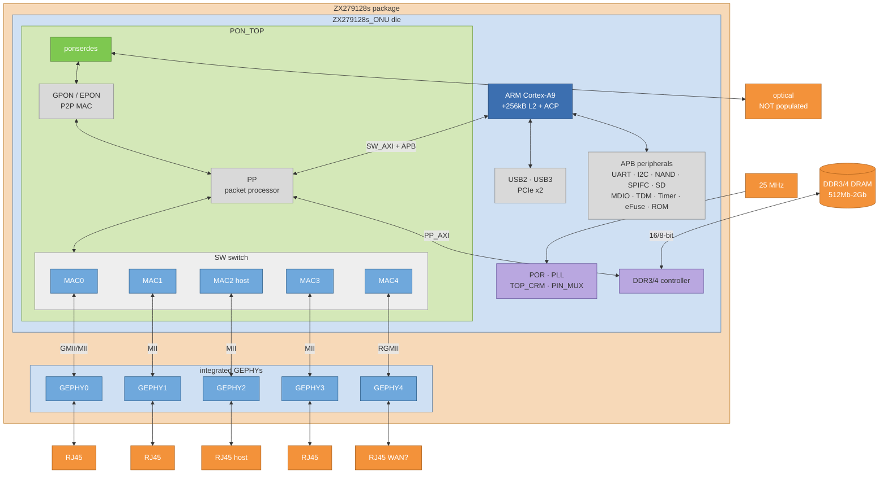
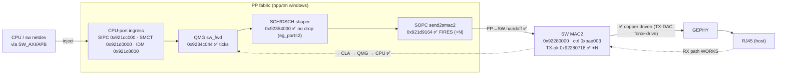
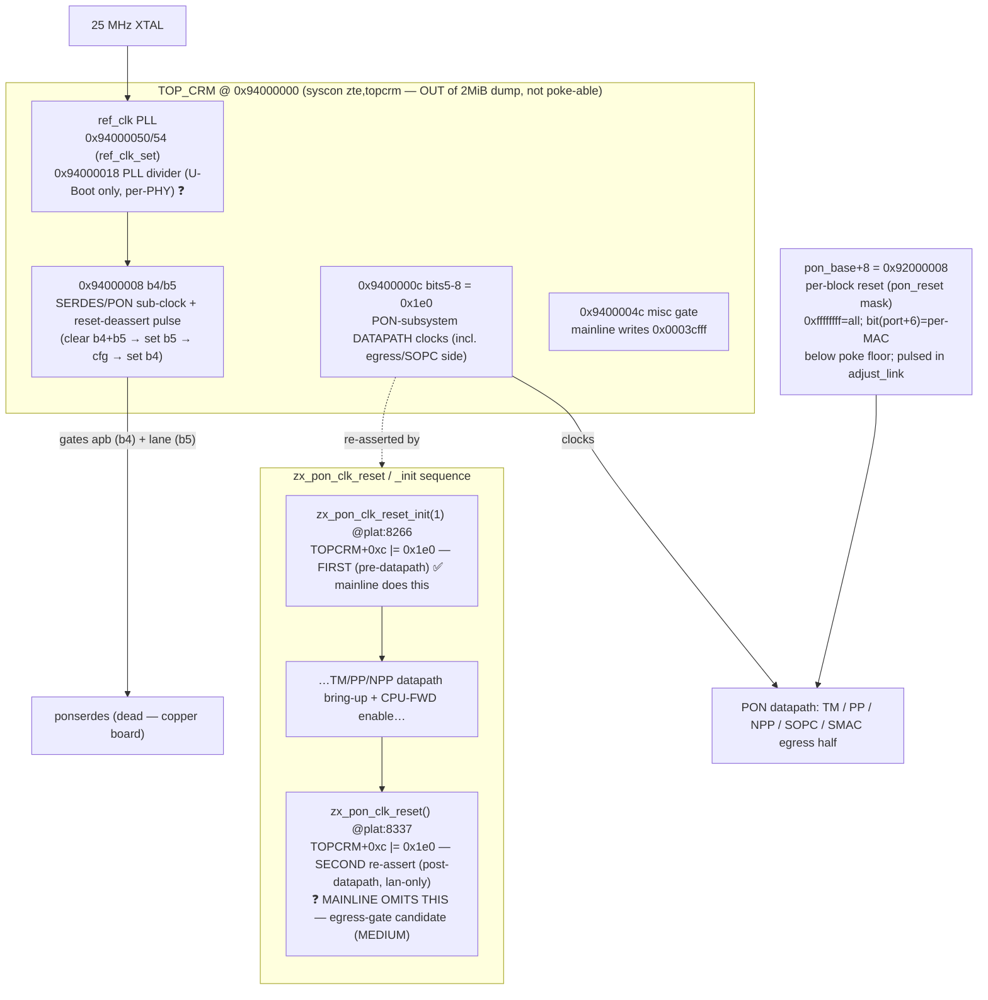
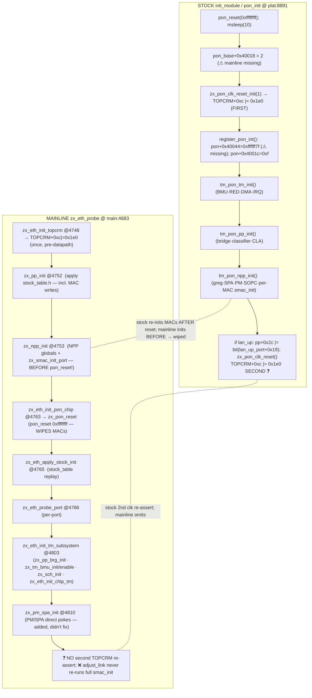
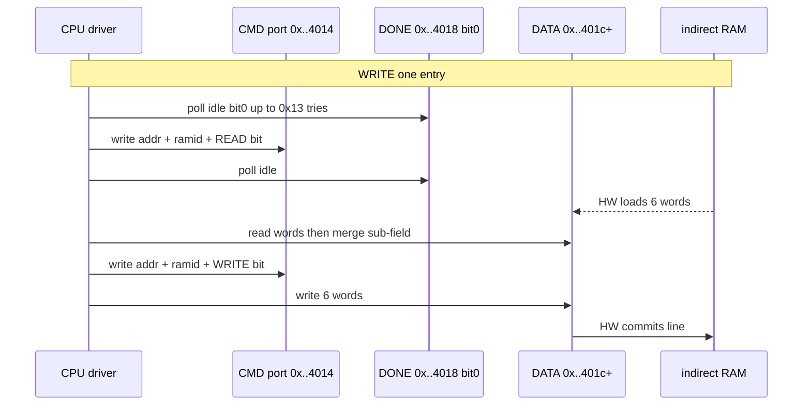

# ZX279128S ethernet/switch — DATASHEET (homemade)

Reverse-engineered register/memory reference for the ZTE ZX279128S ethernet+switch
block (no public *register-level* datasheet exists — only the vendor block brief, see
diagrams below). Built from RE of stock kmods + live reads.
Confidence per entry: ✅ verified live/decomp-named · 🟡 decomp/table-inferred ·
❓ structure known, semantics unknown.

> **Companion:** a high-level hardware block diagram (datapath flow + ports/pins/addresses)
> now lives beside this file at `HW_BLOCK_DIAGRAM.md`. Read it first for the "where does each
> block sit / which port is which address" picture; use this file for the register detail.

## 🔄 WHAT CHANGED SINCE THE OLD DATASHEET (2026-07-04 consolidation)
This revision folds in ~4 weeks of flow-offload / queue-subsystem RE that the old text listed as
"semantics unknown" or didn't cover. Headline changes (all cross-referenced to their findings):

1. **The "PP_PM (semantics largely unknown)" block at `0x9239c000` IS the PM packet-modifier /
   HW-NAT rewrite engine.** Full decode added: indirect iface (`0x9239c014`), the `ram_id` map
   (ram0 flow_info / ram1 next_hop / ram2 vlan / ram3 cmd microcode / ram6 sub_ram), the
   **flow_info 3-word bit layout** (dmac_en/sip_en/dip_en/sport_en/dport_en/hl_ttl/checksums +
   nat_sport/nat_dport + next_hop_idx), the **next_hop RAM** (new DMAC + one NAT'd IP), the
   **EXTERNAL DDR flow-info carve** (`acl_base−0x20000`; fetch addr `= cmd_flow_id | dir<<10`,
   internal iff `<0x400`), and PM counters `0x9239c080/88/a0`. VALIDATED on-device: HW forwards a
   correctly de-NAT'd download frame. (`nat_offload_re`, `download_pm_rewrite`, `up_hwoffload`,
   `stock_red_drain_up_RE`.) ⚠ NOTE the OLD "PM (G.988 port-mapper)" at `0x921e0000` is a
   *different* block (a source→egress authorizer), unchanged.
2. **CLA classifier fully mapped for HW L3 flow-offload:** config `0x9238c080`, hash-poly
   `0x9238c090`, outspace `0x9238c094`; the **HW hash engine** (`0x9238c2c0` trigger /
   `0x9238c2c4..` key / `0x9238c2fc` out) verified live; `gparsehashkey` latch `0x9238c260`;
   `desIn`/`desOut` descriptor latches (`0x9238c3e0`/`0x9238c394`); the ram0-7 indirect banks +
   poly-0/1 CRC hashing; the **`cmd_flow_id` 15-bit split-field packing** (byte3 low-7 / byte4
   high-8) that links a CLA entry to its PM flow_info slot.
3. **CLA verdict counters are DIRECTION-SPLIT and 16-bit** (not u32): UP bank `0x9238c3c0/c4/c8/d8`
   vs DN bank `0x9238c3cc/d0/d4/dc`; `0x9238c3c0`/`c3c8` are each two packed 16-bit sub-counters
   (no_e8 lo / e8 hi); `0x9238c3b8` = acl_required(hi16)/acl_failed(lo16). (`counter_audit`.)
4. **ADM PPS policer at `0x92394000` decoded** (was "semantics unknown"): `one_second`
   `0x92394048`, per-CPU-queue pass-pps `0x92394080+q*4` (UP) / `0x923940c0+q*4` (DN) with
   enable=bit21, drop counters `0x92394180/1c0`. Mainline initializes NONE of it (the trap-queue
   churn-latch gap). Paired **DPA** enables `0x92398000[12:6]`/`0x92398014[0]` + verdict counter
   `0x9239810c` also decoded. (`queue_subsystem_re`.)
5. **QMG/RED trap-path roles pinned:** QMG `0x9234c04c` (DN hw_trap) **saturates at 1024** = the
   CPU-trap credit (the wedge); RED trap-in/out/drop counters `0x92344204..218`; `drop_RED`
   `0x921da044` is the wedge-correlated drop. Full CPU-trap queue map (ptype→CPU-queue via CLA
   ram7) added. (`queue_subsystem_re`, `zte-redwedge-unicast-cpu`.)
6. **Egress/offload status advanced:** CPU→LAN TX egress solved (2026-05-30); bidirectional NAT
   HW-offload now works (10 GB sustained, `up_hwoffload` #492). Residual = flow-churn trap-latch
   (ADM policer is the prescribed fix) + DN CLA hit-rate.

## 🔎 VERIFICATION PASS (2026-07-04 — cross-checked vs driver source + findings)
Every headline address above was checked against `zx-eth-main.c` / `zx-dsa.c` /
`include/linux/dsa/zte.h` / `zx_ffe_table.h` / the DTS and the source findings.
Corrections applied in this revision:
1. **PM-base flag RESOLVED** — PM = `0x9239c000` (e->base = npp `0x921c0000`, + `0x1DC014`);
   `zx-dsa.c` `ZX_PM_PHYS=0x921dc000` is a wrong constant proven non-committing; the binder
   delegates via `zx_pm_ops`. (§"PP_PM = PM packet-modifier", §3.18.)
2. **BMU base corrected** — `0x92348000` (TM[0x8000], ×5 +0x400; driver `TM_REG_BMU_*` are
   tm_write-based), NOT `0x921c8000` (that's IDM — the old PART-1 row was itself a base-gotcha
   instance; §3.3 already had it right).
3. **SADM pipeline position** — UPSTREAM of CLA per `queue_subsystem_re` §A (SPA→SADM→CLA→ADM);
   the 2026-06-01 "downstream of CLA" note is superseded (§SADM; HW_BLOCK_DIAGRAM redrawn).
4. IDM row typo — ctrl is `0x921c8000=0x020f6766` (a VALUE, not address "0x920f6766").
5. greg getPort line untangled — variant A rejects CPU; "5→0" belongs to the regport/variant-B map.
Spot-checked TRUE against code: MAC stride/bases (`npp+(i+1)*0x40000`, MAC4=0x92300000),
SOPC send2smacN `0x921d915c..916c`, QMG DN/UP banks `0xc044-48-4c`/`0xc054-5c-60`, TM ring
`0x10050/0x10060` sets, CLA cmd/DONE/DATA + HW hash engine `0x2c0/0x2c4/0x2fc` + verdict banks
(UP `c3c0/c4/c8/d8`, DN `c3cc/d0/d4/dc`, `c3b8` req/fail), ADM `0x92394080/c0 +q*4`, DPA
`0x92398000[12:6]`/`0x9239810c`, isolation `0x923883c0+regport*4`, drops `0x921da040/44/4c`,
`zx_regport[8]={1,2,3,4,5,0,6,7}` + `ZX_WAN_REGPORT=5`, wanphy @ MDIO 8 (DTS `ethernet-phy@8`,
"ZX5201") + LAN GePHYs @ 10-13, TX hint `((p+0x28)&0x3f)<<4`, RX ingress `(desc[6]>>3&0x1f)-1`,
NAPI weight 512, ring-pending `TM[0x10100+q*4]`.

## ⚠️ ERRATA (2026-06-01 PM — supersedes earlier port1 claims)
- **port1 ingress is NOT lost at MAC→SPA→SDET.** Earlier text (the "Multi-port/DSA ingress
  status" §, the SDET counter §, SPA admit notes, and the H1 `0x19068` hypothesis) said port1's
  frames die before/at SDET (citing "SDET uni1 transport=2"). **REFUTED by clean delta on mainline
  2026-06-01:** port1 frames *fully traverse* MAC→SPA→SDET (MAC RX +27 → SPA rcv_uni +27 → SDET
  transport +27, CRC=0/ovf=0) and are then **100% dropped at `drop_PP` (0x921da040)** — the
  forwarding/policy stage (not RED=congestion, not DSCH=egress-sched). The old "transport=2" was a
  stale/low-traffic snapshot, not a localization. New localization = the PP/bridge forwarding
  decision for regport2; CLA ram7 trap-queue + isolation are identical p0..p6 (not the gate).
  Instrument: `pipeline_stats` now prints the full per-uni ingress chain + drops. See the
  Multi-port § below (corrected inline) and [[zte-multiport-ingress-gap]].
- **smac_init d00/d30 (0x32/0xA8 absolute) REFUTED as a per-port issue:** all 4 ports' HW defaults
  are byte-identical (d00=d30=e0=0) AND mainline's writes to d00/d30/e0 *don't stick* (read back 0).
- **Stock reg-read channel is UNCERTAIN:** this doc/[[zte-device-access]] say `fpga -r` → `/proc/kmsg`,
  but `dump_stock_regs.py` reads `/dev/logger_main` ("fpga read: reg=.., value=.."). `/proc/kmsg` came
  back EMPTY in the 2026-06-01 session; the live channel was NOT re-verified — confirm before relying.

**Three parts:**
0. **Block diagrams** — vendor SoC brief + our RE'd ethernet datapath (where egress dies).
1. **Overview / block map** — DT windows, the base-gotcha, per-block bases, egress pipeline, what is NOT dumped.
2. **Register reference** — every RE'd register/field: absolute phys, bit-field, R/W, semantic name, confidence (623 table-derived + ~30 from findings, 25 blocks).

Merged from the former MEMORY_LAYOUT.md + REGISTER_REFERENCE.md (now consolidated here).

---

# PART 0 — BLOCK DIAGRAMS

## Vendor SoC block brief (ground truth for the silicon topology)
Official ZTE block diagram: `img/zx279128s_official_block_diagram.png`. Transcribed:


(Colors match the vendor brief: orange package · blue ONU die · green PON_TOP · green
ponserdes · blue MACs/GEPHYs · purple clock+DDR · dark-blue CPU · orange off-chip.
Mermaid auto-routes edges, so positions approximate the brief; nesting/containment is exact.)

**What the vendor brief confirms / adds (vs our RE):**
- The datapath is **ponserdes ↔ GPON-MAC ↔ PP ↔ SW(MAC0..4) ↔ GEPHY ↔ RJ45**. The **PP**
  (packet processor) is our whole fabric (QMG/SOPC/SPA/PM/CLA/SCH/TM-ring/BMU/PP_BRG); the
  **SW** block holds the 5 per-port MACs (our SMAC[N] at 0x92200000 + i*0x40000).
- **CPU reaches the datapath via SW_AXI + APB** (not through a MAC). So CPU→LAN = CPU → PP →
  SW → MAC → GEPHY → RJ45. Our egress gate (SOPC `send2smacN` never firing) is exactly the
  **PP→SW handoff** failing for CPU-sourced frames.
- **TOP_CRM** (top-left clock/reset block) is where the egress clock-gate suspect lives —
  outside the 2MiB dump.
- Port PHYs: MAC0 = GMII/MII, MAC1-3 = MII, **MAC4 = RGMII** (likely the WAN port). Host is on **MAC2**.
- This is an **ONU die** (fiber-capable) but this board has **no optical** — ponserdes/GPON-MAC
  path is dead; only PP↔SW↔copper is active. Confirms: ignore all GPON/fiber config.

## Our RE'd ethernet datapath — ✅ CPU→LAN TX EGRESS SOLVED (2026-05-30)

> ⚠️ **WARNING — this diagram may be INCOMPLETE / partly wrong (flagged 2026-05-31).**
> It predates the TX-ring + dup-storm RE done while bringing up DSA. Known gaps:
> - **The TM TX DMA ring (`0x92350000`: UP base `+0x10050` / DN base `+0x10060`,
>   kick `+0x10054/+0x10064`, consume `+0x10058/+0x10068`) is the CPU egress INJECT
>   stage and is NOT shown** — the diagram jumps CPU→QMG. That ring is exactly where
>   the lan2 DUP STORM lives: mainline shared the UP+DN base (`DN=UP=txdesc_dma`),
>   aliasing the HW consumer pointer so it re-scans/re-emits every VALID desc
>   (~82× at MAC2). Stock uses two DISTINCT bases 64 KiB apart.
> - **BMU** (`0x921c8000`, BP buffer pool alloc/free) is in the block map but not in
>   this egress flow; its free-credit interacts with the ring drain.
> - **SCH/DSCH**: `zx_sch_init` programs the UP-path credit but originally OMITTED the
>   **DN-tcont shaper (RAMID 0xe/0xf)** — relevant to whether a single DN kick drains.
> - "EGRESS SOLVED (2026-05-30)" means a frame reaches the wire, but with the SHARED
>   ring it also REPLICATES under load (the dup storm). A split-base + single-kick fix
>   is under HW test (2026-05-31); diagram + this warning to be finalized once verified.


✅ **WORKS end-to-end (2026-05-30):** `ping -c5 192.168.1.99` = 5/5, 0% loss; txtest 16 →
send2smac2 +16, MAC2 TX +16, drop_DSCH **+0**, host tcpdump 16/16 on wire. RX unaffected.
**Two root-cause fixes** (commit `1c7af7d6c`), both required:
1. **Egress-port hint `zx_eg_port` 4→2.** `desc[2:3]=((port+0x28)&0x3f)<<4` (decomp plat:6848).
   Default 4 = a **no-link port** → DSCH refused to schedule it → dropped EVERY frame (the
   long-hunted "dies at DSCH" wall — it was never a scheduler-config bug). Port 2 = the cabled
   MAC2 jack → 0 drops. (Live sweep: eg_port=2→drop+0/send2smac2+16; =4→drop+16; =3→drop+6.)
2. **GePHY TX-DAC force-drive pattern** (`b676/b677=3, b6c2/b6c1=3, b678=0xf`; was the weak
   `param_2==1` set with b678=0), applied even when U-Boot pre-armed the LDO. Without it MAC2
   counts TX but the copper pair isn't driven (wire=0, no CRC errors). With it → wire=16.
⚠️ The 2026-05-29 "fabric CRACKED / reaches MAC2 / only copper left" claim was a **misdiagnosis**
(eg_port was 4, frames never cleanly reached MAC2 on a clean boot — both the crack commit and
HEAD drop at DSCH). See [[zte-tx-egress-blocker]]. Limitation: eg_port=2 is a single-port bench
constant; correct behavior is per-frame FDB-resolved egress port (follow-up).

---

# PART 1 — OVERVIEW / BLOCK MAP

# ZX279128S ethernet — MEMORY LAYOUT (homemade datasheet)

Consolidated register/memory map for the ZTE ZX279128S ethernet/switch block, from
RE + live reads. **Supersedes the block table in `eth_pipeline_architecture_2026-05-28.md`,
which has base-confusion errors (it put QMG at 0x921cc000 and the TM ring at 0x921d0000 —
both WRONG; see the GOTCHA below).** Confidence tags: ✅ live-verified this session;
🟡 decomp/dump only; ❓ uncertain/approx.

## ⚠️ THE BASE GOTCHA (cost us ~6 iterations — read this first)
There are TWO base windows, and several blocks sit at the SAME offset from EACH, so
"offset 0xc000 / 0x10000 / 0x14000" is ambiguous unless you say from WHICH base:

| offset | from npp_base (0x921c0000) | from tm_base (0x92340000) |
|---|---|---|
| +0xc000  | **SIPC** = 0x921cc000        | **QMG** = 0x9234c000 |
| +0x10000 | **SMCT** = 0x921d0000        | **TM DMA ring** = 0x92350000 |
| +0x14000 | **SPA** = 0x921d4000         | **SCH/DSCH shaper** = 0x92354000 |

`tm_base = npp_base + 0x180000 = 0x92340000` (driver `TM_OFF=0x180000`; stock `tm_base`
is a separate of_iomap that resolves to the same phys). **`tm_write(off)` → 0x92340000+off.**
The early oracles read the TM ring at npp+0x10000 (0x921d0054…) — that's SMCT, always ~0 —
and wrongly concluded "ring unused." The REAL ring is tm_base+0x10000 (0x92350054…).
**Always use absolute phys to avoid this.**

## DT windows (from zx279128s.dtsi `ethernet@921c0000`)
| name | phys | size | notes |
|---|---|---|---|
| `pon` | 0x92000000 | 0x1c0000 | DTS labels "MAC[0..4]"; **the `fpga_read_reg` base** (`*(0x92000000+id*4)`). PON/GPON-MAC. **NOT in the 2MiB dump.** ✅ |
| `npp` | **0x921c0000** | 0x200000 | driver `e->base`; the **2MiB dump** = exactly this window (0x921c0000–0x923bffff). ✅ |
| `sys_ctrl` | 0x94100000 | 0x1000 | clock/reset-ish. NOT dumped. 🟡 |
| `pin_mux` | 0x94200000 | 0x1000 | NOT dumped. 🟡 |
| `pon_serdes` | 0x9fe00000 | 0x100000 | fiber SerDes. NOT dumped, irrelevant (copper-only). 🟡 |
| `mdio` | 0x9a101000 | 0x18 | PHY MDIO bus; 4 GePHYs at addr 10–13. ✅ |
| TOPCRM | (DT phandle `zte,topcrm`) | — | clock/reset: [0x08], [0x0c]\|=0x1e0 (PON clks), [0x50] PLL?. NOT dumped. ❓ |

`fpga_read_reg(id) = *(0x92000000 + id*4)` → **phys = 0x92000000 + id*4** (id = (phys-0x92000000)/4).

## Blocks (ABSOLUTE phys)
### npp window (0x921c0000), datapath
| block | phys base | key regs (phys) | role | conf |
|---|---|---|---|---|
| greg / STP | 0x921c0000 | port-STP-state **0x921c0044** (3 bits/port, FWD=4; stock=0=off), stp_en 0x921c0040, port_closed 0x921c004c | global switch regs incl. per-port forwarding state | ✅ |
| IDM | 0x921c8000 | TX desc base **0x921c8004**, TX kick **0x921c8040**, TX consume **0x921c8044**, ctrl 0x921c8000=**0x020f6766** (⚠ was mis-typeset as "address 0x920f6766" — it's the ctrl VALUE) | CPU-port DMA (idm0/idm1 netdevs, WiFi fwd). NOT the LAN-egress path. | ✅ |
| BMU | **0x92348000** = TM[0x8000], 5 instances +0x400 (⚠ CORRECTED 2026-07-04: the old "0x921c8000, overlaps IDM low" row was the base-gotcha — npp+0x8000 is IDM; driver `zx_tm_bmu_init` is tm_write-based) | alloc-result **0x9234800c**, alloc-kick **0x92348014**, pool cfg 0x923480e8..fc | buffer-pointer alloc/free (detail §3.3) | ✅ |
| SIPC | 0x921cc000 | ctrl **0x921cc000=0x11** (cpu_up_en) | CPU↔fabric credit/mailbox bridge (NOT a ring) | ✅ |
| SMCT | 0x921d0000 | init 0x921d0000=0xB, 0x921d0010=0x3810, free-gauge **0x921d0040**, free-doorbell 0x921d004c | CPU-port multi-channel transfer; gauges move during egress | 🟡 |
| SPA (stream parser) | 0x921d4000 | match_mode **0x921d407c**, pkt-en 0x921d4000/04/08/40/44/48, indirect CMD **0x921d4014**/DONE 0x921d4018/DATA 0x921d401c–30, ONU-MAC tbl 0x921d4120/24 (=device MAC, mainline writes it) | source-port classifier; **match-RAM (ram_id0, 11 ent) is INDIRECT — not in flat dump** | ✅ |
| SOPC (NPP) | 0x921d9000 | send2smac0..4 0x921d915c..**0x921d9164**(smac2)..916c | egress crossbar → physical MAC[N]. ✅ **send2smac2 +N once eg_port=2 (was 0 with the dead-port hint).** | ✅ |
| drop counters | 0x921da000 | drop_PP 0x921da040, drop_RED 0x921da044, drop_DSCH 0x921da04c | per-stage drop counters | ✅ |
| PM (G.988 port-mapper) | 0x921e0000 | ctrl **0x921e0054** (stock=0xc0: inport_eq_outport+cpu_not_drop), out-port rule **0x921e01a0=0x08**, in-port rules 0x921e0180+i*4 | source→allowed-egress authorizer. Mainline omits → `zx_pm_spa_init()` added (didn't fix). | ✅ |
| SMAC[i] (MACs) | npp+(i+1)*0x40000 | per-MAC: ctrl +0x00, IRQ_MASK +0x04, ENABLE +0x08, iface +0xe0, TX-byte +0x714, **TX-ok +0x718**, **RX-ok +0x780** | per-port ethernet MAC | ✅ |
| → MAC0 | 0x92200000 | ctrl=0 (down) | | ✅ |
| → MAC1 | 0x92240000 | ctrl=0 (down) | | ✅ |
| → **MAC2** | **0x92280000** | ctrl=**0xba6003** (tx/rx-en+link), RX-ok counts host, ✅ **TX-ok +N (egresses to wire)** | **HOST is cabled here = switch port 2 (`zx_eg_port=2`).** | ✅ |
| → MAC3 | 0x922c0000 | ctrl=0 | | ✅ |
| → MAC4 | 0x92300000 | ctrl=0 | | ✅ |
| PP ctrl | 0x92380000 | CPU-fwd **0x9238002c** (pp[0x2c]; bit (lan_up_port+0x19); high bits not CPU-writable) | packet-processor control | ✅ |
| PP_BRG (bridge) | 0x92388000 | flood bitmap **0x92388340**, bcast gates 0x92388300/04/44, isolation 0x923883c0+, VLAN-check 0x92388008 | FDB/VLAN/isolation/flood/learn. All verified stock-faithful; not the gate. | ✅ |
| ETH_TM2 mux | 0x923a0000 | mux **0x923a00e0** (U-Boot=0x11), PON_PP_TM_CFG **0x923a001c**=0x21200000 | **U-Boot direct-egress mux** (bypasses fabric). Block is CLOCK-GATED in kmod/mainline (writes to 0xe0 don't latch). Option B. | ✅/❓ |

### tm_base window (0x92340000 = npp+0x180000), traffic manager
| block | phys base | key regs (phys) | role | conf |
|---|---|---|---|---|
| QMG | 0x9234c000 | **sw_fwd 0x9234c044**, hw_fwd 0x9234c048, hw_trap 0x9234c04c | queue manager / forward decision. CPU frame reaches sw_fwd then loops to CPU. | ✅ |
| TM DMA ring | 0x92350000 | UP base 0x92350050 / kick **0x92350054** / consume 0x92350058 / cursor 0x9235005c; DN base 0x92350060 / kick **0x92350064** / consume 0x92350068 / cursor 0x9235006c | the REAL TM TX ring (UP+DN). mainline `tm_write(0x10054/64)` lands here. | ✅ |
| SCH/DSCH shaper | 0x92354000 | indirect CMD **0x92354014** / DONE 0x92354018 / DATA 0x9235401c | downstream token-bucket shaper (RAMID per-queue/tcont). `zx_sch_init` fixed the UP-path credit. | ✅ |
| RED | ~0x92344000 | — | random-early-detect / congestion | ❓ |

## Egress pipeline (CPU→LAN) — ✅ WORKS end-to-end (2026-05-30)
```
CPU frame → TM ring → QMG (sw_fwd 0x9234c044 ✅ +N)
  → DSCH (drop_DSCH 0x921da04c ✅ +0, eg_port=2) → SOPC send2smac2 (0x921d9164 ✅ +N)
  → MAC2 TX (0x92280718 ✅ +N) → GePHY (TX-DAC force-drive) → wire ✅ (host tcpdump +N)
```
Fixed by (1) egress-port hint `zx_eg_port` 4→2 (was a no-link port → DSCH dropped all) and
(2) GePHY TX-DAC force-drive pattern (was weak → copper not driven). `ping` = 0% loss. RX
path (wire→PHY→MAC2→CLA→QMG→CPU) works fully and is unaffected.

## What the 2MiB dump does NOT cover (so "config matches stock" is INCOMPLETE)
1. **`pon` window 0x92000000–0x921bffff** (PON-MAC/GPON; copper-irrelevant but unverified).
2. **TOPCRM / sys_ctrl / pin_mux / pon_serdes** — clock/reset/pinmux. **The clock-gate suspect (ETH_TM2) lives here.** Never dumped/diffed.
3. **Indirect RAMs** (SPA match-RAM ram_id0, SCH shaper RAM, CLA tables) — behind index/data ports; a flat dump can't see them.
4. **Write-only doorbells** (ring kicks) — read back as 0/garbage.

## Port numbering
- greg remap **variant A** (tm.c:37917 / getPort): 0–4→0–4, 6→5, 7→6; **logical 5 (CPU) is REJECTED** (no greg slot). **Variant B = regport** (isolation/FDB/CLA-inport): {0,1,2,3,4}→{1,2,3,4,5}, **CPU 5→0**, 6→6, 7→7 (`zx_regport[8]={1,2,3,4,5,0,6,7}`, zx-dsa.c:54). ⚠ the old one-line "0–4→0–4, 5→0(CPU), 6→5, 7→6" conflated the two variants. See [[zte-port-numbering]] / `port_numbering_map_re.md`.
- `lan_up_port = 4` (stock boot log), so CPU-fwd bit = 1<<(4+0x19) = bit 29.
- Host/MAC2 = LAN3 in ZTE numbering.

## IRQs (GIC SPI)
tm=36 (CPU↔switch ⭐), npp=35, idm=38, pon=66, pp=37.
Per-PHY GePHY link-change IRQs: GIC SPI **0x47..0x4a** (71..74) for gephy0..3. ⚠️ **2026-05-31: these IRQs do NOT fire on a cable link-change for the cabled ports** — live test, moving the cable left gephy irq counts at 0; only the unconnected PHY[3] spuriously storms its line (~30M). Stock doesn't rely on them either — it polls (`extphy_timer_func` decomp_all_plat:3137). The mainline DSA driver (eth-dsa branch) therefore uses **`PHY_POLL`** (phylib polling, ~1s) instead of `phy_request_interrupt`; this enables hotplug (move cable, no reboot → `adjust_link` re-runs `zx_smac_init_port`) AND kills the PHY[3] storm.

## Multi-port / DSA ingress status (2026-05-31, eth-dsa branch) — ⚠️ see ERRATA at top
Ports 0/2/3 ping bidirectional via DSA slaves; **port1/jack2 ingress→CPU is broken**. ~~a dynamic, config-invisible per-port drop in the **MAC→SPA→SDET** admit stage (SDET uni1 transport=2...)~~ **CORRECTED 2026-06-01:** port1 frames fully pass MAC→SPA→SDET and are dropped at **`drop_PP` (0x921da040)**, the forwarding/policy stage (clean delta: MAC RX/SPA/SDET all +N, CRC=0; drop_PP +N; CPU 0). NOT hardware (stock pings jack2), NOT a register bit (every per-port reg byte-identical to working ports + stock; CLA ram7 + isolation identical p0..p6). Live debug tools: debugfs `clapeek`/`cladump` (CLA indirect) + `rx_per_ingress` (in `stats`) + **`pipeline_stats` (full per-uni ingress chain: MAC RX/CRC/ovf, SPA rcv_uni, SDET transport, QMG sw/hw_fwd/hw_trap, drops PP/RED/DSCH)**. Full writeup: `tasks/00.01.eth-driver/findings/{multiport_root_cause_macinit,port1_sdet_ingress_gate_re,port1_spa_admit_gate_re}.md` (the last two are now SUPERSEDED — port1 dies at PP, not SPA/SDET).

## Egress status — ✅ SOLVED 2026-05-30 (commit 1c7af7d6c)
CPU→LAN TX egress works end-to-end: `ping -c5 192.168.1.99` = 5/5, 0% loss; txtest → send2smac2
+N, MAC2 TX +N, drop_DSCH +0, frames on wire. RX unaffected. **Two root-cause fixes, both
required:**
1. **Egress-port hint `zx_eg_port` 4→2.** `desc[2:3]=((port+0x28)&0x3f)<<4` (decomp plat:6848).
   The default 4 pointed at a **no-link port**, so the DSCH scheduler dropped every frame
   (`drop_DSCH 0x921da04c` +N) — this was the entire "dies at DSCH" wall, never a scheduler-config
   bug. Port 2 = cabled MAC2 → 0 drops. Proven by live runtime sweep (eg_port 2/3/4).
2. **GePHY TX-DAC force-drive pattern** (`b676/b677=3, b6c2/b6c1=3, b678=0xf`; was weak set with
   b678=0), applied even when U-Boot pre-armed the LDO. Without it MAC2 counted TX but copper
   wasn't driven (wire=0, no errors); with it → wire=N.
⚠️ The 2026-05-29 "FABRIC GATE CRACKED / reaches MAC2 / only MAC2→PHY copper gap left" claim was a
**MISDIAGNOSIS** (retracted): with eg_port=4, frames never cleanly reached MAC2 on a clean boot —
both the crack commit `dc706eae9` and HEAD drop at DSCH. The "MAC↔PHY MII (+0xc20/+0xc50/+0xb00)"
suspects were also wrong (those read back stock values live). The real copper gap was purely the
TX-DAC drive strength. The earlier address-map note (SMCT 0x921d00xx vs real TM ring 0x9235xxxx)
stands. See [[zte-tx-egress-blocker]] for the full ruled-out list.


---

# PART 2 — REGISTER REFERENCE (per-register detail)

# ZX279128S Ethernet/Switch — Register Reference (homemade datasheet)

Synthesised purely from existing RE artefacts for an open-source GPL Linux driver
(hardware owned by developer). **No device/build/git touched.**

Sources: `zx-fpga-reg-tables.h` + `zx_reg_tables.h` (RE'd descriptor tables extracted
from stock `tm.ko` .data), the `decomp_all_*.c` Ghidra decompilations (setter/getter
function -> `tmOnuRegWrite(reg_id,...,&<blk>RegTable)` gives the semantic name), and the
deeply-RE'd egress findings (`MEMORY_LAYOUT.md`, `cpu_source_port_egress_re.md`,
`pm_spa_init_recipe_re.md`, `port_stp_state_re.md`, `mac_egress_enable_re.md`,
`sopc_egress_port_gate_re.md`, `smac_real_counters_re.md`, `pipeline_counter_map.md`).

## Address model
`fpga reg-id (dword) -> phys = 0x92000000 + reg_id*4`, where `reg_id = base_off + stride*sub_idx`.
A field is `(value & mask) << shift` within that 32-bit word (read-modify-write).
`mode`: R=read-only, W=write-only, RW=read-write. **Per-`sub_idx` (max_sub_idx+1) copies**
exist where stride>0 (e.g. per-port / per-entry).

## Confidence legend
- ✅ **verified** — decomp-named setter/getter AND/OR live-read cross-checked (stock dump).
- 🟡 **inferred** — name from decomp accessor, table structure RE'd, not live-verified here.
- ❓ **unknown** — bit-field structure known from the table, semantic meaning not established.

## ⚠ Base gotcha (respect absolute phys)
Two windows overlap by offset: **npp_base=0x921c0000** vs **tm_base=0x92340000**
(tm = npp+0x180000). So QMG=**0x9234c000** (not 0x921cc000), TM-ring=**0x92350000**,
SCH=**0x92354000**, SPA=**0x921d4000** vs SCH=0x92354000, RED~**0x92344000**. Always use the
absolute phys in the tables below — they were computed from `base_off*4` directly.


## greg / global switch + per-port STP

**Block base ≈ `0x921c0000`** (zx_gregregtable). Role: global switch ctrl, per-port STP/forwarding state, OAM, PTP/LPI/MCI ints, RAM-init

| phys (sub0) | reg_id | R/W | bits | semantic name | conf |
|---|---|---|---|---|---|
| `0x921c0000` | 2 | R | [0] | mci_inir[port0] | ✅ |
| `0x921c0000` | 7 | R | [1] | lpi_inir[port0] | ✅ |
| `0x921c0000` | 3 | R | [2] | mci_inir[port1] | ✅ |
| `0x921c0000` | 8 | R | [3] | lpi_inir[port1] | ✅ |
| `0x921c0000` | 4 | R | [4] | mci_inir[port2] | ✅ |
| `0x921c0000` | 9 | R | [5] | lpi_inir[port2] | ✅ |
| `0x921c0000` | 5 | R | [6] | mci_inir[port3] | ✅ |
| `0x921c0000` | 10 | R | [7] | lpi_inir[port3] | ✅ |
| `0x921c0000` | 6 | R | [8] | mci_inir[port4] | ✅ |
| `0x921c0000` | 11 | R | [9] | lpi_inir[port4] | ✅ |
| `0x921c0000` | 1 | R | [17] | ptp_int_req | ✅ |
| `0x921c0000` | 0 | R | [18] | soam_int_req | ✅ |
| `0x921c0004` | 14 | RW | [0] | mci_int_mask[port0] | ✅ |
| `0x921c0004` | 19 | RW | [1] | lpi_int_mask[port0] | ✅ |
| `0x921c0004` | 15 | RW | [2] | mci_int_mask[port1] | ✅ |
| `0x921c0004` | 20 | RW | [3] | lpi_int_mask[port1] | ✅ |
| `0x921c0004` | 16 | RW | [4] | mci_int_mask[port2] | ✅ |
| `0x921c0004` | 21 | RW | [5] | lpi_int_mask[port2] | ✅ |
| `0x921c0004` | 17 | RW | [6] | mci_int_mask[port3] | ✅ |
| `0x921c0004` | 22 | RW | [7] | lpi_int_mask[port3] | ✅ |
| `0x921c0004` | 18 | RW | [8] | mci_int_mask[port4] | ✅ |
| `0x921c0004` | 23 | RW | [9] | lpi_int_mask[port4] | ✅ |
| `0x921c0004` | 13 | RW | [17] | ptp_int_mask | ✅ |
| `0x921c0004` | 12 | RW | [18] | soam_int_mask | ✅ |
| `0x921c0008` | 27 | RW | [5:0] | spa_ram_init | ✅ |
| `0x921c0008` | 26 | RW | [7:6] | smct_ram_init | ✅ |
| `0x921c0008` | 25 | RW | [9:8] | opc_ram_init | ✅ |
| `0x921c0008` | 24 | RW | [12:10] | soam_ram_init | ✅ |
| `0x921c000c` | 28 | RW | [4:0] | nppu_pm_ram_init | ✅ |
| `0x921c0040` | 29 | RW | [0] | port_stp_en[port0] | ✅ |
| `0x921c0040` | 30 | RW | [1] | port_stp_en[port1] | ✅ |
| `0x921c0040` | 31 | RW | [2] | port_stp_en[port2] | ✅ |
| `0x921c0040` | 32 | RW | [3] | port_stp_en[port3] | ✅ |
| `0x921c0040` | 33 | RW | [4] | port_stp_en[port4] | ✅ |
| `0x921c0040` | 34 | RW | [5] | port_stp_en[port5] | ✅ |
| `0x921c0040` | 35 | RW | [6] | port_stp_en[port6] | ✅ |
| `0x921c0040` | 36 | RW | [16] | port_sel_stp_rstp[port0] (0=STP,1=RSTP) | ✅ |
| `0x921c0040` | 37 | RW | [17] | port_sel_stp_rstp[port1] (0=STP,1=RSTP) | ✅ |
| `0x921c0040` | 38 | RW | [18] | port_sel_stp_rstp[port2] (0=STP,1=RSTP) | ✅ |
| `0x921c0040` | 39 | RW | [19] | port_sel_stp_rstp[port3] (0=STP,1=RSTP) | ✅ |
| `0x921c0040` | 40 | RW | [20] | port_sel_stp_rstp[port4] (0=STP,1=RSTP) | ✅ |
| `0x921c0040` | 41 | RW | [21] | port_sel_stp_rstp[port5] (0=STP,1=RSTP) | ✅ |
| `0x921c0040` | 42 | RW | [22] | port_sel_stp_rstp[port6] (0=STP,1=RSTP) | ✅ |
| `0x921c0044` | 43 | RW | [2:0] | port_stp_rstp_status[port0] (0=Dis,1=Block,2=Listen,3=Learn,4=Forward) | ✅ |
| `0x921c0044` | 44 | RW | [5:3] | port_stp_rstp_status[port1] (0=Dis,1=Block,2=Listen,3=Learn,4=Forward) | ✅ |
| `0x921c0044` | 45 | RW | [8:6] | port_stp_rstp_status[port2] (0=Dis,1=Block,2=Listen,3=Learn,4=Forward) | ✅ |
| `0x921c0044` | 46 | RW | [11:9] | port_stp_rstp_status[port3] (0=Dis,1=Block,2=Listen,3=Learn,4=Forward) | ✅ |
| `0x921c0044` | 47 | RW | [14:12] | port_stp_rstp_status[port4] (0=Dis,1=Block,2=Listen,3=Learn,4=Forward) | ✅ |
| `0x921c0044` | 48 | RW | [17:15] | port_stp_rstp_status[port5] (0=Dis,1=Block,2=Listen,3=Learn,4=Forward) | ✅ |
| `0x921c0044` | 49 | RW | [20:18] | port_stp_rstp_status[port6] (0=Dis,1=Block,2=Listen,3=Learn,4=Forward) | ✅ |
| `0x921c0048` | 50 | RW | [0] | port_need_authen[port0] | ✅ |
| `0x921c0048` | 51 | RW | [1] | port_need_authen[port1] | ✅ |
| `0x921c0048` | 52 | RW | [2] | port_need_authen[port2] | ✅ |
| `0x921c0048` | 53 | RW | [3] | port_need_authen[port3] | ✅ |
| `0x921c0048` | 54 | RW | [4] | port_need_authen[port4] | ✅ |
| `0x921c0048` | 55 | RW | [5] | port_need_authen[port5] | ✅ |
| `0x921c0048` | 56 | RW | [6] | port_need_authen[port6] | ✅ |
| `0x921c004c` | 57 | RW | [0] | port_closed[port0] | ✅ |
| `0x921c004c` | 58 | RW | [1] | port_closed[port1] | ✅ |
| `0x921c004c` | 59 | RW | [2] | port_closed[port2] | ✅ |
| `0x921c004c` | 60 | RW | [3] | port_closed[port3] | ✅ |
| `0x921c004c` | 61 | RW | [4] | port_closed[port4] | ✅ |
| `0x921c004c` | 62 | RW | [5] | port_closed[port5] | ✅ |
| `0x921c004c` | 63 | RW | [6] | port_closed[port6] | ✅ |
| `0x921c0058` | 64 | RW | [4:0] | one_step_mode | ✅ |
| `0x921c0090` | 70 | RW | [31:0] | wifi_queue1_protocol | ✅ |
| `0x921c0094` | 71 | RW | [31:0] | wifi_queue1_protocol(2) | ✅ |
| `0x921c00c0` | 66 | RW | [1:0] | oam_action | ✅ |
| `0x921c00c0` | 65 | RW | [3:2] | oam_mode | ✅ |
| `0x921c010c` | 67 | RW | [0] | tm_oam_en | ✅ |
| `0x921c0114` | 68 | RW | [3:0] | gap_add | ✅ |

## NPP reset/clock gate registers

Registers at npp_base+0x08 and npp_base+0x0c. Write-1-to-toggle-and-clear reset/clock gate registers used by stock kernel and U-Boot.

| phys | NPP off | R/W | bits | semantic name | conf |
|---|---|---|---|---|---| 
| `0x921c0008` | 0x0008 | W | [31:0] | **NPP reset gate** — write-1-to-toggle-and-clear. Stock writes 0xFFFFFF (24 bits), U-Boot writes 0xFFFFFFFF (32 bits). Readback is always 0 (self-clearing). Acts as a sub-block reset strobe for the NPP datapath. | ✅ |
| `0x921c000c` | 0x000C | W | [31:0] | **NPP clock gate** — write-1-to-toggle-and-clear. Stock writes 0xFFFFF (bits 0–19), U-Boot writes 0xFFFFFFFF (all 32 bits). Readback is 0x3FFFF (some bits reflect clock state). Higher bits (20–31) that U-Boot toggles but stock does NOT may gate the BMU DDR prefetch path — untested hypothesis. | ✅ |

## SDETG (frame detect / VLAN det)

**Block base ≈ `0x921c4000`** (zx_sdetgregtable). Role: min/max frame len, UNI OMP/PMP VID, soft-VID, c_tpid, SOAM drop

| phys (sub0) | reg_id | R/W | bits | semantic name | conf |
|---|---|---|---|---|---|
| `0x921c4000` | 5 | RW | [13:0] | minframe_length | 🟡 |
| `0x921c4000` | 0 | RW | [29:16] | maxframe_length[port] (base) | 🟡 |
| `0x921c4008` | 7 | RW | [11:0] | uni_pmp_vid (x6, +0x10/idx) | 🟡 |
| `0x921c4008` | 6 | RW | [12] | uni_pmp_vid_vld (x6, +0x10/idx) | 🟡 |
| `0x921c400c` | 9 | RW | [11:0] | uni_omp_vid (x6, +0x10/idx) | 🟡 |
| `0x921c400c` | 8 | RW | [12] | uni_omp_vid_vld (x6, +0x10/idx) | 🟡 |
| `0x921c4080` | 13 | RW | [11:0] | soft_vid (x21, +0x4/idx) | 🟡 |
| `0x921c4080` | 12 | RW | [12] | soft_vid_vld(set) (x21, +0x4/idx) | 🟡 |
| `0x921c4080` | 11 | RW | [30:19] | soft_vld/soft_vid (x21, +0x4/idx) | 🟡 |
| `0x921c4080` | 10 | RW | [31] | soft_vid_vld(set) (x21, +0x4/idx) | 🟡 |
| `0x921c40f0` | 14 | RW | [15:0] | c_tpid | 🟡 |
| `0x921c4200` | 15 | RW | [2:0] | smac_md_level (x6, +0x4/idx) | 🟡 |
| `0x921c4220` | 16 | RW | [29:16] | down_maxframe_length | 🟡 |
| `0x921c4224` | 17 | RW | [5:0] | soam_drop_en | 🟡 |
| `0x921c4250` | 1 | RW | [13:0] | **maxframe_length[port1]** (stock 0x07cc) | ✅ |
| `0x921c4250` | 2 | RW | [29:16] | **maxframe_length[port2]** (stock 0x07cc) | ✅ |
| `0x921c4254` | 3 | RW | [13:0] | **maxframe_length[port3]** (stock 0x07cc) | ✅ |
| `0x921c4254` | 4 | RW | [29:16] | **maxframe_length[port4]** (stock 0x07cc) | ✅ |

**Decoded 2026-05-31** (stock `tm_pon_npp_sdet_initial` decomp_all_tm.c:43182 → `sdet_set_maxframe_length(port,0x3000)` :24470): per-port maxframe is INTERLEAVED in shared words — port0=0x921c4000[29:16], **port1=0x921c4250[13:0], port2=0x921c4250[29:16]** (same word!), port3=0x921c4254[13:0], port4=[29:16]. Live golden: 0x4000=`0x07cc000c`, 0x4250=`0x07cc07cc`, 0x4254=`0x07cc07cc`, c_tpid 0x40f0=`0x00008100`. ⚠️ **Mainline never inits SDET** (`zx_sdetgregtable` defined but unused) — values happen to read the stock value from reset/bootloader, but this block is the per-uni frame-admit stage between MAC-RX and the classifier. See `port1_sdet_ingress_gate_re.md`.

### SDET per-uni transport/drop counters (the silent-drop oracle — was the port1 localizer)
| phys | bits | semantic | conf |
|---|---|---|---|
| `0x921c4160` + uni*4 (uni0..3 = logical port 0..3; uni4 @0x921c4178) | [7:0] | **egress_transport_cnt** (frames that passed SDET to the classifier) | ✅ |
| `0x921c4160` + uni*4 | [23:16] | **egress_drop_cnt** (SDET-dropped) | ✅ |

~~Live 2026-05-31 (ports 1/2/3 cabled): uni1(port1)=transport **2** ... port1's frames don't REACH the SDET (lost upstream in MAC→SPA).~~ ⚠️ **ERRATA 2026-06-01:** WRONG conclusion. The transport=2 was a stale/low-traffic read. Clean delta shows uni1 SDET transport tracks MAC1 RX exactly (port1 frames DO reach + pass SDET); they die downstream at `drop_PP` (0x921da040). SDET is NOT the port1 gate.

## SIPC (CPU<->fabric bridge)

**Block base ≈ `0x921cc000`** (zx_sipcregtable). Role: rx_en / cpu_up_en credit/mailbox bridge

| phys (sub0) | reg_id | R/W | bits | semantic name | conf |
|---|---|---|---|---|---|
| `0x921cc000` | 0 | RW | [0] | rx_en | ✅ |
| `0x921cc000` | 1 | RW | [2] | cpu_up_en | ✅ |

### SIPC block structure (full RE 2026-07-31, from zx_npp_twin_data.h boot capture + decomp sweep)
TWO identical 0x2000 instances at npp+0xc000 (0x921cc000) and npp+0xe000 (0x921ce000), each with
**8 channels at 0x400 stride** (16 channels total), ~50 config words per channel at +0x000..+0x2bc.
Channel offsets +0x280..+0x2bf are an on-chip **packet-buffer window** (the boot capture even holds a
stale SSH frame from the capture session). SIPC = on-chip multi-channel packet FIFO / credit bridge —
**there is NO SIPC→CPU descriptor ring** (no DDR base / producer / consumer register exists anywhere
in stock; exhaustive decomp sweep 2026-07-31). Stock performs **ZERO runtime SIPC accesses** — no
ISR/NAPI/timer consumer; the counters below are read only by debug-shell commands. LIVE (2026-07-31):
the per-channel status regs (e.g. 0xc008+n·0x400 and the 0xe000 twin) read **identical on all 16
channels** — aliased/global, not per-channel state.

### SIPC→CPU drop/fill counters (FULL decode 2026-07-31, tm_up_statistics_get :46235-46239/:46364-46367 + tm_dn_statistics_get :46525/:46597-46600)
| phys | bits | semantic | conf |
|---|---|---|---|
| `0x921cc004` | [3:0] | cpu_short_drop_cnt (up) | ✅ |
| `0x921cc004` | [7:4] | cpu_short_drop_cnt (dn) | ✅ |
| `0x921cc004` | [11:8] | cpu_pkt_drop_cnt (dn) | ✅ |
| `0x921cc004` | [15:12] | cpu_pkt_drop_cnt (up) | ✅ |
| `0x921cc004` | [19:16] | **sipc2cpu_aful_cnt_dn** (SIPC→CPU DN FIFO almost-full events). Non-zero only on mainline (≠0 on stock) — was a surviving lead for wedge#2 (WiFi fabric-ingress). Demoted once root cause (BMU pool starvation) was confirmed. ⚠ SIPC is a single shared block; cannot discriminate per-ingress-port. | ✅ |
| `0x921cc004` | [23:20] | **sipc2cpu_ful_cnt_dn** | ✅ |
| `0x921cc004` | [27:24] | **sipc2cpu_aful_cnt_up** | ✅ |
| `0x921cc004` | [31:28] | **sipc2cpu_ful_cnt_up** | ✅ |
| `0x921cc008` | [23:12] | **NO stock reader/symbol exists.** Three 4-bit event counters that move in lockstep on mainline (RO, write-deaf; boot image writes 0x844 = blind replay no-op). LIVE 2026-07-31: fills AND drains at idle; insensitive to RX-trap traffic; wraps f→1; **saturation does NOT halt the fabric** (box passed traffic at fff) and a true wedge fired with it at 0x777 — it is a coincident symptom, NOT the wedge cause. **Definitively demoted for wedge#2 as well:** wedge#2 root cause = BMU pool starvation (engine unclocked, no DDR prefetch); the 0x921cc008 gauge was never the gate for either wedge. | ✅ |
| `0x921cc024` | [3:0] | sdet_shor_drop_cnt | ✅ |
| `0x921cc030` | [23:0] | sipc_sch_dbg | ✅ |
| `0x921cc038`/`0x921cc03c` | — | static config (boot-written 0x318 both; sizes/thresholds, NOT counters) | ✅ |
| `0x921cc040` | — | static config (boot-written 0x01980000) | ✅ |
| `0x921cc044` | [3:0]/[7:4]/[11:8] | READ semantics ≠ write: **sipc_2spa sop / eop / sipc_drop** live nibble gauges (:46261-46265; boot-written 0x11) | ✅ |
| `0x921cc184` + n*4 | — | **DROP_HPMAU_CNT** ×11, port order: up_cpu, UNI0-4, PON0-1, SOAM, wifi0, wifi1 | ✅ |
| `0x921cc1c4` + n*4 | — | **DROP_AFUL_CNT** ×11, same port order | ✅ |

NOTE: SIPC is a SINGLE shared block (NOT per-port) — it cannot discriminate one ingress port by itself. Confirmed NOT the port1 gate (poke/toggle had no effect). See `port1_sdet_ingress_gate_re.md`.
NOTE (base-gotcha, both directions): stock's `tm_base+0xc008 = 0` write (plat :7080) is **QMG 0x9234c008**, unrelated to npp+0xc008.

## SMCT (CPU-port multi-channel xfer)

**Block base ≈ `0x921d0000`** (zx_smctregtable). Role: uni/pp/ppmove PMAU gauges

| phys (sub0) | reg_id | R/W | bits | semantic name | conf |
|---|---|---|---|---|---|
| `0x921d0000` | 0 | RW | [9:0] | uni_pmau | ✅ |
| `0x921d0004` | 1 | RW | [9:0] | pp_pmau — **stock init writes 0xB** (pon_npp_smct_init plat :3333-3342, hidden behind a Ghidra symbol collision `*(tm_set_onu_mac + npp_base + 4)`); mainline POR = 0xA until the 2026-07-31 driver fix | ✅ |
| `0x921d0008` | 2 | RW | [9:0] | ppmove_pmau | ✅ |

### SMCT error/status regs (tm_error_monitor :46684-46698 decode 2026-07-31)
| phys | bits | semantic | conf |
|---|---|---|---|
| `0x921d0050` | [0] | sipc_err | ✅ |
| `0x921d00d4` | [29] | **sipc_desc_full_err** (the "sipc descriptor" FIFO is HW-internal SMCT↔SIPC; this bit is its only SW visibility) | ✅ |
| `0x921d00d4` | [28] | **sipc_desc_empty_err** | ✅ |
| `0x921d00d4` | [27:16] | bud_wrong | ✅ |
| `0x921d00d4` | [5] | des_err | ✅ |
| `0x921d00d8` | [9:0] | smct_left_pmau (PMAU credit-pool level gauge) | ✅ |
| `0x921d0100` | [0] | dma_up_err | ✅ |

## UOPC (upstream OPC / tcont)

**Block base ≈ `0x921d8000`** (zx_uopcregtable). Role: tcont num/sync/active, mac_ept_resume

| phys (sub0) | reg_id | R/W | bits | semantic name | conf |
|---|---|---|---|---|---|
| `0x921d8000` | 1 | RW | [2:0] | tcont_num | 🟡 |
| `0x921d8000` | 0 | RW | [3] | tcont_num(set) | 🟡 |
| `0x921d8004` | 2 | RW | [0] | tcont_sch_active_ena | 🟡 |
| `0x921d8008` | 3 | RW | [0] | mac_ept_resume_ena | 🟡 |
| `0x921d802c` | 4 | RW | [0] | tcont_syn_ena | 🟡 |
| `0x921d8034` | 5 | RW | [1:0] | *semantics unknown* | ❓ |
| `0x921d8034` | 6 | RW | [4:2] | *semantics unknown* | ❓ |
| `0x921d8034` | 7 | RW | [5] | *semantics unknown* | ❓ |

## SOPC / NPP egress crossbar

**Block base ≈ `0x921d9004`** (zx_sopcregtable). Role: crc_pad, smac delay/half/ready, sp_rr; emits send2smac[N]

| phys (sub0) | reg_id | R/W | bits | semantic name | conf |
|---|---|---|---|---|---|
| `0x921d9004` | 0 | RW | [1:0] | crc_pad_cfg[port] | ✅ |
| `0x921d9004` | 1 | RW | [3:2] | *semantics unknown* | ❓ |
| `0x921d9004` | 2 | RW | [5:4] | *semantics unknown* | ❓ |
| `0x921d9004` | 3 | RW | [7:6] | *semantics unknown* | ❓ |
| `0x921d9004` | 4 | RW | [9:8] | *semantics unknown* | ❓ |
| `0x921d9038` | 5 | RW | [15:0] | smac_delay_cnt_cfg | ✅ |
| `0x921d9038` | 6 | RW | [20:16] | smac_half_mode | ✅ |
| `0x921d9038` | 7 | RW | [30:21] | smac_ready_mode | ✅ |

### ★ SOPC↔SMAC bridge `0x921d9068` (NPP[0x19068]) — the per-port MAC→SPA INGRESS admit gate
(decoded 2026-06-01, `mac_to_spa_admit_re.md`; stock `smac_sopc_mode_switch` plat:2290 + mainline Iter25). Indexed by **raw/logical port** (= phys-MAC-index for LAN0..3).
| phys | bits | semantic | conf |
|---|---|---|---|
| `0x921d9068` | bit(port+5) | **`phy_mac_ready[port]`** — RO, HW sets when serializer/PHY-MAC bonds (p0→b5, p1→b6, p2→b7, p3→b8, p4→b9) | ✅ |
| `0x921d9068` | bit(port) | **`mac_rx_to_fabric_en[port]`** — RW, SW admits this SMAC's RX into the switch crossbar (p0→b0 … p4→b4). **THE per-port MAC→SPA admit gate.** Stock sets it ONLY after `phy_mac_ready` asserts; mainline mirrors (`if(ready)`). | ✅ |
| `0x921d9038` | bit(port+16) | `smac_duplex_half[port]` — 0=FD, 1=HD | ✅ |
| `MAC[port]+0x0` (`0x92200000+port*0x40000`) | [1:0] | RX/TX datapath enable + "MAC-in-fabric"; stock `pon_npp_smac_enable_part_3` sets `\|=3` AFTER the 0x19068 handshake, clears on link-down | ✅ |

**★ port1 ingress root-cause hypothesis (H1) — ⚠️ SUPERSEDED 2026-06-01** (port1 frames DO reach SPA; they drop at `drop_PP`, not the 0x19068 bridge — 0x19068 also disproven on HW since p2/p3 deliver with its bits=0): ~~port1's `phy_mac_ready` (`0x921d9068` bit6) likely never asserts (serializer/RGMII doesn't bond in mainline for port1 — stock bonds it, hence stock pings jack2) → mainline's `if(ready)` guard never sets the admit bit1 → the SOPC↔SMAC bridge stays closed → port1's RX frames never enter the SPA (SPA `rcv_uni1`≈0, SDET uni1 transport≈2) even though MAC1 RX-ok climbs (wire-side, before the bridge). Reconciles the earlier failed poke: poking the admit bit1 alone does nothing because the RO `ready` bit6 (the real HW requirement, needs the serializer bond) can't be forced. NOTE numbering: this block is raw/logical (port1=bit1/bit6), NOT regport. Bench test: read `0x921d9068` with ports 1/2/3 up → expect p2/p3 ready+admit set, **port1 bit6/bit1 clear**; fix is in the per-port serializer bring-up (smac_init), not poking the admit bit.
| `0x921da000` | 8 | RW | [0] | sp_rr (sched) | ✅ |

## SPA (stream/source-port classifier)

**Block base ≈ `0x921d4000`** (zx_sparegtable). Role: source-port match classifier, trap, untag/VLAN, ONU-MAC, indirect match/hash RAM

**2026-05-31 admit-stage notes** (~~MAC→SPA is the stage where port1 ingress dies~~ ⚠️ ERRATA 2026-06-01: port1 dies at `drop_PP`, downstream of SPA — see top ERRATA; SPA admit is all-on and NOT the gate, as this note already concluded): the up/dn receive admit is TWO per-ENTRY bitmaps — **pkt_en** (`0x14000`=ent0-0x1f / `0x14004`=0x20-0x3f / `0x14008`=0x40-0x4d) and **pps_en** (`0x1400c`=ent0-0x1f / `0x14010`=0x20-0x3d), dn mirrors at `0x4040/44/48` + `0x404c/4050`. These are per matched rule/ENTRY (78/62 bits), NOT per physical port — the entry is picked by the SPA match/hash RAM (portless byte-matcher, see [[zte-spa-matchram-not-gate]]). Live golden (all all-on): `0x14000/04=ffffffff`, `0x14008=00003fff`, `0x1400c=ffffffff`, `0x14010=3fffffff`, `0x404c/4050=ffffffff`, `0x14054=03ff05dc`. ⚠️ Mainline `zx_pm_spa_init` writes pkt_en+match but NOT pps_en — harmless because HW reset-default is all-on (verified live). Per-uni receive counters (sop/eop, byte-packed): **`0x921d45cc` + uni*4** (e.g. live 0xe5e5e6e6 = uni2/3 ≈ 229/230). NOT the port1 gate (admit all-on, port1 dies before/at SPA classification). See `port1_spa_admit_gate_re.md`.

**`trap_dmac` semantic (HW-L3-offload, 2026-06):** the `trap_dmac` table (reg_id 24/25, `0x921d41a0`, 5 slots × 8B) is populated by the **bootROM** with the device's own port MACs (fuse-sourced). It traps every **to-me** (DST-MAC == a device MAC) packet at the SPA parser with **`action_rsn=0x3f` (UDF_DMAC0)** — UPSTREAM of the CLA — so a routed/offload packet never reaches the CLA forward hash while it's set. Stock clears it at init; the mainline driver clears the first 4 slots in `zx_eth_clear_spa_trap_dmac()` (zx-eth-main.c). Proven by the desIn `action_rsn` flip **0x3f→0x54** the moment it's cleared (packet advances from pre-CLA trap to CLA-lookup-miss). (NB: RegTable declares 5 slots; the driver clears 4.)

| phys (sub0) | reg_id | R/W | bits | semantic name | conf |
|---|---|---|---|---|---|
| `0x921d4000` | 0 | RW | [31:0] | dn_reg_pkt_en? (RAM) (x4, +0x4/idx) | ✅ |
| `0x921d400c` | 2 | RW | [31:0] | up_reg_pps_en (x3, +0x4/idx) | ✅ |
| `0x921d4014` | 4 | RW | [31:0] | indirect_rw_cmd | ✅ |
| `0x921d4018` | 5 | R | [0] | indirect_rw_status | ✅ |
| `0x921d401c` | 6 | RW | [31:0] | indirect_rw_data (x7, +0x4/idx) | ✅ |
| `0x921d4040` | 1 | RW | [31:0] | dn_reg_pkt_en (x4, +0x4/idx) | ✅ |
| `0x921d404c` | 3 | RW | [31:0] | dn_reg_pps_en (x3, +0x4/idx) | ✅ |
| `0x921d4058` | 7 | RW | [1:0] | stp_action (global) | ✅ |
| `0x921d4060` | 8 | RW | [6:0] | pt_bpdu_trap_en | ✅ |
| `0x921d4064` | 9 | RW | [6:0] | pt_802x_trap_en | ✅ |
| `0x921d4070` | 10 | RW | [2:0] | port_dft_pri[port] | ✅ |
| `0x921d4070` | 11 | RW | [5:3] | *semantics unknown* | ❓ |
| `0x921d4070` | 12 | RW | [8:6] | *semantics unknown* | ❓ |
| `0x921d4070` | 13 | RW | [11:9] | *semantics unknown* | ❓ |
| `0x921d4070` | 14 | RW | [14:12] | *semantics unknown* | ❓ |
| `0x921d4070` | 15 | RW | [17:15] | *semantics unknown* | ❓ |
| `0x921d4070` | 16 | RW | [20:18] | *semantics unknown* | ❓ |
| `0x921d4070` | 17 | RW | [23:21] | *semantics unknown* | ❓ |
| `0x921d407c` | 18 | RW | [1:0] | match_mode | ✅ |
| `0x921d407c` | 19 | RW | [2] | match_rep_en | ✅ |
| `0x921d4080` | 20 | RW | [26:0] | color_mode | ✅ |
| `0x921d4088` | 21 | RW | [1] | loopback_en | ✅ |
| `0x921d4120` | 22 | RW | [31:0] | onu_mac_addr[lo] (x17, +0x8/idx) | ✅ |
| `0x921d4124` | 23 | RW | [15:0] | onu_mac_addr[hi] (x17, +0x8/idx) | ✅ |
| `0x921d41a0` | 24 | RW | [31:0] | trap_dmac[lo] (x5, +0x8/idx) | ✅ |
| `0x921d41a4` | 25 | RW | [15:0] | trap_dmac[hi] (x5, +0x8/idx) | ✅ |
| `0x921d41c0` | 29 | RW | [7:0] | trap_protocol_type3 | ✅ |
| `0x921d41c0` | 28 | RW | [15:8] | trap_protocol_type2 | ✅ |
| `0x921d41c0` | 27 | RW | [23:16] | trap_protocol_type1 | ✅ |
| `0x921d41c0` | 26 | RW | [31:24] | trap_protocol_type0 | ✅ |
| `0x921d41c4` | 31 | RW | [15:0] | trap_eth_type1 | ✅ |
| `0x921d41c4` | 30 | RW | [31:16] | trap_eth_type0 | ✅ |
| `0x921d41c8` | 33 | RW | [15:0] | trap_eth_type3 | ✅ |
| `0x921d41c8` | 32 | RW | [31:16] | trap_eth_type2 | ✅ |
| `0x921d4240` | 34 | RW | [2:0] | tpid_i_sel_i (base) (x10, +0x8/idx) | ✅ |
| `0x921d4240` | 35 | RW | [5:3] | *semantics unknown* (x10, +0x8/idx) | ❓ |
| `0x921d4240` | 36 | RW | [8:6] | *semantics unknown* (x10, +0x8/idx) | ❓ |
| `0x921d4240` | 37 | RW | [11:9] | *semantics unknown* (x10, +0x8/idx) | ❓ |
| `0x921d4240` | 38 | RW | [14:12] | *semantics unknown* (x10, +0x8/idx) | ❓ |
| `0x921d4240` | 39 | RW | [17:15] | *semantics unknown* (x10, +0x8/idx) | ❓ |
| `0x921d4240` | 40 | RW | [20:18] | *semantics unknown* (x10, +0x8/idx) | ❓ |
| `0x921d4240` | 41 | RW | [23:21] | *semantics unknown* (x10, +0x8/idx) | ❓ |
| `0x921d4244` | 42 | RW | [2:0] | *semantics unknown* (x10, +0x8/idx) | ❓ |
| `0x921d4244` | 43 | RW | [5:3] | *semantics unknown* (x10, +0x8/idx) | ❓ |
| `0x921d4244` | 44 | RW | [8:6] | *semantics unknown* (x10, +0x8/idx) | ❓ |
| `0x921d4244` | 45 | RW | [11:9] | *semantics unknown* (x10, +0x8/idx) | ❓ |
| `0x921d4244` | 46 | RW | [14:12] | *semantics unknown* (x10, +0x8/idx) | ❓ |
| `0x921d4244` | 47 | RW | [17:15] | *semantics unknown* (x10, +0x8/idx) | ❓ |
| `0x921d4244` | 48 | RW | [20:18] | *semantics unknown* (x10, +0x8/idx) | ❓ |
| `0x921d4244` | 49 | RW | [23:21] | *semantics unknown* (x10, +0x8/idx) | ❓ |
| `0x921d4288` | 50 | RW | [11:0] | pon_untag_svid | ✅ |
| `0x921d4288` | 51 | RW | [14:12] | pon_untag_pri | ✅ |
| `0x921d4288` | 52 | RW | [26:15] | cpu_untag_svid | ✅ |
| `0x921d4288` | 53 | RW | [29:27] | cpu_untag_pri | ✅ |
| `0x921d428c` | 54 | RW | [11:0] | port_up_untag_pvid (x8, +0x4/idx) | ✅ |
| `0x921d428c` | 55 | RW | [23:12] | port_up_untag_svid (x8, +0x4/idx) | ✅ |
| `0x921d428c` | 56 | RW | [26:24] | port_up_untag_pri (x8, +0x4/idx) | ✅ |
| `0x921d42a8` | 57 | RW | [1:0] | port_pkt_filter[port] | ✅ |
| `0x921d42a8` | 58 | RW | [3:2] | *semantics unknown* | ❓ |
| `0x921d42a8` | 59 | RW | [5:4] | *semantics unknown* | ❓ |
| `0x921d42a8` | 60 | RW | [7:6] | *semantics unknown* | ❓ |
| `0x921d42a8` | 61 | RW | [9:8] | *semantics unknown* | ❓ |
| `0x921d42a8` | 62 | RW | [11:10] | *semantics unknown* | ❓ |
| `0x921d42a8` | 63 | RW | [13:12] | *semantics unknown* | ❓ |
| `0x921d42a8` | 64 | RW | [15:14] | *semantics unknown* | ❓ |
| `0x921d42a8` | 65 | RW | [17:16] | *semantics unknown* | ❓ |
| `0x921d42ac` | 66 | RW | [5:0] | port_vlan_filter (x10, +0x4/idx) | ✅ |
| `0x921d4300` | 67 | RW | [1:0] | enty_pktdeal_cfg[entry] (base) (x9, +0x14/idx) | ✅ |
| `0x921d4300` | 68 | RW | [3:2] | *semantics unknown* (x9, +0x14/idx) | ❓ |
| `0x921d4300` | 69 | RW | [5:4] | *semantics unknown* (x9, +0x14/idx) | ❓ |
| `0x921d4300` | 70 | RW | [7:6] | *semantics unknown* (x9, +0x14/idx) | ❓ |
| `0x921d4300` | 71 | RW | [9:8] | *semantics unknown* (x9, +0x14/idx) | ❓ |
| `0x921d4300` | 72 | RW | [11:10] | *semantics unknown* (x9, +0x14/idx) | ❓ |
| `0x921d4300` | 73 | RW | [13:12] | *semantics unknown* (x9, +0x14/idx) | ❓ |
| `0x921d4300` | 74 | RW | [15:14] | *semantics unknown* (x9, +0x14/idx) | ❓ |
| `0x921d4300` | 75 | RW | [17:16] | *semantics unknown* (x9, +0x14/idx) | ❓ |
| `0x921d4300` | 76 | RW | [19:18] | *semantics unknown* (x9, +0x14/idx) | ❓ |
| `0x921d4300` | 77 | RW | [21:20] | *semantics unknown* (x9, +0x14/idx) | ❓ |
| `0x921d4300` | 78 | RW | [23:22] | *semantics unknown* (x9, +0x14/idx) | ❓ |
| `0x921d4300` | 79 | RW | [25:24] | *semantics unknown* (x9, +0x14/idx) | ❓ |
| `0x921d4300` | 80 | RW | [27:26] | *semantics unknown* (x9, +0x14/idx) | ❓ |
| `0x921d4300` | 81 | RW | [29:28] | *semantics unknown* (x9, +0x14/idx) | ❓ |
| `0x921d4300` | 82 | RW | [31:30] | *semantics unknown* (x9, +0x14/idx) | ❓ |
| `0x921d4304` | 83 | RW | [1:0] | *semantics unknown* (x9, +0x14/idx) | ❓ |
| `0x921d4304` | 84 | RW | [3:2] | *semantics unknown* (x9, +0x14/idx) | ❓ |
| `0x921d4304` | 85 | RW | [5:4] | *semantics unknown* (x9, +0x14/idx) | ❓ |
| `0x921d4304` | 86 | RW | [7:6] | *semantics unknown* (x9, +0x14/idx) | ❓ |
| `0x921d4304` | 87 | RW | [9:8] | *semantics unknown* (x9, +0x14/idx) | ❓ |
| `0x921d4304` | 88 | RW | [11:10] | *semantics unknown* (x9, +0x14/idx) | ❓ |
| `0x921d4304` | 89 | RW | [13:12] | *semantics unknown* (x9, +0x14/idx) | ❓ |
| `0x921d4304` | 90 | RW | [15:14] | *semantics unknown* (x9, +0x14/idx) | ❓ |
| `0x921d4304` | 91 | RW | [17:16] | *semantics unknown* (x9, +0x14/idx) | ❓ |
| `0x921d4304` | 92 | RW | [19:18] | *semantics unknown* (x9, +0x14/idx) | ❓ |
| `0x921d4304` | 93 | RW | [21:20] | *semantics unknown* (x9, +0x14/idx) | ❓ |
| `0x921d4304` | 94 | RW | [23:22] | *semantics unknown* (x9, +0x14/idx) | ❓ |
| `0x921d4304` | 95 | RW | [25:24] | *semantics unknown* (x9, +0x14/idx) | ❓ |
| `0x921d4304` | 96 | RW | [27:26] | *semantics unknown* (x9, +0x14/idx) | ❓ |
| `0x921d4304` | 97 | RW | [29:28] | *semantics unknown* (x9, +0x14/idx) | ❓ |
| `0x921d4304` | 98 | RW | [31:30] | *semantics unknown* (x9, +0x14/idx) | ❓ |
| `0x921d4308` | 99 | RW | [1:0] | *semantics unknown* (x9, +0x14/idx) | ❓ |
| `0x921d4308` | 100 | RW | [3:2] | *semantics unknown* (x9, +0x14/idx) | ❓ |
| `0x921d4308` | 101 | RW | [5:4] | *semantics unknown* (x9, +0x14/idx) | ❓ |
| `0x921d4308` | 102 | RW | [7:6] | *semantics unknown* (x9, +0x14/idx) | ❓ |
| `0x921d4308` | 103 | RW | [9:8] | *semantics unknown* (x9, +0x14/idx) | ❓ |
| `0x921d4308` | 104 | RW | [11:10] | *semantics unknown* (x9, +0x14/idx) | ❓ |
| `0x921d4308` | 105 | RW | [13:12] | *semantics unknown* (x9, +0x14/idx) | ❓ |
| `0x921d4308` | 106 | RW | [15:14] | *semantics unknown* (x9, +0x14/idx) | ❓ |
| `0x921d4308` | 107 | RW | [17:16] | *semantics unknown* (x9, +0x14/idx) | ❓ |
| `0x921d4308` | 108 | RW | [19:18] | *semantics unknown* (x9, +0x14/idx) | ❓ |
| `0x921d4308` | 109 | RW | [21:20] | *semantics unknown* (x9, +0x14/idx) | ❓ |
| `0x921d4308` | 110 | RW | [23:22] | *semantics unknown* (x9, +0x14/idx) | ❓ |
| `0x921d4308` | 111 | RW | [29:28] | *semantics unknown* (x9, +0x14/idx) | ❓ |
| `0x921d430c` | 112 | RW | [1:0] | *semantics unknown* (x9, +0x14/idx) | ❓ |
| `0x921d430c` | 113 | RW | [3:2] | *semantics unknown* (x9, +0x14/idx) | ❓ |
| `0x921d430c` | 114 | RW | [5:4] | *semantics unknown* (x9, +0x14/idx) | ❓ |
| `0x921d430c` | 115 | RW | [7:6] | *semantics unknown* (x9, +0x14/idx) | ❓ |
| `0x921d430c` | 116 | RW | [9:8] | *semantics unknown* (x9, +0x14/idx) | ❓ |
| `0x921d430c` | 117 | RW | [11:10] | *semantics unknown* (x9, +0x14/idx) | ❓ |
| `0x921d430c` | 118 | RW | [13:12] | *semantics unknown* (x9, +0x14/idx) | ❓ |
| `0x921d430c` | 119 | RW | [15:14] | *semantics unknown* (x9, +0x14/idx) | ❓ |
| `0x921d430c` | 120 | RW | [17:16] | *semantics unknown* (x9, +0x14/idx) | ❓ |
| `0x921d430c` | 121 | RW | [19:18] | *semantics unknown* (x9, +0x14/idx) | ❓ |
| `0x921d430c` | 122 | RW | [21:20] | *semantics unknown* (x9, +0x14/idx) | ❓ |
| `0x921d430c` | 123 | RW | [23:22] | *semantics unknown* (x9, +0x14/idx) | ❓ |
| `0x921d430c` | 124 | RW | [25:24] | *semantics unknown* (x9, +0x14/idx) | ❓ |
| `0x921d430c` | 125 | RW | [27:26] | *semantics unknown* (x9, +0x14/idx) | ❓ |
| `0x921d430c` | 126 | RW | [29:28] | *semantics unknown* (x9, +0x14/idx) | ❓ |
| `0x921d430c` | 127 | RW | [31:30] | *semantics unknown* (x9, +0x14/idx) | ❓ |
| `0x921d4310` | 128 | RW | [1:0] | enty_pon_other_pktdeal_cfg[port] (base) | ✅ |
| `0x921d4310` | 129 | RW | [3:2] | *semantics unknown* | ❓ |
| `0x921d4310` | 130 | RW | [5:4] | *semantics unknown* | ❓ |
| `0x921d4310` | 131 | RW | [7:6] | *semantics unknown* | ❓ |
| `0x921d4310` | 132 | RW | [9:8] | *semantics unknown* | ❓ |
| `0x921d4310` | 133 | RW | [11:10] | *semantics unknown* | ❓ |

## PM (G.988 port-mapper)

**Block base ≈ `0x921e0014`** (zx_pmregtable). Role: source->allowed-egress authorizer: in/out port-rule, g988 mode, inport==outport, cpu-drop

| phys (sub0) | reg_id | R/W | bits | semantic name | conf |
|---|---|---|---|---|---|
| `0x921e0014` | 0 | RW | [27:0] | indirect_rw_cmd | ✅ |
| `0x921e0018` | 1 | R | [0] | indirect_rw_status | ✅ |
| `0x921e001c` | 2 | RW | [31:0] | indirect_rw_data (x15, +0x4/idx) | ✅ |
| `0x921e0054` | 3 | RW | [3:2] | g988_mode (x4, +0x4/idx) | ✅ |
| `0x921e0054` | 5 | RW | [4] | g988_cpu_not_drop_staen | ✅ |
| `0x921e0054` | 4 | RW | [5] | g988_cpu_drop_staen | ✅ |
| `0x921e0054` | 16 | RW | [8:7] | g988_inport_equal_outport_staen | ✅ |
| `0x921e0180` | 6 | RW | [3:0] | in_port_rule_valid[idx] (val=port|en<<3) (x9, +0x4/idx) | ✅ |
| `0x921e01a0` | 7 | RW | [3:0] | out_port_rule_valid[idx] (val=port|en<<3) (x9, +0x4/idx) | ✅ |
| `0x921e01d4` | 8 | RW | [0] | flow_sta_en | ✅ |
| `0x921e01d4` | 9 | RW | [1] | flow_sta_pkt_len_sel | ✅ |
| `0x921e01d4` | 10 | RW | [2] | flow_sta_read_clear_en | ✅ |
| `0x921e01d4` | 11 | RW | [3] | flow_sta_cnt_mode | ✅ |
| `0x921e01d4` | 12 | RW | [4] | flow_sta_fwd_only_en | ✅ |
| `0x921e0248` | 13 | RW | [31:0] | g988 rule-RAM[0..64] (65 ent, +0x4/idx): **[20]=valid [19]=byte/type [18]=dir(0=us,1=ds) [17:15]=in_port(raw logical) [14:12]=pri(mode2/3) [11:0]=vlan_id(mode1/3)**; slots: mode0=0-7, mode1=8-15, mode3=16-63. Direct MMIO (not via indirect reg0/1/2). Left EMPTY at boot by BOTH stock+mainline. (corrected 2026-06-01, `pm_add_g988_rule` tm:23625) | ✅ |
| `0x921e0180`/`0x921e01a0` | 6/7 | RW | — | in/out-port rule = `port[2:0] \| valid_en<<3`; idx0..7 is a **positive-match CAM** (lookup by port value, pm_get_*_rule_valid tm:23108), NOT a per-port admit enable. PM is a forwarding AUTHORIZER, **EXONERATED for the port1 ingress gap**. ⚠️ mainline bug: g988_mode `0x20058=0x1`/`0x2005c=0x3` write bits[1:0] but stock targets **bits[3:2]** (correct = 0x4/0xc); latent. | ✅ |
| `0x921e0380` | 14 | RW | [31:0] | zte_index_cfg (x17, +0x4/idx) | ✅ |
| `0x921e03c0` | 15 | RW | [31:0] | zte_index_cfg(2) (x17, +0x4/idx) | ✅ |

## PON-PP

**Block base ≈ `0x923a0000`** (zx_ponppregtable). Role: PON packet-processor cfg (PON/GPON path)

| phys (sub0) | reg_id | R/W | bits | semantic name | conf |
|---|---|---|---|---|---|
| `0x923a0000` | 0 | R | [0] | *semantics unknown* | ❓ |
| `0x923a0004` | 1 | RW | [0] | *semantics unknown* | ❓ |
| `0x923a0008` | 2 | RW | [8:0] | *semantics unknown* | ❓ |
| `0x923a0008` | 3 | RW | [24:16] | *semantics unknown* | ❓ |
| `0x923a000c` | 4 | R | [26:0] | *semantics unknown* | ❓ |
| `0x923a0010` | 5 | RW | [8:0] | *semantics unknown* | ❓ |
| `0x923a0014` | 6 | RW | [8:0] | *semantics unknown* | ❓ |
| `0x923a0018` | 7 | RW | [0] | *semantics unknown* | ❓ |
| `0x923a001c` | 8 | RW | [5:4] | *semantics unknown* | ❓ |
| `0x923a001c` | 9 | RW | [7:6] | *semantics unknown* | ❓ |
| `0x923a001c` | 10 | RW | [8] | *semantics unknown* | ❓ |
| `0x923a001c` | 11 | RW | [9] | *semantics unknown* | ❓ |
| `0x923a001c` | 12 | RW | [23:10] | *semantics unknown* | ❓ |
| `0x923a001c` | 13 | RW | [31:24] | *semantics unknown* | ❓ |
| `0x923a0020` | 14 | RW | [31:0] | *semantics unknown* | ❓ |
| `0x923a0024` | 15 | RW | [31:0] | *semantics unknown* | ❓ |
| `0x923a0028` | 16 | RW | [13:0] | *semantics unknown* | ❓ |
| `0x923a0118` | 17 | RW | [15:0] | *semantics unknown* (x9, +0x4/idx) | ❓ |
| `0x923a03c0` | 18 | RW | [19:0] | *semantics unknown* (x9, +0x4/idx) | ❓ |
| `0x923a03e0` | 19 | RW | [15:0] | *semantics unknown* (x9, +0x4/idx) | ❓ |
| `0x923a0400` | 20 | RW | [31:0] | *semantics unknown* (x17, +0x4/idx) | ❓ |

## PON-TM

**Block base ≈ `0x92340000`** (zx_pontmregtable). Role: PON traffic-manager cfg

| phys (sub0) | reg_id | R/W | bits | semantic name | conf |
|---|---|---|---|---|---|
| `0x92340000` | 1 | RW | [7:4] | *semantics unknown* | ❓ |
| `0x92340000` | 0 | RW | [10] | *semantics unknown* | ❓ |
| `0x923400e8` | 2 | RW | [31:0] | **BPPE_BASE** — global TM BPPE table phys addr in DDR (stock=0x4C000000). Writable; shared by all 5 BMU instances. SW programs once; BMU DMA reads BPPE indices from here. The per-instance mirror at TM[0x80E8] is READ-ONLY (reads back 0 on mainline). | ✅ |
| `0x923400ec` | 3 | RW | [31:0] | **JUMBO_BPPE_BASE** — global TM jumbo BPPE table phys addr (= BPPE_BASE + 0x10000; stock=0x4C010000). Same global/per-instance split as BPPE_BASE. | ✅ |
| `0x923400f0` | 4 | RW | [31:0] | **DESC_BASE** — TM RX descriptor ring 0 phys base (e.g. 0x4FF1F000). Points to DDR where the TM DMA engine places RX descriptors. | ✅ |
| `0x923400f4` | 5 | RW | [31:0] | **BP_BUFFER_BASE** — global TM BP buffer pool phys base in DDR (stock=0x4EC20000). Backing store for normal-size frame buffers; each BP is TM_BP_SIZE bytes (stock 0x900=2304). | ✅ |
| `0x923400f8` | 6 | RW | [31:0] | **JUMBO_BP_BASE** — global TM jumbo BP buffer pool phys base. Stock shares the same bp_dma for both pools. | ✅ |
| `0x923400fc` | 7 | RW | [29:0] | **BP_SIZE** — global TM: low 16 = normal BP_SIZE (stock 0x900=2304 bytes/BP), high 16 = JUMBO_BP_SIZE (stock 0x2800=10240 bytes/BP). Stock live=0x28000900; mainline uses identical values. | ✅ |
| `0x92340100` | 8 | R | [2:0] | *semantics unknown* | ❓ |
| `0x92340100` | 9 | R | [4:3] | *semantics unknown* | ❓ |
| `0x92340100` | 10 | R | [15:8] | *semantics unknown* | ❓ |
| `0x92340104` | 11 | RW | [2:0] | *semantics unknown* | ❓ |
| `0x92340104` | 12 | RW | [4:3] | *semantics unknown* | ❓ |
| `0x92340104` | 13 | RW | [15:8] | *semantics unknown* | ❓ |

## QMG (queue manager)

**Block base ≈ `0x9234c000`** (zx_qmgregtable). Role: queue depth/threshold, trap cfg, forward-decision statistics (sw_fwd/hw_fwd/hw_trap)

| phys (sub0) | reg_id | R/W | bits | semantic name | conf |
|---|---|---|---|---|---|
| `0x9234c000` | 0 | RW | [12:0] | up_ram_thd | ✅ |
| `0x9234c000` | 1 | RW | [25:13] | dn_ram_thd | ✅ |
| `0x9234c004` | 2 | RW | [0] | ext_ddr_only_enable | ✅ |
| `0x9234c004` | 3 | RW | [1] | ddr_cache_enable | ✅ |
| `0x9234c008` | 4 | RW | [1:0] | qmg_trap_cfg | ✅ |
| `0x9234c00c` | 5 | RW | [10:0] | qmg_up_ram_depth | ✅ |
| `0x9234c044` | 6 | R | [31:0] | statistics **DN sw_fwd** (SW-forwarded WAN→LAN) | ✅ |
| `0x9234c048` | 7 | R | [31:0] | statistics **DN hw_fwd** (HW-forwarded download) | ✅ |
| `0x9234c04c` | 8 | R | [31:0] | statistics **DN hw_trap** — ⚠ **SATURATES/pins at 1024 = the CPU-trap-queue credit (the wedge oracle)** | ✅ |
| `0x9234c054` | 9 | R | [31:0] | statistics **UP sw_fwd** (SW-forwarded LAN→WAN) | ✅ |
| `0x9234c05c` | 10 | R | [31:0] | statistics **UP hw_fwd** (⚠ widx 0xd3017 — there is a gap, NOT 0xc058) | ✅ |
| `0x9234c060` | 11 | R | [31:0] | statistics **UP hw_trap** (== MAC RX-ok on LAN→CPU) | ✅ |

## RED (random-early-detect)

**Block base ≈ `0x92344004`** (zx_redregtable). Role: congestion/drop: share max, color trap, FEC, indirect RAM

> ⚠️ **`cfg_enable` master-disable behaviour UNCONFIRMED (2026-06-03):** live value 0xde
> ([1:0]=0b10). Clearing [1:0] (poke 0xde→0xdc, readback OK) did NOT stop the OPC `drop_RED`
> counter (0x921da044) nor restore port1 unicast→CPU when wedged. So [1:0]=2 may be a *mode*
> select rather than a simple enable, or the drop that increments 0x921da044 is not gated by
> this block. The RED block↔drop_RED relationship is not established — see the drop-counter note.

| phys (sub0) | reg_id | R/W | bits | semantic name | conf |
|---|---|---|---|---|---|
| `0x92344004` | 0 | RW | [1:0] | cfg_enable (⚠️ effect unconfirmed) | ❓ |
| `0x92344004` | 3 | RW | [2] | share_mode | ✅ |
| `0x92344004` | 2 | RW | [3] | trap_color_en | ✅ |
| `0x92344004` | 1 | RW | [4] | open_out_en | ✅ |
| `0x92344014` | 4 | RW | [27:0] | indirect_rw_cmd | ✅ |
| `0x92344018` | 5 | R | [0] | ind_acc_done | ✅ |
| `0x9234401c` | 6 | RW | [31:0] | ind_acc_data (x5, +0x4/idx) | ✅ |
| `0x92344040` | 7 | RW | [12:0] | in_share_max (live 0x3ff) | ✅ |
| `0x9234406c` | 11 | RW | [0] | fec_enable | ✅ |
| `0x92344074` | 12 | RW | [14:0] | up_out_share_max (live 0x3fff) | ✅ |

### RED trap-path counters (plain MMIO reads) + per-queue indirect RAM roles
The RED block sits DIRECTLY before QMG on the CPU-trap path; `red_trp_in` climbing while `red_trp_out`
halts and `red_drop` explodes is the churn-latch signature. The correlated OPC drop `drop_RED`
(`0x921da044`) ≈100k tracks the reboot-only latch.
| phys | name | dir | conf |
|---|---|---|---|
| `0x92344204` / `0x92344210` | RED fwd in / out | both | ✅ |
| `0x92344208` / `0x92344214` | **RED trap in (rtin) / trap out (rtout)** | both | ✅ |
| `0x9234420c` / `0x92344218` | RED drop in / out | both | ✅ |

**Indirect per-queue RAM (via CMD `0x92344014` / DONE `0x92344018` / DATA `0x9234401c`, 5 words):**
ram0 = per-queue OUT-buffer (guart|max<<11; q0-15=0x400 = the 1024 trap latch depth); ram2 = per-queue
IN-buffer; ram4 = 9-word WRED curve (per queue); ram1/ram5 = occupancy readback. Mainline `zx_tm_red_init`
replays ram0/2/4 byte-identically to stock; the RED *globals* are parity at reset defaults (a latent
`zx_red_block_init` base-arithmetic bug writes them to dead space `0x924C4xxx`, currently harmless).

## BMU (Buffer Management Unit)

**Block base ≈ `0x92348000` = TM[0x8000]**, 5 instances at strides of +0x400 (0x92348000/8400/8800/8C00/9000). Role: HW buffer-pointer (BP) allocator/freer for the fabric and CPU TM path. Two pools: normal + jumbo. Global base-address regs at TM[0xE8..0xFC] (phys 0x923400e8..0xfc, see PON-TM section above) are RW; per-instance mirrors at TM[0x80e8..0x80fc] are RO (read back 0 on mainline).

### BMU per-instance control registers (TM[0x8000..0x8014])

| phys (inst0) | off | R/W | bits | semantic name | conf |
|---|---|---|---|---|---|
| `0x92348000` | 0x8000 | RW | [0] | **BMU_ENABLE** — bit0=1 enables the alloc/free engine. Stock writes 0 in `pon_tm_bmu_init`, then 1 in `pon_tm_bmu_enable`. Other bits unused. | ✅ |
| `0x92348004` | 0x8004 | RW | [31:0] | **bppCtrl1** — DMA-burst / threshold config. Stock constant = 0x0104C040. | ✅ |
| `0x92348008` | 0x8008 | RW | [31:0] | **bppCtrl2** — identical to 0x8004. Stock constant = 0x0104C040. | ✅ |
| `0x9234800c` | 0x800C | RO | [31]/[15:0] | **sw_alloc_bp** — alloc result. bit31=valid, bits[15:0]=bp_idx. HW writes this when alloc completes; SW polls until bit31 set. | ✅ |
| `0x92348010` | 0x8010 | W | [14:0]/[15] | **sw_free_bp** — free request. bits[14:0]=bp_idx, bit15=jumbo_flag. Reading shows last-written value. | ✅ |
| `0x92348014` | 0x8014 | RW | [1:0] | **sw_alloc_cfg** — alloc-kick register. bit0=alloc_kick (pulse: write 1 then poll until 0), bit1=jumbo_select. Poll bits[1:0] for 0 (= done). | ✅ |

### BMU per-instance pool/pointer registers (TM[0x8040..0x805c])

| phys (inst0) | off | R/W | bits | semantic name | conf |
|---|---|---|---|---|---|
| `0x92348040` | 0x8040 | RO | [15:0]/[31:16] | **bppi ptr** — low16=read_ptr, high16=write_ptr. BPPI = "buffers pending into pool" on-chip FIFO; HW moves entries from here to BPPE. Stock live=0x00510002; mvl=0xfb00ec. | ✅ |
| `0x92348044` | 0x8044 | RW | [31:0] | **bppi cfg** — BPPI FIFO config. Stock live=0x00500001. HW-maintained; no stock SW writer after init. Mainline reads 0. | ✅ |
| `0x92348048` | 0x8048 | RW | [15:0]/[31:16] | **bppe ptr** — low16=read_ptr (HW increments on alloc), high16=write_ptr (HW increments on free). Init: write POOL<<16 to advertise N valid entries. Stock live=0x00000050 (HW consumed 80 entries). **Mainline writes value but reads back 0** (SW write-deaf; engine-unclocked). | ✅ |
| `0x9234804c` | 0x804C | RW | [15:0]/[31:16] | **jumbo bppe ptr** — jumbo counterpart of 0x8048. Stock live=0x00660050. | ✅ |
| `0x92348058` | 0x8058 | RW | [7:0] | **pool size** — bucket count for normal pool. Stock formula (POOL>>5)-1 yields 0xFF for POOL=8192, but live shows 0x100 (HW adds +1 or decomp imm is >>5). Mainline writes 0x1F for POOL=1024, reads back 0x20. | ✅ |
| `0x9234805c` | 0x805C | RW | [7:0] | **jumbo pool size** — jumbo counterpart. Stock live=0x03 for POOL=0x66. | ✅ |

### BMU per-instance level/counter registers (TM[0x8080..0x80e4])

| phys (inst0) | off | R/W | bits | semantic name | conf |
|---|---|---|---|---|---|
| `0x92348080` | 0x8080 | RO | [15:0] | **bppe bpcnt** — number of free BPs currently in DDR BPPE free-list ring. Stock live=0x1FB0 (8112 of 8192). **Mainline reads 0** (engine unclocked → DDR prefetch never runs). | ✅ |
| `0x92348088` | 0x8088 | RO | [15:0] | **bppi bpcnt** — number of free BPs in on-chip BPPI FIFO. Stock live=0x4F (79). Mainline=0xa–0xf (survives on ~10-entry recycle margin only). | ✅ |
| `0x92348090` | 0x8090 | RO | [31:0] | **alloc bpcnt** — lifetime BP-alloc counter (HW ledger). Tracks MAC-ingress frame counts; diff alloc−release = currently allocated. | ✅ |
| `0x92348098` | 0x8098 | RO | [31:0] | **rls bpcnt** — lifetime BP-free counter. Balance (alloc−release) constant at wedge onset = pool drain NOT the gate. | ✅ |
| `0x923480dc` | 0x80DC | RW | [5:0]/[30] | **bp stat** — multi-field status. bits[5:0]=free-credit (consumer reads `(value>>3)&0x3f` for 6-bit capacity), bit30=engine-ready indicator (RO). Stock live=0x40000111; mvl=0x00000111 (bit30 clear). | ✅ |
| `0x923480e0` | 0x80E0 | RO | [31:0] | **distress counter** — non-zero on mainline (0xfb1), zero on stock. Climbs with traffic. Undecoded; likely starvation-event counter. | ✅ |
| `0x923480e4` | 0x80E4 | RO | [31:0] | **distress counter (jumbo?)** — mainline-only (0x3b0), climbs with traffic. | ✅ |

### BMU per-instance BPPE base-address mirrors (TM[0x80e8..0x80fc]) — READ-ONLY

These are **per-instance mirrors** of the global TM[0xE8..0xFC] registers (see PON-TM section). On mainline they read back 0; stock reads back the global value. The global set at TM[0xE8..0xFC] is the canonical, writable set shared by all 5 BMU instances.

| phys (inst0) | off | R/W | bits | semantic name | conf |
|---|---|---|---|---|---|
| `0x923480e8` | 0x80E8 | RO | [31:0] | BPPE_BASE per-instance mirror (global source: 0x923400e8) | ✅ |
| `0x923480ec` | 0x80EC | RO | [31:0] | JUMBO_BPPE_BASE mirror (global: 0x923400ec) | ✅ |
| `0x923480f0` | 0x80F0 | RO | [31:0] | DESC_BASE mirror (global: 0x923400f0) | ✅ |
| `0x923480f4` | 0x80F4 | RO | [31:0] | BP_BUFFER_BASE mirror (global: 0x923400f4) | ✅ |
| `0x923480f8` | 0x80F8 | RO | [31:0] | JUMBO_BP_BASE mirror (global: 0x923400f8) | ✅ |
| `0x923480fc` | 0x80FC | RO | [29:0] | BP_SIZE mirror (global: 0x923400fc) | ✅ |

## SCH/DSCH (shaper/scheduler)

**Block base ≈ `0x92354000`** (zx_schregtable). Role: token-bucket shaper, DWRR, aging, indirect per-queue/tcont RAM

| phys (sub0) | reg_id | R/W | bits | semantic name | conf |
|---|---|---|---|---|---|
| `0x92354000` | 0 | RW | [0] | que_sharp_enable | ✅ |
| `0x92354000` | 1 | RW | [1] | dwrr_enable | ✅ |
| `0x92354000` | 2 | RW | [2] | hw_up_age_enable | ✅ |
| `0x92354000` | 3 | RW | [3] | hw_up_age_mode | ✅ |
| `0x92354000` | 4 | RW | [4] | tcont_sharp_enable | ✅ |
| `0x92354000` | 5 | RW | [5] | quesch_sharp_enable | ✅ |
| `0x92354000` | 6 | RW | [6] | secsch_dwrr_enable | ✅ |
| `0x92354000` | 7 | RW | [7] | oam_age_enable | ✅ |
| `0x92354000` | 8 | RW | [8] | hw_dn_age_enable | ✅ |
| `0x92354000` | 9 | RW | [9] | hw_dn_age_mode | ✅ |
| `0x92354004` | 10 | RW | [31:0] | hw_age_time | ✅ |
| `0x92354008` | 11 | RW | [7:0] | sw_age_pqid | ✅ |
| `0x92354008` | 12 | RW | [8] | sw_age_enable | ✅ |
| `0x92354014` | 13 | RW | [31:0] | indirect_rw_cmd | ✅ |
| `0x92354018` | 14 | R | [0] | ind_acc_done | ✅ |
| `0x9235401c` | 15 | RW | [31:0] | ind_acc_data (x3, +0x4/idx) | ✅ |
| `0x92354024` | 16 | RW | [5:0] | spend_byte | ✅ |
| `0x92354028` | 17 | RW | [17:0] | shp_fill_time | ✅ |
| `0x92354340` | 18 | RW | [31:0] | quesch_mount_tcont_que (x41, +0x4/idx) | ✅ |

## CLA (classifier/ACL)

**Block base ≈ `0x9238c014`** (zx_claregtable). Role: L2/L3 flow defaults, MTU, mirror, trap-ACL, local IPv4/v6, hash, indirect RAM

### CLA indirect-RAM banks (decoded 2026-05-31 — `cla_ram_layout_re.md`)
One indirect iface: CMD `0x9238c014` (`cmd = addr | ram_id<<22 | rw<<27`, rw bit27=read), DONE `0x9238c018`, 17 DATA slots `0x9238c01c`. `ram_id` selects DIFFERENT tables/formats:
| ram_id | stock fn (decomp_all_tm.c) | format | per-inport? |
|---|---|---|---|
| 0 | `cla_set_extra_index_table` :2650 | byte-extractor (extract_index0..15) | **No** (portless) |
| 1 | `cla_set_extra_rule_table` :2870 | rule TCAM (winoffset/winmask0..19); byte0x39 bit5=`inport_mask` FLAG | flag only |
| 2..6 | `cla_set_hash_table` :3366 | result/hash table — holds the **`inport` VALUE** `=(byte[0x0e]&0x3f)<<6\|(byte[0x0d]>>2)` + trap action `cpu_qid`(byte6)+`cpu_qid_rp_en` + valid_en/direct(byte0x10) | **Yes (keyed by inport)** |
| 7 | `cla_set_cpu_queue_id` :3957 | per-(ptype,port) CPU trap-queue (data[0]=qid) | per-port |
addr→bank: 0..0xff=ram2, 0x100..17f=ram3, 180..1bf=ram4, 1c0..1ff=ram5, 200..207=ram6. CLA inport = REGPORT (logical {0,1,2,3}→regport {1,2,3,4}). Driver debugfs `clapeek "<ram_id> <addr>"` reads an entry; `cladump` dumps ram7 per (ptype,port). **port1 verdict: regport2 entries are present + valid + identical-action to working regport3 (clapeek-verified live) → CLA is NOT the port1 gate** (the drop is upstream, MAC→SPA→SDET).

**ram7 = CPU-trap-queue map (ptype/action_rsn → CPU queue), per-port banks** (`cla_set_cpu_queue_id`,
per-port +0x80 stride: p0@+0x80…p6@+0x300, p5=CPU skip). Every to-CPU frame carries a 7-bit
`ptype`/`action_rsn` (`trapPktType[]`). Key rows: `0x4a` BROADCAST→**q0**; `0x49/0x4c/0x60/0x61`
OTHERS→q1; `0x4b`→q2; `0x54` LOOK_UP_MISS + `0x47/0x50-52/0x56-58`→**q3**; `0x3f` UDF_DMAC0 (to-me
routed transit = churn first-packets) + bulk→**q4**; `0x11/0x1d/0x1f/0x20`→q5; bank1 ptype 0/1/2→q7.
8 CPU queues; ring-pending regs `TM[0x10100+q*4]`; RED out-buffer depth 0x400 = the 1024 trap latch;
drain = TM RX DMA → NAPI (weight 512). Mainline replays this faithfully (`zx_chip_tm_init_trap_queues`).

| phys (sub0) | reg_id | R/W | bits | semantic name | conf |
|---|---|---|---|---|---|
| `0x9238c014` | 0 | RW | [27:0] | indirect_rw_cmd | 🟡 |
| `0x9238c018` | 1 | R | [0] | indirect_rw_status | 🟡 |
| `0x9238c01c` | 2 | RW | [31:0] | indirect_rw_data (x18, +0x4/idx) | 🟡 |
| `0x9238c080` | 3 | RW | [19:0] | config | 🟡 |
| `0x9238c080` | 5 | RW | [11] | mac_req_ctrl_config | 🟡 |
| `0x9238c080` | 4 | RW | [17] | trap_acl_en_config | 🟡 |
| `0x9238c088` | 6 | RW | [13:0] | l3_mtu_length_cfg | 🟡 |
| `0x9238c088` | 7 | RW | [15:14] | l3_mtu_act_cfg | 🟡 |
| `0x9238c08c` | 8 | RW | [7] | port_mirror_flow_ctrl_config[port] (base) | 🟡 |
| `0x9238c08c` | 9 | RW | [9] | *semantics unknown* | ❓ |
| `0x9238c08c` | 10 | RW | [11] | *semantics unknown* | ❓ |
| `0x9238c08c` | 11 | RW | [13] | *semantics unknown* | ❓ |
| `0x9238c090` | 12 | RW | [23:0] | hash_poly_config | 🟡 |
| `0x9238c094` | 13 | RW | [3:0] | outspace_cfg | 🟡 |
| `0x9238c098` | 16 | RW | [13:0] | dn_mtu_length_cfg | 🟡 |
| `0x9238c098` | 17 | RW | [15:14] | dn_mtu_act_cfg | 🟡 |
| `0x9238c098` | 14 | RW | [29:16] | up_mtu_length_cfg | 🟡 |
| `0x9238c098` | 15 | RW | [31:30] | up_mtu_act_cfg | 🟡 |
| `0x9238c09c` | 18 | RW | [31:0] | local_ipv4_addr | 🟡 |
| `0x9238c0a0` | 19 | RW | [31:0] | local_ipv6_addr (x5, +0x4/idx) | 🟡 |
| `0x9238c0c8` | 20 | RW | [1:0] | ttl_over_action_cfg | 🟡 |
| `0x9238c0cc` | 21 | RW | [1:0] | oth_l3_pkt_action_cfg | 🟡 |
| `0x9238c0d0` | 22 | RW | [1:0] | dn_unknown_da_action_cfg | 🟡 |
| `0x9238c0fc` | 23 | RW | [31:0] | up_l2_uni_default_flow_cfg (x9, +0x4/idx) | 🟡 |
| `0x9238c11c` | 26 | RW | [31:0] | dn_l2_default_flow_cfg | 🟡 |
| `0x9238c120` | 30 | RW | [31:0] | up_l3_default_flow_cfg | 🟡 |
| `0x9238c124` | 33 | RW | [31:0] | dn_l3_default_flow_cfg | 🟡 |
| `0x9238c128` | 37 | RW | [28:0] | up_mirror_cfg (x3, +0x4/idx) | 🟡 |
| `0x9238c138` | 38 | RW | [28:0] | dn_multi_flow_cfg | 🟡 |
| `0x9238c13c` | 42 | RW | [28:0] | dn_broad_flow_cfg | 🟡 |
| `0x9238c140` | 46 | RW | [31:0] | up_unicast_flow_cfg | 🟡 |
| `0x9238c144` | 49 | RW | [31:0] | dn_unicast_flow_cfg | 🟡 |
| `0x9238c148` | 82 | RW | [31:0] | (cla reg 0x52 RW; semantics unknown) | 🟡 |
| `0x9238c14c` | 57 | RW | [31:0] | dn_mirror_cfg | 🟡 |
| `0x9238c154` | 58 | RW | [9:0] | def_qos_info_cfg | 🟡 |
| `0x9238c160` | 60 | RW | [5:0] | up_default_bucket_id_cfg | 🟡 |
| `0x9238c164` | 59 | RW | [5:0] | dn_default_bucket_id_cfg | 🟡 |
| `0x9238c404` | 24 | RW | [11] | up_l2_uni_default_flow_cfg (x9, +0x4/idx) | 🟡 |
| `0x9238c404` | 25 | RW | [12] | up_l2_uni_default_flow_cfg (x9, +0x4/idx) | 🟡 |
| `0x9238c424` | 27 | RW | [11] | dn_l2_default_flow_cfg | 🟡 |
| `0x9238c424` | 28 | RW | [12] | dn_l2_default_flow_cfg | 🟡 |
| `0x9238c424` | 29 | RW | [13] | dn_l2_default_flow_cfg | 🟡 |
| `0x9238c428` | 31 | RW | [11] | up_l3_default_flow_cfg | 🟡 |
| `0x9238c428` | 32 | RW | [12] | up_l3_default_flow_cfg | 🟡 |
| `0x9238c42c` | 34 | RW | [11] | dn_l3_default_flow_cfg | 🟡 |
| `0x9238c42c` | 35 | RW | [12] | dn_l3_default_flow_cfg | 🟡 |
| `0x9238c42c` | 36 | RW | [13] | dn_l3_default_flow_cfg | 🟡 |
| `0x9238c440` | 39 | RW | [11] | dn_multi_flow_cfg | 🟡 |
| `0x9238c440` | 40 | RW | [12] | dn_multi_flow_cfg | 🟡 |
| `0x9238c440` | 41 | RW | [13] | dn_multi_flow_cfg | 🟡 |
| `0x9238c444` | 43 | RW | [11] | dn_broad_flow_cfg | 🟡 |
| `0x9238c444` | 44 | RW | [12] | dn_broad_flow_cfg | 🟡 |
| `0x9238c444` | 45 | RW | [13] | dn_broad_flow_cfg | 🟡 |
| `0x9238c448` | 47 | RW | [11] | up_unicast_flow_cfg | 🟡 |
| `0x9238c448` | 48 | RW | [12] | up_unicast_flow_cfg | 🟡 |
| `0x9238c44c` | 50 | RW | [11] | dn_unicast_flow_cfg | 🟡 |
| `0x9238c44c` | 51 | RW | [12] | dn_unicast_flow_cfg | 🟡 |
| `0x9238c44c` | 52 | RW | [13] | dn_unicast_flow_cfg | 🟡 |
| `0x9238c450` | 54 | RW | [11] | dn_unknown_flow_cfg | 🟡 |
| `0x9238c450` | 55 | RW | [12] | dn_unknown_flow_cfg | 🟡 |
| `0x9238c450` | 56 | RW | [13] | dn_unknown_flow_cfg | 🟡 |

### CLA live forward/trap counters + descriptor latches (NOT in claRegTable; HW-L3-offload findings 2026-06)
These are read directly (not via the indirect-RAM iface, not in `zx_claregtable`) and are the primary signal for HW L3 flow-offload debugging: they say whether a routed packet was SUBMITTED to the forward classify, then FORWARDED vs TRAPPED. fpga widx ↔ phys: **`phys = widx*4 + 0x92000000`** (e.g. widx `0xe30f0` → `0x9238c3c0`).

| phys | name | decode | meaning | conf |
|---|---|---|---|---|
| `0x9238c260` | gparsehashkey latch | full key bytes | live HW-computed hash key for the in-flight packet; byte-exact vs the SW key-builder (this is what PROVED the key-builder correct) | ✅ |
| `0x9238c3b8` | acl_required / acl_failed | **hi16=acl_required, lo16=acl_failed** (agnostic) | hi16 = packets SUBMITTED to the ACL/forward classify ("needs ACL"), **the submit gate**; lo16 = of those, count whose lookup FAILED. Direction-agnostic (single reg; not UP/DN-split). Decode: `statics` decomp_all_tm.c:68136–68138 | ✅ |
| `0x9238c3c0` | cla_tx_fwd (**UP**) | **16-bit, PACKED: lo16=fwd_no_e8, hi16=fwd_e8** | UP (LAN→WAN) HW-forwarded. ⚠ NOT a u32 — two 16-bit sub-counters (statics: "cla tx fwd no e8"/"…e8"). Reading the full word mixes them when e8≠0. DN forward is a SEPARATE reg `0x9238c3cc` | ✅ |
| `0x9238c3c4` | cla_tx_trp (**UP**) | 16-bit (lo16) | UP trap-to-CPU. **DN trap is 0x9238c3d0.** ⚠ CLA counters are direction-split (UP 0x…c3c0/c4/c8/d8, DN 0x…c3cc/d0/d4/dc) — see the ★ note in memory zte-datasheet. `0x9238c3c8`=UP drop (packed drp_no_e8/e8), `0x9238c3d8`=UP copy (u32) | ✅ |
| `0x9238c3e0` | desIn[0] (CLA-ingress descriptor latch) | low half = L4 ports | shared per-packet SNAPSHOT of the in-flight CLA-ingress descriptor (e.g. `0x__9a40__` = sport 40000). ⚠️ SHARED / not pinned to a specific packet — trust the counters, use the latch only for spot-decoding | 🟡 |
| `0x9238c3e8` | desIn[2] action_rsn | bits[29:23] (7-bit) | trap-reason of the latched descriptor. Codes: **0x3f UDF_DMAC0** (to-me DMAC trapped at the SPA parser, UPSTREAM of CLA), **0x54 LOOK_UP_MISS** (CLA hash found nothing), **0x49 OTHERS** (catch-all → forward). The reason is a pipeline-depth gauge: 0x3f=pre-CLA, 0x54=in-CLA-lookup, 0x49=through-CLA | 🟡 |
| `0x9238c3ec` | desIn[3] l3_en | bit6 (fpga widx `0xe30fb`) | descriptor L3-routable flag (HW-computed in parse/route, NOT SW-writable). Observed l3_en=0 on a trapped mainline transit packet vs l3_en=1 on stock while forwarding | 🟡 |

**Related (other blocks):** `hw_trap 0x9234c060` (QMG/UP trap counter — climbs together with cla_tx_trp); the SPA `trap_dmac` table `0x921d41a0` (SPA block, reg_id 24/25) is the source of the pre-CLA `action_rsn=0x3f` trap.

### CLA verdict counters — full DIRECTION-SPLIT bank (corrected 2026-07-03, `counter_audit`)
CLA counters are **16-bit** (not u32) and **split by direction**. `0x9238c3c0`/`c3c8` each hold TWO
packed 16-bit sub-counters (lo16=no_e8, hi16=e8). The driver `pipeline_stats` historically read only
the UP bank as full u32 — mixes sub-counters and reads the wrong direction for a download.
| bank | fwd | trap | drop | copy | dir |
|---|---|---|---|---|---|
| UP (LAN→WAN) | `0x9238c3c0` | `0x9238c3c4` | `0x9238c3c8` | `0x9238c3d8` | uploads/ACKs |
| **DN (WAN→LAN)** | **`0x9238c3cc`** | **`0x9238c3d0`** | **`0x9238c3d4`** | `0x9238c3dc` | downloads |

`0x9238c3d0` (cla_dn_trap) = LOOK_UP_MISS on a download; ≈ `acl_failed`(`0x9238c3b8` lo16) ≈ QMG DN
hw_trap — this is where the DN CLA-hit-rate loss shows.

### CLA static config registers (values from the stock↔#452 full-block diff, `cla_fullblock_diff`)
Every static CLA config register is BYTE-IDENTICAL stock↔mainline — the lookup-miss regression is an
init-*operation* / hash-table build, NOT a settable register.
| phys | stock/live value | meaning | conf |
|---|---|---|---|
| `0x9238c080` | `0x00000600` | **cla_config** (v6rd_del+dslite_del; trap_acl_en=0, up_unicast_ctrl=0) | ✅ |
| `0x9238c088` | `0x00007fff` | l3_mtu length/action | ✅ |
| `0x9238c090` | `0x00e400e4` | **hash_poly_config** (which CRC poly per hash_mode) | ✅ |
| `0x9238c094` | `0x00000004` | **outspace_cfg** (`ACL_OUT_SPACE_SEL=0`, `ACL_OUT_HASH_NUM=1`) → slot mask `(0x400<<(6-space_sel))-1` | ✅ |
| `0x9238c0cc` | `0x00000007` | oth_l3_pkt_action / MTU group | ✅ |

### CLA HW hash engine (VERIFIED live on mainline, `zte-cla-hw-hash-engine`, `phase6_cla_hw_hash_CRACKED`)
A dedicated engine computes the ram2-6 flow-slot from a 45-byte structured key. **Load key FIRST,
trigger LAST.**
| phys | role | conf |
|---|---|---|
| `0x9238c2c4 .. 0x9238c2f0` | 12 key words in (the 45-byte key) | ✅ |
| `0x9238c2c0` | **trigger** — write `1` to latch+compute (control reg; reads 0x3=idle) | ✅ |
| `0x9238c2fc` | 16-bit raw hash OUT | ✅ |

Slot = `aclGetAvailableHashAddr`: `raw & ((0x400<<(6-ACL_OUT_SPACE_SEL))-1)` + way bits + free-slot
probe. Hash = byte-wise CRC-32 (MSB-first, init 0) over the key REVERSED; **poly selected by hash_mode**
(0=`0x04C11DB7`, 1=`0x1EDC6F41`, 2=`0xF4ACFB13`, 3=`0x32583499`). Key includes inport/outport ⇒ the slot
is **port-numbering dependent** (can't reuse stock slots). Verified: key=0→0x0000, w0=1→0x6f41
(=low16 of poly-1). The driver's SW `zx_ft_flow_hash_poly0` mirrors the hash_mode-0 lane.

### cmd_flow_id — links a CLA entry to its PM flow_info slot (15-bit SPLIT field)
Packed across two entry bytes: `entry_byte[3] = ((idx & 0x7f) << 1) | 1` (→ CLA word0 bits[31:24], the
LOW 7 bits) and `entry_byte[4] = (idx >> 7) & 0xff` (→ CLA word1 bits[7:0], the HIGH 8 bits). Decode:
`cmd_flow_id = (word0.byte3 >> 1) | (word1.byte0 << 7)`. The PM engine then fetches flow_info from
`ram0[cmd_flow_id | dir<<10]` (internal iff `<0x400`, else external DDR). `direct`(word4 bit5) +
`da_known`(word4 bit20) are required on BOTH directions' entries for the PM/NAT-rewrite stage to run
(`up_hwoffload`).

### desOut descriptor latch (CLA egress descriptor)
`0x9238c394 .. 0x9238c3b4` (desOut[0..8]) = shared per-packet snapshot of the last CLA-*egress*
descriptor (e.g. the resolved Outport: gemport_uni_id=5→WAN, =3→lan2). ⚠ SHARED/not pinned to a
specific packet — use for spot-decode only, trust the counters for verdicts.

## SBRAG / PP_BRG (bridge: FDB/VLAN/flood)

**Block base ≈ `0x92388004`** (zx_sbragregtable). Role: FDB learn/age, VLAN check, flood/bcast/mcast, isolation, mirror, indirect FDB RAM

| phys (sub0) | reg_id | R/W | bits | semantic name | conf |
|---|---|---|---|---|---|
| `0x92388004` | 1 | RW | [7:0] | pt_transfer_en | 🟡 |
| `0x92388004` | 2 | RW | [15:8] | pt_macaddr_clr | 🟡 |
| `0x92388004` | 3 | RW | [16] | pt_macaddr_clr | 🟡 |
| `0x92388004` | 4 | RW | [17] | macaddr_age_en | 🟡 |
| `0x92388004` | 5 | RW | [25:18] | pt_learn_limit_en | 🟡 |
| `0x92388004` | 6 | RW | [26] | hash_collision_pktdeal | 🟡 |
| `0x92388004` | 7 | RW | [27] | one_func_open | 🟡 |
| `0x92388004` | 8 | RW | [28] | mac_bind | 🟡 |
| `0x92388004` | 9 | RW | [29] | desc_monitor_sel | 🟡 |
| `0x92388008` | 10 | RW | [7:0] | inport_vl_chk_en | 🟡 |
| `0x92388008` | 11 | RW | [15:8] | outport_vl_chk_en | 🟡 |
| `0x92388008` | 12 | RW | [16] | cpu_chk_en | 🟡 |
| `0x92388008` | 13 | RW | [17] | outport_vlan_sle | 🟡 |
| `0x92388008` | 14 | RW | [18] | stat_clean_en | 🟡 |
| `0x92388014` | 15 | RW | [11:0] | *semantics unknown* | ❓ |
| `0x92388014` | 19 | RW | [31:0] | indreg_cmd | 🟡 |
| `0x92388014` | 16 | RW | [26:22] | *semantics unknown* | ❓ |
| `0x92388014` | 17 | RW | [27] | *semantics unknown* | ❓ |
| `0x92388014` | 18 | RW | [31] | *semantics unknown* | ❓ |
| `0x92388018` | 20 | R | [0] | ind_access_initial_done | 🟡 |
| `0x92388018` | 21 | R | [1] | ind_access_lk_lnok | 🟡 |
| `0x9238801c` | 22 | RW | [31:0] | ind_access_data (x4, +0x4/idx) | 🟡 |
| `0x9238801c` | 76 | RW | [31:0] | indreg_wr | 🟡 |
| `0x92388020` | 77 | RW | [31:0] | indreg_wr | 🟡 |
| `0x92388024` | 78 | RW | [31:0] | indreg_wr | 🟡 |
| `0x92388180` | 23 | RW | [0] | macaddr_exchange_md | 🟡 |
| `0x92388180` | 24 | RW | [1] | multicst_md | 🟡 |
| `0x92388180` | 25 | RW | [2] | multi_vlan_mode | 🟡 |
| `0x92388180` | 26 | RW | [3] | hash_mode | 🟡 |
| `0x92388180` | 27 | RW | [4] | multi_mac_vlan_mode | 🟡 |
| `0x92388180` | 28 | RW | [5] | multi_mac_hash_mode | 🟡 |
| `0x92388184` | 29 | RW | [1:0] | table_sel | 🟡 |
| `0x92388188` | 30 | RW | [31:0] | srcaddr_aging_cycle | 🟡 |
| `0x92388190` | 31 | R | [0] | ptclr_bit | 🟡 |
| `0x923881c0` | 32 | RW | [7:0] | pt_smac_look_en | 🟡 |
| `0x923881c0` | 33 | RW | [15:8] | pt_smac_lookfail_pktdeal | 🟡 |
| `0x923881c4` | 34 | RW | [1:0] | pt_learn_mode[port] (base) | 🟡 |
| `0x923881c4` | 35 | RW | [3:2] | *semantics unknown* | ❓ |
| `0x923881c4` | 36 | RW | [5:4] | *semantics unknown* | ❓ |
| `0x923881c4` | 37 | RW | [7:6] | *semantics unknown* | ❓ |
| `0x923881c4` | 38 | RW | [9:8] | *semantics unknown* | ❓ |
| `0x923881c4` | 39 | RW | [11:10] | *semantics unknown* | ❓ |
| `0x923881c4` | 40 | RW | [13:12] | *semantics unknown* | ❓ |
| `0x923881c4` | 41 | RW | [15:14] | *semantics unknown* | ❓ |
| `0x923881d4` | 42 | RW | [12:0] | macaddr_ln_num_limit (x9, +0x4/idx) | 🟡 |
| `0x92388200` | 43 | R | [12:0] | macaddr_ln_statistics (x9, +0x4/idx) | 🟡 |
| `0x923882c0` | 44 | RW | [7:0] | pt_da_lookup_en | 🟡 |
| `0x923882d4` | 45 | RW | [15:0] | multicst_transmit_ctrl | 🟡 |
| `0x923882d4` | 46 | RW | [23:16] | unknown_multicst_pktdeal | 🟡 |
| `0x923882d4` | 47 | RW | [31:24] | unknown_multicst_fwd | 🟡 |
| `0x923882d8` | 48 | RW | [7:0] | uni_unkmul_fld_inctrl / unkmul_flood_portmask (x9, +0x4/idx) | 🟡 |
| `0x92388300` | 49 | RW | [7:0] | brdcst_fld_en | 🟡 |
| `0x92388300` | 50 | RW | [15:8] | brdcst_fwd_en | 🟡 |
| `0x92388304` | 51 | RW | [7:0] | pon_brdcst_fld_inctrl / pon_brdcst_flood_portmask | 🟡 |
| `0x92388340` | 52 | RW | [7:0] | unknown_unicst_transmit_ctrl | 🟡 |
| `0x92388340` | 53 | RW | [23:8] | unknown_unicst_pktdeal | 🟡 |
| `0x92388340` | 54 | RW | [31:24] | unknown_unicst_fwd | 🟡 |
| `0x92388344` | 55 | RW | [7:0] | pon_unkuni_fld_inctrl | 🟡 |
| `0x92388380` | 56 | RW | [7:0] | pt_tls | 🟡 |
| `0x923883c0` | 57 | RW | [7:0] | isolate_pt_cfg (x9, +0x4/idx) | 🟡 |
| `0x92388630` | 58 | RW | [2:0] | capture_pt | 🟡 |
| `0x92388630` | 59 | RW | [3] | vl_mirror_en | 🟡 |
| `0x92388630` | 60 | RW | [4] | pt_mirror_en | 🟡 |
| `0x92388630` | 61 | RW | [5] | gempt_mirror_en | 🟡 |
| `0x92388630` | 62 | RW | [6] | igsdrp_mirror_en | 🟡 |
| `0x92388630` | 63 | RW | [7] | globle_mirror_en | 🟡 |
| `0x92388630` | 64 | RW | [15:8] | igs_mirror_en | 🟡 |
| `0x92388630` | 65 | RW | [23:16] | egs_mirror_en | 🟡 |
| `0x92388634` | 66 | RW | [11:0] | mirror_vlid | 🟡 |
| `0x92388638` | 67 | RW | [7:0] | dft_multi_vl_trans_pktdeal | 🟡 |
| `0x9238863c` | 68 | RW | [15:0] | dft_brd_vl_trans_pktdeal | 🟡 |
| `0x9238863c` | 69 | RW | [31:16] | dft_unkuni_vl_trans_pktdeal | 🟡 |
| `0x92388640` | 71 | RW | [7:0] | broad_vtrans_outvlan_check | 🟡 |
| `0x92388640` | 70 | RW | [23:16] | uni_vtrans_outvlan_check | 🟡 |
| `0x92388670` | 72 | RW | [31:0] | multicst_vltrans_table (x49, +0x4/idx) | 🟡 |
| `0x92388730` | 73 | RW | [31:0] | broadcst_vltrans_table (x49, +0x4/idx) | 🟡 |
| `0x92388800` | 74 | RW | [7:0] | multicst_pritrans_table (x49, +0x4/idx) | 🟡 |
| `0x923888c0` | 75 | RW | [7:0] | broadcst_pritrans_table (x49, +0x4/idx) | 🟡 |
| `0x92388d80` | 79 | RW | [15:0] | qnum_map_mode | 🟡 |
| `0x92388d84` | 80 | RW | [23:0] | sbrg_pri_qtab_pon[idx] (base) (x9, +0x4/idx) | 🟡 |
| `0x92388d88` | 81 | RW | [23:0] | *semantics unknown* (x9, +0x4/idx) | ❓ |
| `0x92388d8c` | 82 | RW | [23:0] | *semantics unknown* (x9, +0x4/idx) | ❓ |
| `0x92388d90` | 83 | RW | [23:0] | *semantics unknown* (x9, +0x4/idx) | ❓ |
| `0x92388d94` | 84 | RW | [23:0] | *semantics unknown* (x9, +0x4/idx) | ❓ |
| `0x92388d98` | 85 | RW | [23:0] | *semantics unknown* (x9, +0x4/idx) | ❓ |
| `0x92388d9c` | 86 | RW | [23:0] | *semantics unknown* (x9, +0x4/idx) | ❓ |
| `0x92388da0` | 87 | RW | [23:0] | *semantics unknown* (x9, +0x4/idx) | ❓ |

## SADM (subscriber admission/policing)

**Block base ≈ `0x92384000`** (zx_sadmregtable). Role: per-flow policing, token bucket, pps limits, indirect RAM

**2026-06-01 placement/init (mac_to_spa_admit_re.md):** SADM is **per-flow/per-subscriber, NOT per-ingress-port** — it cannot gate the SMAC→SPA handoff. ⚠ **Pipeline position CORRECTED 2026-07-04:** `queue_subsystem_re` §A and the stock statistics chain (`undecoded_pipeline_counters`) both place SADM **UPSTREAM of CLA** (SPA→**SADM**→CLA→ADM→PM→DPA→SBRG→RED→QMG); the older mac_to_spa_admit_re claim ~~"DOWNSTREAM of CLA" (SPA→SDET→CLA→SADM→RED→QMG)~~ is superseded. Either way SADM sits downstream of the SMAC→SPA admit, so the port1 exoneration below stands. Stock inits it **globally only**: `adm_en 0x92384000[0]=1`, `adm_trap_en 0x92384000[5]=1`, `one_second 0x9238400c=200000000` (`tm_pon_pp_sadm_initial`); the per-port bucket helper `sadm_port_limit` is **never called**, `pon_pp_sadm_init` is a no-op. **Mainline does not init SADM at all.** Indirect RAM: cmd `0x92384014` / done `0x92384018`[0] / data `0x9238401c`. → SADM EXONERATED for the port1 ingress anomaly.

| phys (sub0) | reg_id | R/W | bits | semantic name | conf |
|---|---|---|---|---|---|
| `0x92384000` | 0 | RW | [0] | adm_en | 🟡 |
| `0x92384000` | 1 | RW | [1] | adm_mode | 🟡 |
| `0x92384000` | 2 | RW | [4:2] | pps_type | 🟡 |
| `0x92384000` | 3 | RW | [5] | adm_trap_en | 🟡 |
| `0x92384004` | 4 | RW | [20:0] | bps_th | 🟡 |
| `0x9238400c` | 5 | RW | [27:0] | one_second | 🟡 |
| `0x92384014` | 6 | RW | [31:0] | indacs_cmd | 🟡 |
| `0x92384018` | 7 | R | [0] | indacs_done | 🟡 |
| `0x9238401c` | 8 | RW | [31:0] | indacs_dat (x4, +0x4/idx) | 🟡 |
| `0x92384028` | 9 | RW | [20:0] | bucket_overspeed_threshold | 🟡 |
| `0x9238402c` | 10 | RW | [4:0] | bucket_overspeed_en | 🟡 |
| `0x92384030` | 11 | RW | [5:0] | spend_byte | 🟡 |
| `0x92384034` | 12 | RW | [17:0] | bucket_fill_time | 🟡 |
| `0x92384080` | 13 | RW | [12:0] | brgunsapt_pps_pktnum (x9, +0x4/idx) | 🟡 |
| `0x92384080` | 14 | RW | [13] | brgunsapt_pps_en (x9, +0x4/idx) | 🟡 |
| `0x923840a8` | 15 | RW | [12:0] | brgun_unidapt_pps_pktnum (x9, +0x4/idx) | 🟡 |
| `0x923840a8` | 16 | RW | [13] | brgun_unidapt_pps_en (x9, +0x4/idx) | 🟡 |
| `0x923840a8` | 18 | RW | [16] | brgun_muldapt_pps_en (x9, +0x4/idx) | 🟡 |
| `0x923840a8` | 17 | RW | [41:29] | brgun_muldapt_pps_pktnum (x9, +0x4/idx) | 🟡 |
| `0x92384284` | 19 | RW | [2:0] | up_tf_mode | 🟡 |
| `0x92384284` | 20 | RW | [5:3] | dn_tf_mode | 🟡 |

## ADM (admission / CPU-queue PPS policer)  ✅ (decoded 2026-07-04, `queue_subsystem_re`)

**Block base `0x92394000`** (`zx_admregtable`, fpga idx 0xe5000). Role: **admission-side rate
limiter on the trap path**, sitting BEFORE RED/QMG in the CPU-trap pipeline
(…SADM→CLA→**ADM**→PM→DPA→SBRG→RED→QMG→CPU-DMA). Per-CPU-queue PPS caps + per-flow srTCM/trTCM
buckets. Decoded from `adm_set_policing_enable`@tm:17197, `adm_set_pass_pktcnt_persec`@17296,
`tm_pon_pp_adm_initial`@42773, `zte_api_pp_set_cpu_queue_rate`@57522.

**★ Mainline initializes NONE of this block** — it is the single queue-subsystem mechanism stock has
and mainline entirely lacks, and the prescribed fix for the flow-CHURN trap-queue latch (enable the
per-queue policer on data trap queues q3/q4/q6; excess first-packets then drop at ADM, never charge
`drop_RED` `0x921da044`). See `queue_subsystem_re` §D for the poke recipe.

| phys (sub0) | reg_id | R/W | bits | semantic name | conf |
|---|---|---|---|---|---|
| `0x92394000` | 0 | RW | [0] | **turnon_enable** (ADM master; stock sets 1 at boot) | ✅ |
| `0x92394000` | 1 | RW | [2] | credit_cmp_mode | 🟡 |
| `0x92394000` | 2 | RW | [4] | color_enable | 🟡 |
| `0x92394004` | 4 | RW | [17:0] | bucket_fill_time (runtime API uses 0x1869) | ✅ |
| `0x92394008` | 3 | RW | [20:0] | flow_stc_mode | 🟡 |
| `0x92394014` | 5 | RW | [27:0] | indirect_rw_cmd (per-FLOW srTCM/trTCM buckets `adm_set_bucket_c/_e` = the QoS per-flow policer) | ✅ |
| `0x92394018` | 6 | R | [0] | ind_acc_done | ✅ |
| `0x9239401c` | 7 | RW | [31:0] | ind_acc_data (x4, +0x4/idx) | ✅ |
| `0x9239402c` | 8 | RW | [5:0] | spend_byte_cfg (runtime API uses 0x18) | ✅ |
| `0x92394040` | 9 | RW | [23:0] | **UP queue→bucket remap** (3 bits per CPU queue; never written at boot → HW default) | ✅ |
| `0x92394044` | 10 | RW | [23:0] | **DN queue→bucket remap** (dir0; never written at boot) | ✅ |
| `0x92394048` | 11 | RW | [27:0] | **one_second** = tick base = 200000000 (0xBEBC200) = 200 MHz clock ticks/sec | ✅ |
| `0x92394080` +q*4 | 14 | RW | [20:0] | **UP per-CPU-queue pass-pkt-per-sec** (q=0..7; dir==1 bank) | ✅ |
| `0x92394080` +q*4 | 12 | RW | [21] | **UP per-queue policing enable** | ✅ |
| `0x923940c0` +q*4 | 15 | RW | [20:0] | **DN per-CPU-queue pass-pps** (dir==0 bank) | ✅ |
| `0x923940c0` +q*4 | 13 | RW | [21] | **DN per-queue policing enable** | ✅ |
| `0x92394100` +q*4 | 16 | R | [31:0] | DN per-queue PASS counter (RO) | ✅ |
| `0x92394140` +q*4 | 17 | R | [31:0] | UP per-queue PASS counter (RO) | ✅ |
| `0x92394180` +q*4 | 18 | R | [31:0] | **DN per-queue DROP counter (RO) — the churn-fix oracle** | ✅ |
| `0x923941c0` +q*4 | 19 | R | [31:0] | UP per-queue DROP counter (RO) | ✅ |
| `0x9239422c` | 20 | R | [31:0] | down_drop_protocol_pktcnt (aggregate) | ✅ |
| `0x92394230` | 21 | R | [31:0] | up_drop_protocol_pktcnt (aggregate) | ✅ |

**Stock boot sequence (last-write-wins):** tm.ko `tm_pon_pp_adm_initial` sets turnon=1,
one_second=200e6, pps q0=800/q3=400/q4=400/q5=400/q6=1000 (both dirs, enable=1); switch.ko
`chip_tm_init` then overrides via `zte_api_pp_set_cpu_queue_rate` → **final: q0=8000, q5=8000
(storm control on broadcast/ARP + ICMP), q1-4/6-7 = enable-bit set + pps=0** (pps=0 with enable=1
appears to mean UNLIMITED — the data trap queues are NOT policed by stock, flag: verify live).
The "per-protocol pass/drop proto0=ARP..5=ICMP" in older notes = these per-QUEUE counters (ARP rides
q0, ICMP q5). Per-flow policer (attachable to an offloaded session) = the indirect srTCM/trTCM buckets.

## DPA (downstream packet analysis)  — the DN PARSE stage (decoded 2026-07-04)

**Block base `0x92398000`** (`zx_dparegtable`). Role: downstream (WAN→LAN) protocol analysis /
parse verdict; feeds the CPU-PPS hookup for the ADM policer. `0x92398000` bits[12:6] = per-port
(port0..6) `protocol_pkt_aly_en` (`dpa_set_protocol_pkt_aly_en`, tm:42978); `0x92398014[0]` =
`protocol_cpu_pps_en`. **Mainline does zero DPA writes** (classification works at reset defaults, but
the CPU-pps hookup bit's reset default is unknown — pair with the ADM fix). Verdict counter
`0x9239810c` (byte-packed) is the DN-parse disposition oracle.

| phys (sub0) | reg_id | R/W | bits | semantic name | conf |
|---|---|---|---|---|---|
| `0x92398000` | 0 | RW | [6] | **protocol_pkt_aly_en[port0]** | ✅ |
| `0x92398000` | 1 | RW | [7] | **protocol_pkt_aly_en[port1]** | ✅ |
| `0x92398000` | 2 | RW | [8] | **protocol_pkt_aly_en[port2]** | ✅ |
| `0x92398000` | 3 | RW | [9] | **protocol_pkt_aly_en[port3]** | ✅ |
| `0x92398000` | 4 | RW | [10] | **protocol_pkt_aly_en[port4]** | ✅ |
| `0x92398000` | 5 | RW | [11] | **protocol_pkt_aly_en[port5]** | ✅ |
| `0x92398000` | 6 | RW | [12] | **protocol_pkt_aly_en[port6]** | ✅ |
| `0x92398014` | 7 | RW | [0] | protocol_cpu_pps_en (CPU-pps hookup for ADM) | ✅ |
| `0x9239810c` | — | R | bytes | **DN parse verdict: fwd[31:24]/drp[23:16]/cpy[15:8]/trp[7:0]** (dpa_trp climbing = DN-parse loss) | ✅ |
| `0x92398038` | 8 | RW | [23:0] | pon_detault_pri | 🟡 |
| `0x92398080` | 9 | RW | [2:0] | tpid_i_sel_i (base) (x10, +0x8/idx) | 🟡 |
| `0x92398080` | 10 | RW | [5:3] | *semantics unknown* (x10, +0x8/idx) | ❓ |
| `0x92398080` | 11 | RW | [8:6] | *semantics unknown* (x10, +0x8/idx) | ❓ |
| `0x92398080` | 12 | RW | [11:9] | *semantics unknown* (x10, +0x8/idx) | ❓ |
| `0x92398080` | 13 | RW | [14:12] | *semantics unknown* (x10, +0x8/idx) | ❓ |
| `0x92398080` | 14 | RW | [17:15] | *semantics unknown* (x10, +0x8/idx) | ❓ |
| `0x92398080` | 15 | RW | [20:18] | *semantics unknown* (x10, +0x8/idx) | ❓ |
| `0x92398080` | 16 | RW | [23:21] | *semantics unknown* (x10, +0x8/idx) | ❓ |
| `0x92398084` | 17 | RW | [2:0] | *semantics unknown* (x10, +0x8/idx) | ❓ |
| `0x92398084` | 18 | RW | [5:3] | *semantics unknown* (x10, +0x8/idx) | ❓ |
| `0x92398084` | 19 | RW | [8:6] | *semantics unknown* (x10, +0x8/idx) | ❓ |
| `0x92398084` | 20 | RW | [11:9] | *semantics unknown* (x10, +0x8/idx) | ❓ |
| `0x92398084` | 21 | RW | [14:12] | *semantics unknown* (x10, +0x8/idx) | ❓ |
| `0x92398084` | 22 | RW | [17:15] | *semantics unknown* (x10, +0x8/idx) | ❓ |
| `0x92398084` | 23 | RW | [20:18] | *semantics unknown* (x10, +0x8/idx) | ❓ |
| `0x92398084` | 24 | RW | [23:21] | *semantics unknown* (x10, +0x8/idx) | ❓ |

## PP_PM = PM packet-modifier / HW-NAT rewrite engine (0x9239c000)  ✅ (DECODED + on-device-validated 2026-07)

**Block base `0x9239c000`** (formerly labelled "PP_PM port-mapper, semantics unknown" — that was
wrong; this block is the **Packet Modifier**). It performs HW SNAT/DNAT (IP+L4 port), DMAC/SMAC set,
TTL--, and IP/L4-checksum fixup on HW-forwarded flows. **Do NOT confuse with the "PM (G.988
port-mapper)" authorizer at `0x921e0000`** — different block, different role. Sources:
`nat_offload_re_2026-07-03`, `download_pm_rewrite_2026-07-04` (validated: client TCP accepts a
de-NAT'd HW-forwarded frame), `up_hwoffload_2026-07-04`, `pp_pm_table_re`.

✅ **Driver-base discrepancy — RESOLVED (2026-07-04 verification pass):** `e->base` is the "npp"
DT window at **`0x921c0000`** (`devm_platform_ioremap_resource_byname(pdev, "npp")`,
zx-eth-main.c:7700), so the validated path `e->base + 0x1DC014` = **phys `0x9239c014`** —
**`0x9239c000` IS the PM base** (npp + 0x1DC000). The `zx-dsa.c` `ZX_PM_PHYS = 0x921dc000`
(= npp + 0x1c000, where NO PM block exists — a mis-derived phys) is a **stale/wrong constant**:
writes through that mapping were **proven NOT to commit** to the live datapath PM RAM
(readback-verify — word1 never lands; documented in the `include/linux/dsa/zte.h` comment block).
Because of exactly this, the DSA binder delegates ALL PM access to the conduit's working path via
`zx_pm_ops` (registered at conduit probe); the binder's local `pm_regs` mapping survives only as a
pr_warn'd fallback (zx-dsa.c:689). Nothing should ever use `0x921dc000`.

### Indirect interface + ram_id map (verified vs driver + decomp)
| reg | phys | meaning |
|---|---|---|
| CMD  | `0x9239c014` | `addr | (ram_id<<22) | (rw<<27)` — CMD-first, then data DESCENDING (data-first does NOT commit) |
| DONE | `0x9239c018` | poll bit0 |
| DATA0..3 | `0x9239c01c + i*4` | data slots 0..3 |
| DATA4..7 | `0x9239c100 + (i-4)*4` | data slots 4..7 |

| ram_id | table | words | addr range | role | conf |
|---|---|---|---|---|---|
| 0 | **flow_info** | 3 | `flow_id \| dir<<10` (dir bit10; 0=UP/SNAT, 1=DN/DNAT) | per-flow rewrite/enable descriptor + NAT L4 ports | ✅ |
| 1 | **next_hop** | 3 | 0..0x1ff | new DMAC (6B) + the ONE new/NAT'd IP (4B) | ✅ |
| 2 | vlan_modify | 1 | 0..0x3ff | C/S VLAN tag values | 🟡 |
| 3 | **cmd_ram** | 1 | 0..0x1fff | VLAN/tunnel edit microcode ONLY (no L3/L4/MAC/TTL opcodes); NAPT uses no-op terminator `0x00800000` | ✅ |
| 4 | e8_qos | 1 | 0..0x1ff | DSCP/pri modify | 🟡 |
| 5 | modify_ram | 1 | 0..0x1ff | generic 32-bit; NOT used by the L3 fast path | 🟡 |
| 6 | **sub_ram** | 2 | 0..0x3ff | pointers: cmd_addr→ram3, vlan_addr→ram2, modi_dat→ram5 + swap/DSCP/pppoe/dslite/v6rd flags | ✅ |
| 0xc | cpu_mac / per-egress SMAC | — | — | egress-port SMAC source (`zx_pp_pm_set_cpu_mac`) | 🟡 |

### flow_info entry (ram0) — THE NAT descriptor, 3 words (authoritative: `pp_pm_set_flow_info` tm:18340 + `operInfoAdd` tm:51760)
```
word0: dmac_en(b0) smac_en(b1) nat_dport[17:2] nat_sport[31:18]
word1: nat_sport[15:14](b0-1) hl_ttl_en(b2) tcp_udp_chk_en(b3) ip_chk_en(b4)
       dport_en(b5) sport_en(b6) dip_en(b7) sip_en(b8) subnet_id[12:9]
       flow_pri[15:13] flow_pri_en(b16) pri_dscp_tc_en(b17)
       next_hop_idx[26:18] sub_ram_index[31:27]
word2: sub_ram_index[4:0]  (rest unused)
```
- Only ONE IP is rewritten per flow (`next_hop.ip`); `sip_en` XOR `dip_en` picks src vs dst. Both L4
  ports have their own value slot. SNAT half sets sip_en+sport_en; DNAT half sets dip_en+dport_en;
  whenever any field changes, `ip_chk_en`+`tcp_udp_chk_en` must be on; `hl_ttl_en` for routed transit.
- **Fetch address** the CLA hands the PM engine = `cmd_flow_id | (dir<<10)`; **internal ram0** when
  `cmd_flow_id < 0x400`, else EXTERNAL DDR (see carve below). ✅ verified.
- ⚠ **known-bad values → black-hole:** hardcoded `next_hop_idx=5` (empty slot) → DMAC = 00:00:00:00:00:00;
  SNAT enables on the DN half → never de-NATs dst. Both were mainline bugs, now fixed
  (`download_pm_rewrite`). Verified-good example — DN slot9: `fi[0]=0x00027101 fi[1]=0x002402bc`
  (dmac_en, dip_en, dport_en=40000, ip/tcp chk, next_hop_idx=9); UP slot8: `fi[0]=0x71000001
  fi[1]=0x0020035e` (dmac_en, sip_en, sport_en=40000, next_hop_idx=8).

### next_hop RAM (ram1) — 3 words (`pp_pm_set_next_hop_ram_info` tm:18623)
`slot0 = ip[0]<<24|ip[1]<<16|ip[2]<<8|ip[3]` (IP as one BE word) · `slot1 = mac[2..5]` · `slot2 = mac[0]<<8|mac[1]`.
= `{ new_MAC (rewritten DMAC / L2 next-hop), new_IP (the one NAT'd L3 address) }`.

### sub_ram (ram6) — 2 words (`pp_pm_set_sub_ram_info` tm:19413)
byte0=dscp_tc_val; byte1: dscp_tc_en(b0)/dei_en(b1)/dslite_en(b2)/pppoe_en(b3)/v6rd_en(b4);
`cmd_addr` = byte1[7:5]|byte2<<3|(byte3&3)<<11 (→ram3); `vlan_addr` = byte3>>2|(byte4&0xf)<<6 (→ram2);
`modi_dat_addr` = byte4>>4|(byte5&0x1f)<<4 (→ram5); `swap_en` = byte5 b5. NAPT default: all flags 0,
cmd_addr→no-op terminator.

### cmd_ram microcode (ram3) — VLAN/tunnel edits only
Record → `pp_pm_set_cmd_ram_info`: `data0 = modify_data[15:0] | modify_cmd<<16 | ip_chk<<21 |
tcp_chk<<22 | last_cmd<<23 | dat_type<<24`. Opcodes are VLAN push/pop/swap + PPPoE/DS-Lite/6rd encap/decap.
**No SIP/DIP/SPORT/DPORT/DMAC/TTL opcode** (those are flow_info bits). NAPT keeps `0x00800000`, last_cmd=1.

### EXTERNAL DDR flow-info carve (for `cmd_flow_id ≥ 0x400`)
`pp_pm_set_external_flow_info` (tm:18535). Carve mapped at virt `0xf1000000`: **acl @ +0x20000** (4 MiB),
pm @ +0x420000 (1 MiB). Flow tables at `(0xf140000 | (dir?0x9c00:0x1c00) + idx) * 0x10` (16-byte stride).
Driver: `pm_ext_phys = acl_base − 0x20000`; DDR base via `pon_pp_set_pm_base_addr` (ONU reg 0xe). DN's
`cmd_flow_id = pm_slot*128+1` lands ≥0x400 → this DDR path (the driver also fills it, so DN works); UP was
repacked to `cmd_flow_id = pm_slot` (<0x400) → internal ram0[pm_slot] (`up_hwoffload`).

### PM counters (plain MMIO reads; base 0x9239c000)
| phys | field | meaning | conf |
|---|---|---|---|
| `0x9239c080` | full32 | pm_send | ✅ |
| `0x9239c088` | full32 | pm_recv | ✅ |
| `0x9239c0a0` | fwd[31:16] / trap[15:0] | PM forward / trap counts | ✅ |

## SMAC[N] (per-port ethernet MAC)

**Block base ≈ `0x92200000`** (zx_smacregtable). Role: per-MAC: CTRL/cfg, enable, IPG, flow-ctrl, statistics. Base=MAC0=0x92200000, stride 0x40000/port

| phys (sub0) | reg_id | R/W | bits | semantic name | conf |
|---|---|---|---|---|---|
| `0x92200000` | 1 | RW | [27:0] | cfg (CTRL: bit0/1=rx/tx-en, bit15=static-cfg/link) (x6, +0x40000/idx) | ✅ |
| `0x92200000` | 0 | RW | [26:24] | ipg (x6, +0x40000/idx) | ✅ |
| `0x92200008` | 2 | RW | [0] | pr (x6, +0x40000/idx) | ✅ |
| `0x92200050` | 28 | R | [31:0] | *semantics unknown* (x6, +0x40000/idx) | ❓ |
| `0x92200050` | 29 | R | [31:0] | *semantics unknown* (x6, +0x40000/idx) | ❓ |
| `0x92200054` | 30 | R | [31:0] | *semantics unknown* (x6, +0x40000/idx) | ❓ |
| `0x92200054` | 31 | R | [31:0] | *semantics unknown* (x6, +0x40000/idx) | ❓ |
| `0x92200054` | 32 | R | [31:0] | *semantics unknown* (x6, +0x40000/idx) | ❓ |
| `0x92200054` | 33 | R | [31:0] | *semantics unknown* (x6, +0x40000/idx) | ❓ |
| `0x92200058` | 34 | R | [31:0] | *semantics unknown* (x6, +0x40000/idx) | ❓ |
| `0x9220005c` | 39 | R | [31:0] | *semantics unknown* (x6, +0x40000/idx) | ❓ |
| `0x92200064` | 46 | R | [31:0] | *semantics unknown* (x6, +0x40000/idx) | ❓ |
| `0x92200070` | 58 | R | [31:0] | *semantics unknown* (x6, +0x40000/idx) | ❓ |
| `0x92200070` | 59 | R | [31:0] | *semantics unknown* (x6, +0x40000/idx) | ❓ |
| `0x92200070` | 3 | RW | [1] | tfe (x6, +0x40000/idx) | ✅ |
| `0x92200070` | 5 | RW | [7] | dzpq (x6, +0x40000/idx) | ✅ |
| `0x92200070` | 4 | RW | [31:16] | pt (x6, +0x40000/idx) | ✅ |
| `0x92200074` | 62 | R | [31:0] | *semantics unknown* (x6, +0x40000/idx) | ❓ |
| `0x92200090` | 6 | RW | [0] | rfe (x6, +0x40000/idx) | ✅ |
| `0x92200700` | 13 | RW | [0] | cnt_rst (x6, +0x40000/idx) | ✅ |
| `0x92200714` | 15 | R | [31:0] | *semantics unknown* (x6, +0x40000/idx) | ❓ |
| `0x92200718` | 16 | R | [31:0] | *semantics unknown* (x6, +0x40000/idx) | ❓ |
| `0x9220071c` | 17 | R | [31:0] | *semantics unknown* (x6, +0x40000/idx) | ❓ |
| `0x92200720` | 18 | R | [31:0] | *semantics unknown* (x6, +0x40000/idx) | ❓ |
| `0x92200724` | 19 | R | [31:0] | *semantics unknown* (x6, +0x40000/idx) | ❓ |
| `0x92200728` | 20 | R | [31:0] | *semantics unknown* (x6, +0x40000/idx) | ❓ |
| `0x9220072c` | 21 | R | [31:0] | *semantics unknown* (x6, +0x40000/idx) | ❓ |
| `0x92200730` | 22 | R | [31:0] | *semantics unknown* (x6, +0x40000/idx) | ❓ |
| `0x92200734` | 23 | R | [31:0] | *semantics unknown* (x6, +0x40000/idx) | ❓ |
| `0x92200738` | 24 | R | [31:0] | *semantics unknown* (x6, +0x40000/idx) | ❓ |
| `0x9220073c` | 25 | R | [31:0] | *semantics unknown* (x6, +0x40000/idx) | ❓ |
| `0x92200740` | 26 | R | [31:0] | *semantics unknown* (x6, +0x40000/idx) | ❓ |
| `0x92200744` | 27 | R | [31:0] | *semantics unknown* (x6, +0x40000/idx) | ❓ |
| `0x92200764` | 35 | R | [31:0] | *semantics unknown* (x6, +0x40000/idx) | ❓ |
| `0x92200768` | 36 | R | [31:0] | *semantics unknown* (x6, +0x40000/idx) | ❓ |
| `0x9220076c` | 37 | R | [31:0] | *semantics unknown* (x6, +0x40000/idx) | ❓ |
| `0x92200770` | 38 | R | [31:0] | *semantics unknown* (x6, +0x40000/idx) | ❓ |
| `0x92200780` | 40 | R | [31:0] | *semantics unknown* (x6, +0x40000/idx) | ❓ |
| `0x92200784` | 41 | R | [31:0] | *semantics unknown* (x6, +0x40000/idx) | ❓ |
| `0x92200788` | 42 | R | [31:0] | *semantics unknown* (x6, +0x40000/idx) | ❓ |
| `0x9220078c` | 43 | R | [31:0] | *semantics unknown* (x6, +0x40000/idx) | ❓ |
| `0x92200790` | 44 | R | [31:0] | *semantics unknown* (x6, +0x40000/idx) | ❓ |
| `0x92200794` | 45 | R | [31:0] | *semantics unknown* (x6, +0x40000/idx) | ❓ |
| `0x9220079c` | 47 | R | [31:0] | *semantics unknown* (x6, +0x40000/idx) | ❓ |
| `0x922007a0` | 48 | R | [31:0] | *semantics unknown* (x6, +0x40000/idx) | ❓ |
| `0x922007a4` | 49 | R | [31:0] | *semantics unknown* (x6, +0x40000/idx) | ❓ |
| `0x922007a8` | 50 | R | [31:0] | *semantics unknown* (x6, +0x40000/idx) | ❓ |
| `0x922007ac` | 51 | R | [31:0] | *semantics unknown* (x6, +0x40000/idx) | ❓ |
| `0x922007b0` | 52 | R | [31:0] | *semantics unknown* (x6, +0x40000/idx) | ❓ |
| `0x922007b4` | 53 | R | [31:0] | *semantics unknown* (x6, +0x40000/idx) | ❓ |
| `0x922007b8` | 54 | R | [31:0] | *semantics unknown* (x6, +0x40000/idx) | ❓ |
| `0x922007bc` | 55 | R | [31:0] | *semantics unknown* (x6, +0x40000/idx) | ❓ |
| `0x922007c0` | 56 | R | [31:0] | *semantics unknown* (x6, +0x40000/idx) | ❓ |
| `0x922007c4` | 57 | R | [31:0] | *semantics unknown* (x6, +0x40000/idx) | ❓ |
| `0x922007d0` | 60 | R | [31:0] | *semantics unknown* (x6, +0x40000/idx) | ❓ |
| `0x922007d4` | 61 | R | [31:0] | *semantics unknown* (x6, +0x40000/idx) | ❓ |
| `0x922007dc` | 63 | R | [31:0] | *semantics unknown* (x6, +0x40000/idx) | ❓ |
| `0x92200b00` | 10 | RW | [31:0] | timestamp_control (x6, +0x40000/idx) | ✅ |
| `0x92200d00` | 11 | RW | [1] | tsf_mode (x6, +0x40000/idx) | ✅ |
| `0x92200d30` | 12 | RW | [5] | rsf_mode (x6, +0x40000/idx) | ✅ |
| `0x92200d30` | 7 | RW | [7] | efc (x6, +0x40000/idx) | ✅ |
| `0x92200d30` | 8 | RW | [13:8] | rfa (x6, +0x40000/idx) | ✅ |
| `0x92200d30` | 9 | RW | [19:14] | rfd (x6, +0x40000/idx) | ✅ |

## SMAC[N] MAC block — extra runtime regs & counters (from findings, not in smacRegTable)
Per-MAC stride 0x40000; MAC0=0x92200000 … MAC2(host/LAN3)=0x92280000 … MAC4=0x92300000.

### SMAC↔PHY serializer / iface bring-up regs (decoded 2026-06-01, `smac_serializer_bond_re.md`)
The per-port bond chain that makes `phy_mac_ready` (0x921d9068 bit port+5, RO serializer-lock — **cannot be forced**, transient) assert: **`pon_reset(1<<(port+6))` = `pon_base+8` bit(port+6) pulse (clear→delay→set; port1→bit7)** → reprogram these MAC iface regs → config_speed_duplex → settle. Stock holds READY by re-running the whole chain every 10 jiffies (`extphy_timer_func`); mainline drove it once on the link edge (port1 fix = re-run in keepalive, branch port1-serializer-fix).
| offset (per MAC) | value (U-Boot / kmod) | meaning | conf |
|---|---|---|---|
| `+0x000` ctrl | 0xBBE003 / 0xBAE003 | bits[1:0]=rx/tx en, b13=1G, b14=100M, b15=half/10M | ✅ |
| `+0x004` irq mask | 0xFFFE / 0xFFFF | | ✅ |
| `+0x008` enable | 0x80000001 | | ✅ |
| `+0x0e0` serializer/iface cfg | 0x00011200 (writes; reads back ~0 = write-once/clock-gated) | the WRITE during bond is what matters | ✅ |
| `+0x070` | 0x00300002 | IFG/rate | ✅ |
| `+0x0b4` | 0x00004000 | | ✅ |
| `+0xb00` | 0x0010FF11 | | ✅ |
| `+0xd00` (=+0xe0+0xc20) | 0x32 (U-Boot abs) / `&=~0x2` (kmod) | tsf/store-fwd | ✅ |
| `+0xd30` (=+0xe0+0xc50) | 0xa8 (U-Boot abs) / `&=~0x20` (kmod) | rsf/flow | ✅ |

| offset (per MAC) | phys (MAC2) | R/W | semantic name | meaning | conf |
|---|---|---|---|---|---|
| +0x000 | `0x92280000` | RW | CTRL | bit0/1 = rx/tx-enable pair; bit15(0x8000)=static MAC-cfg/link-present (set on live 1G/FD host); bit13 speed/duplex. stock host=0xBAE003 | ✅ |
| +0x004 | `0x92280004` | RW | IRQ/FEATURE MASK | 0=MAC disabled; stock holds 0x3FFF/0xFFFF | ✅ |
| +0x008 | `0x92280008` | RW | ENABLE | bit31=master MAC enable (clock/run gate); bit0=secondary run. stock=0x80000001 | ✅ |
| +0x0e0 | `0x922800e0` | RW | iface / PHY-cb ptr | per-MAC interface mode (RGMII) | 🟡 |
| +0x714 | `0x92280714` | R | TX total bytes | smac send total bytes | ✅ |
| +0x718 | `0x92280718` | R | TX total frames | smac send total frames (host-egress witness; stays 0 when gate shut) | ✅ |
| +0x780 | `0x92280780` | R | RX total frames | smac receive total frames | ✅ |
| +0x784 | `0x92280784` | R | RX total bytes | smac receive total bytes (host RX witness) | ✅ |

## SOPC egress crossbar — send2smac status (not in sopcRegTable; from MEMORY_LAYOUT/sopc findings)
| phys | R/W | semantic | meaning | conf |
|---|---|---|---|---|
| `0x921d915c`..`0x921d916c` | R | send2smac0..4 | egress crossbar -> physical MAC[N] issue counters; send2smac2=`0x921d9164`. Never fires for CPU-sourced frames = the egress gate. | ✅ |
| `0x921d91c8` | R | sopc status (=0x1f live) | SOPC ready/status bitmap | 🟡 |

## QMG forward-decision live counters (qmg statistics reg_ids 6-0xb resolve here)
| phys | R/W | semantic | meaning | conf |
|---|---|---|---|---|
| `0x9234c044` | R | sw_fwd count | software-forward (to-CPU) decision counter; ticks for CPU-loop frame | ✅ |
| `0x9234c048` | R | hw_fwd count | hardware-forward (to egress port) counter | ✅ |
| `0x9234c04c` | R | hw_trap count | trap-to-CPU counter | ✅ |

## TM DMA ring (tm_base+0x10000 = 0x92350000) — write-only doorbells, not in any RegTable
| phys | R/W | semantic | conf |
|---|---|---|---|
| `0x92350050/54/58/5c` | RW/W | UP ring: base / kick(doorbell) / consume / cursor | ✅ |
| `0x92350060/64/68/6c` | RW/W | DN ring: base / kick(doorbell) / consume / cursor | ✅ |

## Drop counters (0x921da000)
| phys | R/W | semantic | conf |
|---|---|---|---|
| `0x921da040` | R | drop_PP | ✅ |
| `0x921da044` | R | drop_RED (⚠️ see note) | ❓ |
| `0x921da04c` | R | drop_DSCH | ✅ |

> ⚠️ **`0x921da044` "drop_RED" name UNCONFIRMED (2026-06-03).** These are OPC drop-*reason*
> counters in the 0x921da000 region. Live test: with port1 unicast→CPU wedged (each unicast
> frame increments 0x921da044 +1), **disabling the actual RED block `0x92344004` cfg_enable
> [1:0] (poked 0xde→0xdc, readback OK) did NOT stop the 0x921da044 drops and did NOT restore
> unicast**. So either (a) 0x921da044 is an OPC-enforced drop NOT controlled by the RED block
> (the "RED" label is just a reason tag), or (b) `0x92344004[1:0]` is not the RED master enable
> (its encoding is unconfirmed — value read 0xde, [1:0]=0b10). Treat the "drop_RED"↔RED-block
> association as NOT established until verified. The drop that gates port1 unicast→CPU under
> load/relink is bucketed here but its true enforcing stage is still unidentified
> (OPC/QMG up_ram_thd suspected). See findings/redwedge_debug_state.md.

## PP / ETH_TM2 (outside the RegTables; from MEMORY_LAYOUT)
| phys | R/W | semantic | meaning | conf |
|---|---|---|---|---|
| `0x9238002c` | RW | CPU-fwd ctrl (pp[0x2c]) | bit (lan_up_port+0x19) gates CPU-source forward; high bits not CPU-writable | ✅ |
| `0x923a00e0` | RW | ETH_TM2 mux | U-Boot direct-egress mux (U-Boot=0x11); CLOCK-GATED under kmod/mainline | ✅/❓ |
| `0x923a001c` | RW | PON_PP_TM_CFG | =0x21200000 stock; bit29 = CPU/WAN->TM-accept gate | ✅ |


---
## Coverage summary
- **Table-derived register fields documented: 644** (380 decomp-named, 243 structure-only/❓, plus 21 non-table BMU/NPP-gate entries from findings).
- Plus ~30 non-table regs (SMAC counters/ctrl, SOPC send2smac, QMG counters, TM ring doorbells, drop counters, PP/ETH_TM2) folded in from findings.

### Per-block field counts (table-derived)

- greg / global switch + per-port STP: 71
- NPP reset/clock gate: 2
- SDETG (frame detect / VLAN det): 18
- SIPC (CPU<->fabric bridge): 2
- SMCT (CPU-port multi-channel xfer): 3
- UOPC (upstream OPC / tcont): 8
- SOPC / NPP egress crossbar: 9
- SPA (stream/source-port classifier): 134
- PM (G.988 port-mapper): 17
- PON-PP: 21
- PON-TM: 14
- QMG (queue manager): 12
- RED (random-early-detect): 10
- BMU (buffer management unit): 19
- SCH/DSCH (shaper/scheduler): 19
- CLA (classifier/ACL): 61
- SBRAG / PP_BRG (bridge: FDB/VLAN/flood): 87
- SADM (subscriber admission/policing): 21
- ADM (admission/policing): 22
- DPA (downstream packet analysis): 25
- PP_PM (PP port-mapper): 6
- SMAC[N] (per-port ethernet MAC): 63


---

# PART 3 — PER-BLOCK DEEP CONTEXT + DIAGRAMS

Consolidates the scattered `findings/*.md` + decomp into one per-block reference.
Conventions: **ABSOLUTE phys only** (respect the base-gotcha: npp_base=0x921c0000,
tm_base=0x92340000, pp_base=0x92380000; `fpga_read_reg(id)=*(0x92000000+id*4)`).
Decomp cites use `tm:NNNN`=`decomp_all_tm.c`, `plat:NNNN`=`decomp_all_plat_zxylzb_9128S.c`,
`sw:NNNN`=`decomp_all_switch.c`, `idmfdb:NNNN`=`decomp_all_idmfdb.c`. Mainline cites use
`main:NNNN`=`linux-v6.6/drivers/net/ethernet/zte/zx-eth-main.c`. Confidence ✅ verified
(decomp-named AND/OR live) · 🟡 decomp/table-inferred · ❓ structure known, semantics unknown.

> **Standing update — fabric gate CRACKED (journey #21, 2026-05-29):** CPU→LAN frames now
> traverse QMG sw_fwd → RED → DSCH → **SOPC send2smac2 → MAC2 TX** (only smac2, zero drops).
> Fix = the TX-descriptor **egress-port hint** `desc[2:3]=((port+0x28)&0x3f)<<4` (mainline had
> hardcoded 0) + the MAC init-order-wipe fix. The pre-#21 "loops to CPU / NEVER fires / ring-less"
> claims below are SUPERSEDED — they were driven by the address-map error (reads of SMCT
> 0x921d00xx instead of the real TM ring 0x9235xxxx). **Only remaining gap: MAC2→PHY→copper**
> (MAC counts TX, GePHY doesn't drive the wire, no errors at host → MII TX config). Full writeup:
> `session_2026-05-29_egress_fabric_cracked.md`.

## 3.0 Block index (role one-liners)
| block | phys base | role | context depth |
|---|---|---|---|
| greg/STP | 0x921c0000 | global switch ctrl + per-port STP/forwarding-state | rich |
| IDM | 0x921c8000 | CPU-port DMA (idm0/idm1 netdevs, WiFi fwd) | rich |
| BMU | 0x92348000 (TM[0x8000]) | buffer-pointer alloc/free, 5 instances | rich |
| SIPC | 0x921cc000 | CPU↔fabric credit/mailbox bridge | medium |
| SMCT | 0x921d0000 | CPU-port multi-channel xfer gauges | thin |
| SPA | 0x921d4000 | source-port classifier + match/hash RAM (indirect) | rich |
| SOPC | 0x921d9000 | egress crossbar → physical MAC[N] (`send2smacN`) | rich |
| PM | 0x921e0000 | source→allowed-egress (G.988 in/out-port) authorizer | rich |
| CLA | 0x9238c000 | L2/L3 classifier, protocol→CPU-queue, indirect RAM | medium |
| QMG | 0x9234c000 | queue manager / forward decision (sw/hw fwd/trap) | rich |
| TM-ring | 0x92350000 | UP+DN DMA descriptor rings (doorbells) | rich |
| SCH/DSCH | 0x92354000 | token-bucket shaper, per-queue/tcont, indirect RAM | rich |
| RED | 0x92344000 | random-early-detect / congestion | thin |
| PP_BRG/SBRAG | 0x92388000 | FDB learn/age, VLAN, isolation, flood, indirect FDB | rich |
| SADM | 0x92384000 | subscriber admission/policing (PPS, token bucket) | thin |
| ADM | 0x92394000 | admission/policing + protocol pass/drop counters | thin |
| DPA | 0x92398000 | downstream protocol analysis, cpu-pps gate | thin |
| PM (packet-modifier) | 0x9239c000 | HW-NAT rewrite engine (flow_info/next_hop/cmd_ram; formerly "PP_PM, unknown") | ✅ decoded |
| SMAC[N] | 0x92200000+N*0x40000 | per-port ethernet MAC | rich |
| ETH_TM2 | 0x923a0000 | U-Boot direct-egress mux + PON_PP_TM_CFG | rich |
| UOPC | 0x921d8000 | upstream OPC / tcont (PON) | thin |
| PON-PP/PON-TM | 0x923a0000 / 0x92340000 | PON packet-proc / traffic-mgr cfg | thin |
| TOP_CRM | 0x94000000 | SoC clock/reset (PON sub-clocks, PLL) | rich |

---

## 3.1 greg / STP — global switch + per-port forwarding state  ✅
**Base 0x921c0000.** Role: global switch ctrl, per-port STP/forwarding state, OAM,
PTP/LPI/MCI interrupts, RAM-init triggers.
- **Key regs (abs phys):** stp_en `0x921c0040` (bit/port); **stp_rstp_status `0x921c0044`**
  (3 bits/port, FWD=4); port_need_authen `0x921c0048`; port_closed `0x921c004c` (bit/port);
  RAM-init triggers `0x921c0008` (spa/smct/opc/soam) / `0x921c000c` (nppu_pm). Full bitfields in PART 2.
- **Stock fns:** `greg_set_port_stp_rstp_status(port,status)`→`tmOnuRegWrite(port+0x2b,…,&gregRegTable)`
  (tm:22312); `greg_set_port_stp_en` subblk port+0x1d (tm:22190); `greg_set_port_sel_stp_rstp`
  port+0x24 (tm:22252, 0=STP/1=RSTP); `greg_set_port_closed` port+0x39 (tm:22444). Initializer
  `tm_pon_npp_greg_initial` (tm:43166) closes all ports at boot (`tm_port_status_set(p,0)`),
  reopened on link-up.
- **Init / live values (stock dump):** `0x921c0040=0` (STP off), `0x921c0044=0` (all ports
  Disabled — dormant since STP off), `0x921c0048=0`, `0x921c004c=0` (all OPEN). So stock runs
  **STP disabled, all ports open/forwarding-by-default**.
- **Port remap (load-bearing):** greg uses **physical** port 0..6. `tm_port_stp_status_set`
  (tm:37917): logical 0..4→0..4, 6→5, 7→6; **logical 5 (CPU) is rejected** — CPU has NO greg
  STP slot. So greg is LAN-port-only.
- **Mainline vs stock:** mainline **never writes greg** (`zx_gregregtable` defined but unused;
  grep = 0 hits). Relies on HW default (STP off, ports open) = matches stock live. No-op for LAN path.
- **Verified/ruled out:** ✅ STP not the egress gate (stock itself runs STP off). FORWARDING=4
  encoding is 🟡 MEDIUM-HIGH (inferred from 5-state `<5` validation + 802.1D, name strings not in
  printks). ⚠ A prior `sopc_egress_port_gate_re.md:131` claim "greg port-state @ 0x9238c14c" is
  **WRONG** (conflated greg with a PP offset) — corrected to 0x921c0044 in `port_stp_state_re.md`.

## 3.2 IDM — CPU-port DMA engine  ✅
**Base 0x921c8000** (overlaps BMU low addresses). Role: CPU-port DMA for the **idm0/idm1
netdevs + WiFi forward path** — NOT the bridged-LAN egress path.
- **Key regs:** CONTROL `0x921c8000=0x020f6766` (bit25 set; mainline matches); TX-desc base
  `0x921c8004`; TX kick `0x921c8040` (=nframes<<16); TX consume `0x921c8044`; BMU bp-idx
  `0x921c800c`; BMU alloc-poll `0x921c8014`.
- **Stock fns:** `idm_net_register`/`idm_net_netdev_ops`/`idm_net_tx` (idm0/idm1 only);
  `idm_fdb_hook_xmit` (SW pre-TX port-routing), `idm_fdb_recv_handle` (RX, sets skb cb[0xb7]
  ssid, idmfdb:16), `idm_fdb_forward`. 54 fns total (`idmfdb.ko`).
- **Mainline vs stock:** mainline collapsed the `idm_fdb_*` SW routing layer into one
  hardcoded `zx_sw_xmit` (port=0). CONTROL/ring bases already match stock; **not the gate**.
- **Verified/ruled out:** ✅ IDM consume advances (+N) but QMG sw_fwd stays 0 in some tests;
  the LAN/br0 netdev uses **`pon_tm_net_tx` (TM ring), NOT `idm_net_tx`** (idm is WiFi/host-mgmt).
  IDM ring xmit tested → no egress (`idm_ring_xmit_test_result_2026-05-28.md`). cb[0xb7] is an
  RX ssid, not a TX egress override (`idm_cpuport_fabric_forward_re.md` Q2).

## 3.3 BMU — Buffer Management Unit  ✅ (closed — wedge#1+#2 root-caused and fixed)

**Base TM[0x8000] = 0x92348000**, 5 instances at +0x400 (0x92348000/8400/8800/8C00/9000).
Global base-address regs at **TM[0xE8..0xFC] = 0x923400e8..0x923400fc** (RW, shared by all 5);
per-instance mirrors at **TM[0x80e8..0x80fc]** are **READ-ONLY** (read back 0 on mainline).
Role: HW allocator/freer of **Buffer Pointers (BP)** for fabric + CPU TM path; two pools (normal + jumbo).

### Two-level pool architecture
```
    BPPI (on-chip FIFO, ~191 entries)
        ↑ free writes (SW via 0x8010, HW via desc-completion)
        ↓ alloc reads (HW on alloc-kick via 0x8014)
    BPPE (DDR free-list ring, 8192 entries in stock)
        — populated by HW DDR prefetch engine from BPPE phys addr at TM[0xE8]
        — on mainline the DDR prefetch engine is UNCLOCKED → bppe_cnt always 0
```

| Pool component | Register | Stock live | Mainline live | What it means |
|---|---|---|---|---|
| bppe bpcnt (DDR free) | TM[0x8080] | 0x1FB0 (8112) | **0** | DDR pool empty — engine never prefetches |
| bppi bpcnt (on-chip FIFO) | TM[0x8088] | 0x4F (79) | 0xa–0xf | On-chip recycle margin only |
| bppe ptr (cursor) | TM[0x8048] | 0x50 (HW-owned) | **0** | SW write-deaf; engine-unclocked |
| bppi ptr (cursor) | TM[0x8040] | 0x880039 (moves) | 0xfb00ec (moves) | On-chip path is alive |
| alloc−release ledger | 0x8090−0x8098 | balanced | balanced | Balanced at wedge onset → NOT a pool drain |

### Wedge#1 — churn/RED 1024-pin

The per-queue RED cpuDn out-buffer charge-accounting leaked 1:1 per DN trap frame
with no return path. **RED_CFG bit6** (phys 0x92344004) is the charge-enable level
control — clearing it (0xDE→0x9E) prevents charge accumulation and the wedge is
impossible. QMG DN hw_trap driven >10500 across five 60-flow churn storms on one
boot, occupancy flat at 0 throughout. Fixed in-driver (2 lines + comments; commit
for the [red-arm] branch 2026-07-04).

### Wedge#2 — WiFi fabric-ingress starvation

With no DDR pool (bppe_cnt=0), the chip runs on the ~10–15 entry on-chip BPPI
recycle margin only. **HW-forwarded frames never take the SW free path**
(zx_bmu_free_bp is only called from CPU RX-consume). Each HW-forwarded frame
consumes one BP without returning it → starvation halt after ~1k–72k frames.
The DDR→chip prefetch engine never triggers on mainline — all register-level
config is byte-identical to stock, but every engine register (0x8048 cursor,
0x8080 level, DDR refill) is inert. The gate is an undiscovered clock/reset
outside the TM/BMU register space (top_crm, sys_ctrl; TOPCRM byte-identical
stock↔mainline, AXI QoS fixed but not the gate, NPP reset/clock gates
0x921c0008/0c tried and refuted).

**Fix (software priming, 2026-08-01):** in `zx_tm_bmu_enable()`, after writing
INIT=1 to all 5 BMU instances, loop every BP index (0..8191) and write each to
`TM_REG_BMU_FREE` (0x8010). The BMU accepts each free: BPPI on-chip FIFO fills
to ~191 entries, excess spills to DDR BPPE free-list. Result: `bppe_cnt=1872`
(DDR) + `bppi_cnt=186` (on-chip) = ~2058 total BP entries (stock parity ~8112
not fully reached; 2058 is >3.8× the worst observed onset and sufficient for
indefinite HW-forwarding). Verified: **139,262 WiFi fabric-ingress frames, ZERO
freeze** across 60 cold-start rounds.

### Collateral bugs found + fixed en route

- **BP double-free** (`bcee9471f`): TM RX consume dropped branches both called
  `zx_bmu_free_bp` and fell through to the common per-descriptor release → two
  free-writes per BP. Live proof: ledger drift == `tm_rx_loopback_drops` exactly.
  Explains corruption signature (garbage gkey/raw-HTTP-in-parser) + probabilistic
  long-fuse onsets (0.9k–72k frames).
- **pm_ext BPPE-table memset wipe** (`e82c6c385`): the DN-offload `zx_ft_pm_ext_init`
  memset the full 0x520000 carve including the first 0x20000 = the BMU BPPE
  free-list table. Every boot silently wiped the pool. Fixed: zero from +0x20000 only.

### Remaining open questions

1. What clock/reset gate enables the BMU DDR prefetch? (academic — fix works without)
2. Why does stock achieve ~8112 BPPE entries vs mainline's ~1872? (gap irrelevant)
3. Is there a per-frame BP auto-return path for HW-forwarded fabric-ingress frames?

## 3.4 SIPC — CPU↔fabric credit/mailbox bridge  ✅
**Base 0x921cc000.** Role: rx_en / cpu_up_en credit bridge between CPU and the fabric. **NOT a
DMA ring** (early oracles confused npp+0xc000 region — see base-gotcha).
- **Key regs:** ctrl `0x921cc000` = bit0 rx_en, bit2 cpu_up_en; stock-live `0x11` (both on).
  Downstream drop/aful counters at `0x921cc004` (nibble fields), sipc→spa handoff `0x921cc044`.
- **Stock fns:** `sipc_set_rx_en`/`sipc_set_cpu_up_en` (`zx_sipcregtable`). Counters read in
  `tm_dn_statistics_get` (tm:46525,46532).
- **Mainline vs stock / verified:** ✅ ctrl matches stock. `stock_sipc_smct_sweep_re.md` swept
  this region — not the gate.

## 3.5 SMCT — CPU-port multi-channel transfer  🟡 (thin)
**Base 0x921d0000.** Role: PMAU free-gauges for uni/pp/ppmove channels.
- **Key regs:** uni_pmau `0x921d0000`, pp_pmau `0x921d0004`, ppmove_pmau `0x921d0008`; init
  `0x921d0000=0xB`, `0x921d0010=0x3810`; free-gauge `0x921d0040`, free-doorbell `0x921d004c`.
- **Context:** gauges at +0x40/+0x4c move during egress (`smct_channel_egress_localized_re.md`,
  `smct_channel_submit_re.md`). **Beware:** npp+0x10000 (=SMCT) is the SAME offset as
  tm_base+0x10000 (=TM ring) — the early-oracle TM-ring address error read SMCT here and wrongly
  concluded "ring unused" (base-gotcha / `ADDRESS_MAP_ERROR_tm_ring`). Semantics 🟡 inferred.

## 3.6 SPA — source-port classifier + match/hash RAM  ✅ (rich; RAM is indirect)
**Base 0x921d4000.** Role: source-port match classifier (CAM), trap rules, untag/VLAN, ONU-MAC
table, indirect match/hash RAM. **One of the two prime remaining egress-gate suspects.**
- **Key direct regs:** up_pkt_en `0x921d4000/04/08`, dn_pkt_en `0x921d4040/44/48`, **indirect
  CMD `0x921d4014` / DONE `0x921d4018` (bit0) / DATA `0x921d401c..30` (6 words)**, stp_action
  `0x921d4058`, **match_mode `0x921d407c`** (=1 enables classifier), ONU-MAC table
  `0x921d4120/4124` (+slot*8), match_mode/802x/dft_pri/pkt_filter priming.
- **Stock fns / init:** `tm_pon_npp_spa_initial` (tm:43271): up/dn pkt-en all-1s, `0x921d4054 |=
  0x03000000`, **`spa_set_match_mode(1)`** (tm:26715), **`spa_set_matchram`×11** from `_LANCHOR1`
  blob (ram_id 0, tm:26131), `spa_set_hashram`×8 (ram_id 5, tm:26029), `spa_set_onu_mac_addr`
  (tm:26870). Indirect protocol in `spa_indirect_ram_protocol_re.md` (see §Diagram 4).
- **Init / live values:** `0x921d4000/04=0xffffffff,4008=0x00003fff`; `0x921d4040/44=0xffffffff,
  4048=0x0007ffff`; `0x921d4054=0x03ff05dc`; **`0x921d407c=0x00000001`** (match enabled);
  ONU-MAC `0x921d4120=470f4264 / 4124=0000f4f6` = `f4:f6:47:0f:42:64` (device MAC); leftover CMD
  `0x921d4014=0x01400007` (=ram_id5, addr7 — last hash-RAM write).
- **Match-RAM line format (tm:26164-26248):** 11 entries, 4 rules/line, 6 packed words/line;
  per-rule = `rule_num, valid, v4_v6, offset_mode(2b), offset(6b), compare_mode(2b), mask(16b),
  data(16b)` — an **offset/mask/data byte-matcher, NOT a src→out-port pair** (out-port decided
  downstream by PM). CMD encoding: `addr[21:0] | ram_id[26:22]<<22 | rw[27]<<27` (rw 1=read-prefetch,
  0=write-commit; tm:25957). Hash-RAM: 8 entries, 2 words each, fields `valid, match_array,
  action_rsn, action(2b)`.
- **Mainline vs stock:** mainline keeps only the bare `NPP[0x141c0]=0` (`pon_npp_spa_init`) +
  `spa_set_onu_mac_addr` (main:1864) + `enty_pktdeal_cfg`. **OMITS match_mode=1 and the entire
  match-RAM/hash-RAM load.** `zx_pm_spa_init` (main:4339) later added the direct PM/SPA pokes
  (incl. match_mode) but **NOT the indirect match-RAM contents**.
- **Verified/ruled out:** ✅ device-MAC is reg22/23 DIRECT at 0x921d4120/4124 (a prior
  "match-RAM" claim was **corrected** in `pm_spa_init_recipe_re.md` §C — mainline already writes
  it). ❓ Whether a CPU-source-port authorization rule lives in `_LANCHOR1` is **UNRESOLVED** —
  the blob is in tm.ko .rodata (`_LANCHOR1`+`DAT_0004eee4`), NOT in the 2MiB MMIO dump (RAM is
  indirect-only). This match-RAM is the **#1 recommended next probe** (session handoff #1).

## 3.7 SOPC — egress crossbar → physical MAC[N]  ✅
**Base 0x921d9000** (`sopcRegTable` base 0x921d9004). Role: hands a queued frame to the
egress physical MAC; emits `send2smac[N]`. **NO LONGER the gate (journey #21)** — `send2smac2`
now fires once the TX desc carries the egress-port hint `desc[2:3]=((port+0x28)&0x3f)<<4`.
- **Key regs:** crc_pad `0x921d9004` (per-port), smac delay/half/ready `0x921d9038`, sp_rr
  `0x921da000`; **`send2smac0..4` = `0x921d915c..0x921d916c`** (send2smac2=`0x921d9164`, host);
  SOPC status `0x921d91c8=0x1f` live; SOPC↔SMAC bridge `0x921d9068` (bit per port), duplex
  `0x921d9038` (bit N+16). 
- **Stock fns:** `tm_pon_npp_sopc_initial` (tm:43242) sets only crc_pad×5 + sp_rr=0;
  `smac_sopc_mode_switch(port,duplex)` (plat:2290) polls `0x921d9068 & BIT(port+5)` then sets
  `BIT(port)` (the PHY-MAC link-ready handshake). send2smacN counters read in `tm_dn_statistics_get`
  (tm:46582-46586).
- **Mainline vs stock:** `smac_sopc_mode_switch` replicated in `zx_eth_adjust_link` (`0x921d9068`).
  crc_pad/sp_rr init present.
- **Verified/ruled out:** ✅ SOPC has NO source-gated egress-port matrix — confirmed, AND the
  real determinant is the **TX-descriptor egress-port hint** (`desc[2:3]=((port+0x28)&0x3f)<<4`,
  decomp plat:6848): with it set (mainline had 0), SOPC routes the frame to the correct
  send2smacN. The egress port comes from the desc/upstream forwarding decision, not a SOPC knob.
  `0x921d91c8=0x1f` / `0x191cc..dc` are read-only status.
- **⚠️ CORRECTION 2026-05-29 (later session) — NOT fixed; gate re-localized to the OPC ISSUE stage:**
  the egress-port-hint "fix" got `send2smac2` to fire only ONCE (the good boot with a live ping);
  on every clean cold boot since, `send2smac2`=0 deterministically (3/3 trials), 0 on wire. The
  drop counter **`0x921da04c` is decomp-grounded as the OPC "DSCH DROP" counter** =
  `fpga_read_reg(0x76813)` (stats dumper tm:46478-46490) — it lives in the SAME OPC block as
  `send2smacN` (0x76457+) and `tcont_sch_active_ena` (0x76001=`0x921d8004`). So the frame **IS**
  dequeued by DSCH and reaches the **OPC issue stage**, which **drops it (drop@0x921da04c +1 per
  frame) instead of emitting `send2smac[port]`**. This is one stage LATER than the DSCH scheduler.
  - **Ruled out as the cause:** `tcont_sch_active_ena 0x921d8004` already reads 0x1 on mainline
    (=stock). A full live-mainline-vs-stock-2MiB-dump diff of the whole OPC/SOPC block
    (0x921d8000-0x921da0ff) shows ALL **writable** OPC config (tcont_num, active_ena, crc_pad,
    sp_rr) MATCHES stock; the only diffs are per-port COUNTERS (stock ran traffic) and **read-only
    OPC pipeline-state** regs `0x921d80a8=3 / 0x921d830c=1 / 0x921d8310=0x20000000` that DON'T
    LATCH on poke and are written by NO decomp fn → RO state, not config.
  - **So the OPC drop is DYNAMIC, not a missing static config write.** Reconciles with the good
    boot (send2smac2 + MAC2 TX climbed after a live ping). Open candidates: (1) SMAC/MAC2-TX-side
    readiness — `sopc_set_smac_ready_mode`/`half_mode`/`smac_delay_cnt` (distinct from the
    ruled-out 0x19068 bridge); (2) a DA/FDB resolution the OPC consults to pick the smac (the
    live ping would have populated it). Decisive next: capture stock OPC/SMAC regs DURING a
    working egress vs mainline mid-txtest to see which dynamic reg flips. See [[zte-tx-egress-blocker]].

## 3.8 PM — G.988 source→allowed-egress authorizer  ✅
**Base 0x921e0000** (`zx_pmregtable` base 0x921e0014). Role: per-source `(in_port,out_port)`
forwarding-pair authorizer + inport==outport hairpin handler + cpu-drop policy. **Historical
prime gate suspect.**
- **Key regs:** indirect CMD `0x921e0014` / DONE `0x921e0018` / DATA `0x921e001c..` (used only by
  `pm_add_g988_rule`, which init never calls → rule-RAM `0x921e0248` stays 0); **ctrl
  `0x921e0054`** (b2-3 g988_mode, b4 cpu_not_drop, b5 cpu_drop, **b7-8 inport_eq_outport**);
  in-port rules `0x921e0180+i*4`; **out-port rules `0x921e01a0+i*4`** (val=`port|en<<3`).
- **Stock fns / init:** `tm_pon_npp_pm_initial` (tm:43376): in/out-port rules i=0..7 set INVALID
  (en=0); g988_mode 0/1/3; **`zte_api_set_port_rule({1,1,5})`→`pm_set_out_port_rule_valid(0,0,1)`**
  (enables OUT-port rule for physical port 0, valid_en bit3); cpu_not_drop=0; **inport_eq_outport=1**.
- **Init / live values:** **`0x921e0054=0x000000c0`** (b7=1 inport_eq, b6 unexplained — see flag),
  **`0x921e01a0=0x00000008`** (idx0 port0 valid), `0x921e0180..019c=0..7` (en=0), `0x921e01a4..01bc
  =1..7` (en=0), g988 rule-RAM `0x921e0248+`=0.
- **Mainline vs stock:** mainline originally **omitted the entire PM block**; `zx_pm_spa_init`
  (main:4339) was added to write the 3 load-bearing pokes (`0x921e01a0=0x08`, `0x921e0054=0xc0`,
  `0x921d407c=0x01`). **Did NOT fix egress.**
- **Verified/ruled out:** ✅ all live PM values match decomp'd stock writes (HIGH). 🟡 MEDIUM:
  which physical-port idx = MAC2/host (A4 enables physical 0 = CPU port; host idx unproven from
  decomp). ❓ **FLAG:** `0x921e0054` bit6 (0x40) is stock-live but `pm_initial` only produces
  0x80 — bit6 is unmapped at base 0x78015 and set by power-on default or another writer (write
  literal 0xc0 to be faithful). The PM pokes were applied at runtime AND boot → **STILL no egress**
  (session handoff "ruled out").

## 3.9 CLA — L2/L3 classifier / ACL  🟡
**Base 0x9238c000** (`zx_claregtable` base 0x9238c014). Role: L2/L3 default-flow, MTU, mirror,
trap-ACL, local IPv4/v6 (HW ARP/ICMP responder), protocol→CPU-queue map, hash, indirect RAM.
- **Key regs:** indirect CMD `0x9238c014` / DONE `0x9238c018` / DATA `0x9238c01c..`; config
  `0x9238c080`; MTU `0x9238c088/098`; local IPv4 `0x9238c09c`; default-flow/bucket cfgs. CLA fwd/
  trap/drop/copy counters at `0x9238c3c0/c3c4/c3c8/c3d8` (16-bit, `&0xffff`).
- **Stock fns:** `cla_set_cpu_queue_id` (tm:3959, indirect RAM-7: poll `0x9238c018` → CMD
  `ram_addr|7<<22` → DATA queue), `cla_set_local_ipv4/v6_addr`, `cla_set_dn_unknown_da_action_cfg`,
  `cla_set_dn_l2/l3_default_flow_cfg`. Protocol→queue from `DAT_00013cf4[164]` triples (ARP 0x0806/
  ICMP→CPU queue 1). Indirect protocol: poll `0x9238c018` bit0, CMD `0x9238c014`, DATA `0x9238c01c`.
- **Mainline vs stock:** protocol→queue replayed via `zx_cla_apply_replay` / `zx_cla_table.h`
  (✅ present). 
- **Verified/ruled out:** 🟡 `mac_to_cpu_path_re.md` Q4 flagged a possible **PP[0xc080]=0x600
  (stock) vs 0x1000 (decomp/replay?)** mismatch as a CLA-config divergence affecting ARP/ICMP
  trap — needs a live mainline-vs-stock diff to confirm (MEDIUM). RX path classification works
  (host RX reaches CPU), so CLA RX-trap is effectively correct on the live device.

## 3.10 QMG — queue manager / forward decision  ✅
**Base 0x9234c000.** Role: queue depth/threshold, forward decision (sw_fwd/hw_fwd/hw_trap),
DDR-vs-SRAM. The frame's **forward-vs-trap** verdict lives here.
- **Key regs:** thresholds `0x9234c000` (up_ram_thd[12:0], dn_ram_thd[25:13]), ddr cfg
  `0x9234c004`, trap_cfg `0x9234c008` (global 2-bit), **DN sw_fwd `0x9234c044`**, DN hw_fwd
  `0x9234c048`, DN hw_trap `0x9234c04c`, **UP sw_fwd `0x9234c054`**, UP hw_fwd `0x9234c05c`, UP
  hw_trap `0x9234c060`.
- **Stock fns:** `tm_pon_tm_qmg_initial` (tm:42624) `qmg_set_dn_ram_thd(0x1fa0)`+
  `qmg_set_up_ram_thd(0x50)` (gated on lan_up==1); `qmg_get_statistics` (tm:33061) labels
  reg6=0xd3011=**DN sw_fwd**, reg9=0xd3015=UP sw_fwd. (`pipeline_counter_map.md` mislabeled 0x44
  generic; corrected in `dn_ring_dsch_drain_re.md` — CPU→LAN egress is DOWNSTREAM → 0x9234c044 is
  the right counter.)
- **Init / live values:** `0x9234c000=0x03f40050` (up_thd 0x50 | dn_thd 0x1fa0) — mainline link-up
  writes EXACT match (main:4097). Stock: while egressing 0x257 frames out MAC2, sw_fwd climbs but
  **hw_fwd=0 and hw_trap=0** on BOTH stock and mainline.
- **Verified/ruled out:** ✅ CPU frame is **software-forwarded, not trapped** (hw_trap=0); "sw_fwd
  vs hw_fwd" is a dead end. ram_thd matches stock — not the gate. The frame reaches sw_fwd then
  fails to reach SOPC (drop at DSCH (now fixed) or never queued to egress).

## 3.11 TM-ring — UP+DN DMA descriptor rings  ✅
**Base tm_base+0x10000 = 0x92350000.** Role: the REAL TM TX descriptor rings (UP + DN).
**Write-only doorbells** (read back 0/garbage). ⚠ **base-gotcha epicenter.**
- **Key regs:** UP base `0x92350050` / **kick `0x92350054`** / consume `0x92350058` / cursor
  `0x9235005c`; DN base `0x92350060` / **kick `0x92350064`** / consume `0x92350068` / cursor
  `0x9235006c`. (mainline `tm_write(0x10054/64)` lands here.)
- **Stock fns:** `pon_tm_net_tx` (plat:6719) → `pon_tm_data_raw_send(skb,desc,dir)` →
  `soft_insert_tx_1desc`. kotrace (`stock_egress_fn_trace_re.md`) shows the **DN ring kick
  `*(tm_base+0x10064)=1`** per ping reply. DN desc format: desc[0]=0x80, desc[3]=3, desc+2 =
  `(lan_up_port+0x28)&0x3f<<4` (=0x2c0 for port4), bp idx packed, len at desc+0xc, desc+0xb|=0x20.
- **Mainline vs stock:** old `zx_sw_xmit` kicked the **UP** ring (0x10054, desc[0]=0xc9) → reached
  QMG, died at SOPC. Stock uses **DN** ring (0x10064, desc[0]=0x80). A DN attempt saw "0x10068
  high16 grows but never drains."
- **Verified/ruled out:** ⚠ **CONTRADICTION (UNRESOLVED):** the live stock egress *oracle*
  (`stock_live_egress_oracle_re.md`) read **all ring counters 0** while egressing 0x257 frames
  (→ "fabric software-forward, ring untouched"), but the **kotrace + decomp** show
  `soft_insert_tx_1desc` kicking 0x10064 every frame. Reconciliation in
  `idm_cpuport_fabric_forward_re.md` Q3 + `ADDRESS_MAP_ERROR_tm_ring`: the oracle was a different
  (slot-B factory) boot and/or read a stale/aliased SMCT address (npp+0x10000=0x921d0054, NOT
  tm+0x10000=0x92350054). **Flag for re-measure** at the CORRECT phys (0x92350064/68 DN) during a
  real egress before trusting either. This is exactly the kind of address-map error that has bitten
  us before.

## 3.12 SCH/DSCH — token-bucket shaper / scheduler  ✅
**Base 0x92354000.** Role: per-queue & per-tcont token-bucket shaper + DWRR, aging; one HW
scheduler with **separate UP and DN indirect-RAM tables** selected by RAMID.
- **Key regs:** enables `0x92354000` (que_sharp/dwrr/age bits), hw_age_time `0x92354004`,
  **indirect CMD `0x92354014` / DONE `0x92354018` (bit0) / DATA `0x9235401c`** (3 words),
  spend_byte `0x92354024`, shp_fill_time `0x92354028`.
- **CMD encoding:** `addr[8:0] | ramid[?]<<22 | indRwEn<<27 | incrEn<<31` (tm:29690). RAMID map:
  2=UP pq fill-rate, 3=UP pq bucket-cap, 5=UP tcont fill, 6=UP tcont cap, **0xb=DN que SP/DWRR,
  0xc=DN que WRR weight, 0xe=DN tcont fill, 0xf=DN tcont cap**. DN pq fill/cap are STUBS (return 0).
- **Stock fns / init:** `tm_pon_tm_sch_initial` (tm:47025) loops 0x20 units × 8 queues writing
  **UP only** (RAMID 2/3/5/6, fill=1600000=0x186A00, cap=`tm_getFillcap(1600000)`=200000=0x30D40).
  The **DN tcont** shaper (RAMID 0xe/0xf) is NEVER programmed by tm.ko — filled later by cspd/rootfs
  QoS (`tm_port_egress_traffic_sharp_set` tm:45453). DN default = fill=cap=0 = zero credit.
- **Mainline vs stock:** `zx_sch_init` (main:2574) replays the **UP** RAMID 2/3/5/6 loop faithfully
  (the SCH fix, `sch_init_fix_impl.md`) — replaced 3 garbage indirect-port writes that had left
  bucket-caps at 0 (DSCH dropped every CPU→LAN frame). DN RAMID 0xb/0xc/0xe/0xf **NOT** programmed.
- **Verified/ruled out:** ✅ UP-path DSCH drop FIXED (drop_DSCH stopped). 🟡 **`dn_ring_dsch_drain_re.md`:**
  for downstream (CPU→LAN) the DN tcont credit (RAMID 0xe/0xf) is 0 forever in mainline (no cspd) →
  DN scheduler tcont has zero credit → never dequeues → drop_DSCH. **Untested poke:** program DN
  tcont credit for all 8 LAN tconts (sweep units 0..7) — highest-confidence single next change on
  the DN path.

## 3.13 RED — random-early-detect / congestion  🟡 (thin)
**Base 0x92344000** (`zx_redregtable` base 0x92344004). Role: probabilistic drop near buffer-full;
share-max, color-trap, FEC; indirect RAM.
- **Key regs:** cfg_enable `0x92344004`, indirect CMD `0x92344014` / DONE `0x92344018` / DATA
  `0x9234401c`, in_share_max `0x92344040`, fec_enable `0x9234406c`, up_out_share_max `0x92344074`.
  Counters fwd/trap/drop in+out at `0x92344204..0x92344218`.
- **Stock fns:** `red_set_queue_cfg` (indirect), `red_set_cfg_enable`. RED drops only when buffers
  wedge.
- **Verified/ruled out:** 🟢 LOW priority for the egress gate (only fires on sustained buffer-full,
  not low-rate ping). Counters available for tracing (`pipeline_counter_map.md` stage 1).

## 3.14 PP_BRG / SBRAG — bridge: FDB / VLAN / flood  ✅ (rich)
**Base 0x92388000** (`zx_sbragregtable` base 0x92388004). Role: FDB learn/age, VLAN check,
flood/bcast/mcast, isolation, mirror; two indirect FDB tables.
- **Key regs:** transfer_en/age `0x92388004`, vl-chk `0x92388008` (b0-7 in, b8-15 out),
  FDB indirect CMD `0x92388014` / DONE `0x92388018` / DATA `0x9238801c..`; learn-mode
  **`0x923881c4=0x5555`** (2b/port, mode 1); smac_look `0x923881c0`; da_lookup `0x923882c0`;
  bcast flood/fwd `0x92388300/04`; **unknown-unicast fwd `0x92388340`**; isolation
  `0x923883c0+port*4`; FDB-A shadow `0x923880a8..0xb0`.
- **Two HW FDBs:** **FDB-A** = PP_BRG_RAM hashed (CMD `0x92388014`, payload `0x9238801c..24`;
  auto-learn target; readable shadow at `0x923880a8`); **FDB-B** = sbrag indirect secondary
  (`sbrg_add_mactable` tm:10706; mainline `zx_sbrag_add_mac` main:670, unused). Hash = crc16(MAC)
  & (buckets-1); bucket-size sel `0x92388184` (live=1=512), aging `0x92388188` (live=0x211b00).
- **Stock fns / init:** `pon_pp_brg_init` (plat:5379), `tm_pon_pp_brg_initial` (tm:43596),
  `sbrg_set_pt_learn_mode(1,port)`×8 (tm:5770→`0x923881c4=0x5555`), `pon_pp_add_mac` (plat:4750,
  FDB-A), `pon_pp_port_isolate` (plat:4606). Isolation live `0x923883c0..dc`={fe,fd,fb,f7,ef,df,ff,ff}.
- **Init / live values:** learn-mode `0x5555` ✅ (mainline main:2360 matches); transfer_en `0xff`,
  smac_look `0xff`, da_lookup `0xff` (all matched); aging `0x211b00` (mainline main:2401 matches).
- **Mainline vs stock / verified:** ✅ FDB learning enabled (host MAC learns on phys port 3 = MAC2),
  isolation matches, flood/VLAN verified stock-faithful — **not the gate**. ⚠ **Two real drifts
  flagged:** (1) `fdb_learning_enable_re.md` Q6: unknown-unicast fwd `0x92388340` mainline=0xff5555ff
  (flood-all) vs **stock 0x015555ff (CPU-only)** — single most-actionable FDB fix, matches the
  loopback symptom; (2) vl-chk `0x92388008` mainline=0xff00 vs stock-runtime 0xdfdf (cspd-set);
  (3) mcast vl-trans `0x9238863c` mainline=0xaaaaaaaa vs stock 0 (`sopc_egress_port_gate_re.md`).
  Even after flood-bitmap fix → broadcast still didn't egress (session handoff "ruled out" for the
  fundamental gate, but the flood-policy drift is genuine and worth landing).

## 3.15 SADM — subscriber admission / policing  🟡 (thin)
**Base 0x92384000.** Role: per-flow policing, token bucket, PPS limits; indirect RAM.
- **Key regs:** adm_en `0x92384000`, bps_th `0x92384004`, indirect CMD `0x92384014` / DONE
  `0x92384018` / DATA `0x9238401c`, bucket cfgs `0x92384028/2c/30/34`, per-port PPS
  `0x92384080+i*4` / `0x923840a8+i*4`. SADM pass/drop counters `0x92384200..0x923842b4`.
- **Stock fns:** `sadm_ram_set/get` (indirect), `sadm_set_brgunsapt_pps_en` (bridge-unicast-unknown
  PPS gate). 
- **Verified/ruled out:** 🟡 MEDIUM (HW_BLOCKS_INVENTORY): a PPS gate defaulted to 0 *could*
  silence a path, but not specifically implicated; not yet swept live. Semantics decomp-inferred.

## 3.16 ADM — admission / policing + protocol counters  🟡 (thin)
**Base 0x92394000.** Role: turn-on/color/bucket-fill, protocol pkt pass/drop counters; indirect RAM.
- **Key regs:** turnon `0x92394000`, bucket_fill `0x92394004`, indirect CMD `0x92394014` / DONE
  `0x92394018` / DATA `0x9239401c`, protocol-map `0x92394040/44`, pass/drop counters
  `0x92394100..0x923941c0` (per-proto, x9), aggregate `0x9239422c/230`.
- **Stock fns:** `adm_get_*_pass/drop_protocal_packtcnt(proto)` (proto 0=ARP, 5=ICMP). ADM drop
  counter at `0x9239422c` is in the egress trace (`pipeline_counter_map.md`).
- **Verified/ruled out:** 🟢 not implicated; counters useful for tracing. Semantics 🟡 inferred.

## 3.17 DPA — downstream packet analysis  🟡 (thin)
**Base 0x92398000.** Role: protocol-analysis enable, cpu-pps gate, default pri, tpid select.
- **Key regs:** unknown enables `0x92398000` (bits 6-12), **protocol_cpu_pps_en `0x92398014`**,
  pon_default_pri `0x92398038`, tpid-sel `0x92398080..`. dpa fwd/drp/cpy/trp counter `0x9239810c`.
- **Stock fns:** `dpa_set_protocol_cpu_pps_en(en)` (the CPU-punt gate), `dpa_set_protocol_pkt_aly_en`.
- **Verified/ruled out:** 🟡 flagged in HW_BLOCKS_INVENTORY as a possible "gate OFF" for CPU punt
  (ALTO), but RX-to-CPU works → the punt gate is effectively on for RX. Not swept for the egress
  direction. Semantics 🟡 inferred.

## 3.18 PM (packet-modifier / HW-NAT engine) — was "PP_PM port-mapper"  ✅ (DECODED 2026-07)
**Base 0x9239c000** (`zx_pppmregtable`; indirect base `0x9239c014`). **CORRECTED:** this is NOT a
"port-mapper with unknown semantics" — it is the **PM packet-modifier / HW-NAT rewrite engine**
(SNAT/DNAT + DMAC/SMAC + TTL-- + checksums), validated on-device. See PART 2 → "PP_PM = PM
packet-modifier / HW-NAT rewrite engine" for the full ram_id map, flow_info/next_hop layouts, the
external DDR carve, and the cmd_flow_id fetch. (Not to be confused with §3.8 PM = the G.988
source→egress authorizer at 0x921e0000.)
- **Key regs:** indirect CMD `0x9239c014` / DONE `0x9239c018` / DATA `0x9239c01c..` + `0x9239c100..`;
  counters pm_send `0x9239c080`, pm_recv `0x9239c088`, fwd/trap `0x9239c0a0`.
- **Driver-base flag — RESOLVED (2026-07-04):** `0x9239c000` is the PM base (e->base = npp
  `0x921c0000`, + 0x1DC014 = 0x9239c014). `zx-dsa.c` `ZX_PM_PHYS=0x921dc000` is a wrong constant
  (npp+0x1c000 — no PM block there; proven non-committing by readback-verify). The DSA binder
  delegates PM access to the conduit via `zx_pm_ops` (see include/linux/dsa/zte.h); its local
  mapping is a pr_warn'd fallback only.

## 3.19 SMAC[N] — per-port ethernet MAC  ✅ (rich)
**Base 0x92200000 + N*0x40000** (MAC0=0x92200000 … **MAC2/host=0x92280000** … MAC4=0x92300000).
Role: per-port MAC: ctrl/cfg, enable, IPG, flow-ctrl, statistics. **Host is cabled on MAC2.**
- **Key regs (per MAC, shown for MAC2):** CTRL `0x92280000` (bit0/1=rx/tx-en, bit13=speed,
  bit15=static-cfg/link; stock host=0xBA6003); IRQ/feature MASK `0x92280004` (stock 0xffff/0x3fff);
  ENABLE `0x92280008` (bit31=master enable; stock 0x80000001); **iface/PHY word `0x922800e0`**
  (stock 0x00011200 — write-once, reads back 0); TX-bytes `0x92280714`, **TX-frames `0x92280718`**
  (host-egress witness, stays 0 when gate shut), RX-frames `0x92280780`, RX-bytes `0x92280784`.
- **Stock fns / init:** `smac_init(port)` (plat:2272) writes ctrl/mask/en + `+0xE0=0x00011200`;
  `pon_npp_smac_init` (plat:3273) loops smac_init + `npp[(N+1)*0x40000]|=2` (per-port fabric
  enable); per-link: `pon_reset(1<<(p+6)); smac_init(p); config_speed_duplex; smac_sopc_mode_switch;
  enable_part_3 (|3)`. Counters via `smac_get_statistics` (stride 0x40000, plain readl).
- **Init / live values (MAC2):** ctrl `0xBA6003` (mainline `adjust_link` writes — correct);
  **mask=0, en=0, +0xE0=0 (WIPED)** in mainline live; stock should hold mask 0x3FFF, en 0x80000001,
  +0xE0 consumed (reads 0 on BOTH — write-once). MAC0/1/3/4 ctrl=0 (down).
- **Mainline vs stock:** ⚠ **INIT-ORDER WIPE** (`init_order_egress_re.md`): mainline runs
  `zx_smac_init_port` at probe step 3 (BEFORE `pon_reset(0xffffffff)` at step 5) → pon_reset clears
  every MAC block; `adjust_link` only re-writes ctrl=0xBA6003, **never re-runs full smac_init** →
  mask/en/+0xE0 stay 0. Stock ALWAYS re-runs full smac_init after any reset pulse.
- **Verified/ruled out:** ✅ host is on MAC2 (only MAC2 has ctrl=0xBA6003 + RX counting). 🟡
  MEDIUM-HIGH: with en set but +0xE0=0, the MAC serializer isn't bonded to the PHY → frames loop
  internally = the STORM seen when `en` alone was forced. `hw_write_lock_pattern_re.md`: the
  "writes don't stick" for +0xE0/+0x70/+0xB4 is **expected & benign** (W1C/consumed-by-HW; stock has
  the same symptom and works). **Fix:** `adjust_link` must call full `zx_smac_init_port` (mask+en+0xE0)
  on link-up, mirroring stock order; and reorder probe so smac_init runs AFTER pon_reset.

## 3.20 ETH_TM2 / PON-PP — U-Boot direct-egress mux + PON_PP_TM_CFG  ✅/❓
**Base 0x923a0000.** Role: U-Boot's **direct-egress mux** (bypasses the fabric) + the
`PON_PP_TM_CFG` CPU/WAN→TM forwarding gate. **Clock-gated under kmod/mainline.**
- **Key regs:** **mux `0x923a00e0`** (U-Boot=0x11; reads 0 / writes don't latch under kmod);
  MAC slots `0x923a0078/7c`; **PON_PP_TM_CFG `0x923a001c`** (stock-live 0x21200000, boot transitions
  →0x23200000; **bit29 = `1<<(lan_up_port+0x19)` = CPU/WAN→TM accept** for lan_up_port=4); `0x923a0004=1`.
- **Stock fns:** `tm_set_pp_wan_cfg(port)` (tm:35962) `fpga_write_reg(0xe8007, …|1<<(port+0x19))`;
  driven by `sw_set_p2pmode`/`sw_set_uni_as_wan` (switch.ko). The init_module tail also does
  `pp[0x2c] |= 1<<(lan_up_port+0x19)` (plat:8938) but that bit reads 0 live (transient/write-lock).
- **Mainline vs stock:** mainline **never writes `0x923a001c`** (commented away as "not the boot
  path" at main:1082/1296 — wrong for the H3600 which is lan_up=1). U-Boot mux path (`0x923a00e0`)
  also unused.
- **Verified/ruled out:** ✅ `0x923a001c=0x21200000` live (bit29 set on stock). 🟡 mainline-poke of
  `0x923a001c=0x23200000` was tried → "already set (0x21200000)" per session handoff "ruled out";
  bit29 was effectively present. ❓ ETH_TM2 mux (`0x923a00e0`) is **clock-gated** (writes don't
  latch; TOPCRM[0x08] edge + [0x0c] re-assert didn't ungate) — Option B (U-Boot direct mux) is a
  separate, bigger-change architecture. NB: SOPC (0x921d9xxx) and MAC2 RX are clocked fine, so the
  *fabric* egress path is NOT obviously clock-gated — only the ETH_TM2 *direct-mux* block is.

## 3.21 (U)OPC — output-processor / tcont issue stage  🔴 (THE current egress gate, NOT dead)
**Base 0x921d8000.** ⚠️ **Previously mis-tagged "PON-only / dead path" — WRONG.** This OPC block
is the **last TM stage before the MAC** and is exactly where CPU→LAN egress dies (2026-05-29):
the **OPC "DSCH DROP" counter `0x921da04c`** (`fpga_read_reg(0x76813)`, stats dumper tm:46478-90),
`send2smacN` (0x76457+ = `0x921d915c..`), and `tcont_sch_active_ena` (`0x921d8004`) all live in
this one OPC hardware unit. A dequeued frame reaching the OPC issue stage is DROPPED here (drop
+1/frame) instead of emitting send2smac → the live-confirmed deterministic egress failure.
- **Key regs:** tcont_num `0x921d8000` (live=stock 0x124), **tcont_sch_active_ena `0x921d8004`
  (live=0x1=stock — already set, NOT the gap)**, `0x921d8008`=1, `0x921d800c`=0xf, tcont_syn
  `0x921d802c`=1, `0x921d8040`=0x1e0, `0x921d80a8`/`0x921d80ac`/`0x921d80b0` + the `0x921d8300`
  sub-block (`8300`=1,`830c`=1,`8310`=0x20000000 on stock) = **read-only pipeline-state** (don't
  latch on write; written by no decomp fn; read 0 on idle mainline because no egress in flight).
- **Verified/ruled out:** all WRITABLE OPC config matches stock (full block diff vs stock_eth_2mib).
  The OPC drop is **dynamic** — not a missing static reg.
- **✅ RESOLVED 2026-05-30 — the OPC/DSCH drop was the WRONG EGRESS PORT, not an OPC config gap.**
  `0x921da04c` incremented because `zx_sw_xmit` stamped the egress-port hint with `zx_eg_port=4`,
  a **no-link port**: the scheduler/OPC will not issue a frame to a down port, so it dropped
  every one. Setting `zx_eg_port=2` (the cabled MAC2 jack) → `0x921da04c`+0, `send2smac2`+N,
  MAC2 TX+N, frames on wire. Confirmed by live runtime sweep (eg_port 2/3/4). So this OPC block
  is healthy; it was correctly *refusing* to issue to a dead destination. The earlier "dynamic /
  SMAC-ready / DA-FDB" candidates were red herrings — none was the cause. See §"datapath SOLVED"
  at top + commit `1c7af7d6c` + [[zte-tx-egress-blocker]]. (The optical/GPON *physical* layer is
  still dead on copper; this OPC packet-issue block is shared and LIVE for LAN egress.)

## 3.22 PON-PP / PON-TM — PON packet-proc / traffic-mgr cfg  ❓ (thin, PON-context)
**PON-PP base 0x923a0000** (`zx_ponppregtable`, overlaps ETH_TM2 window), **PON-TM base
0x92340000** (`zx_pontmregtable`, overlaps tm_base low). Role: PON-side packet-processor /
traffic-manager configuration. Most fields ❓ (structure from table, no decomp-named setters
resolved). `0x923a001c` (PON_PP_TM_CFG) is the one load-bearing reg here (see §3.20).
- **Verified/ruled out:** ❓ semantics largely unknown; copper-irrelevant except PON_PP_TM_CFG.

## 3.23 TOP_CRM — SoC clock / reset  ✅ (rich, out-of-dump)
**Base 0x94000000** (`zte,topcrm` syscon; of_iomap idx1 of the pon node). Role: PON
sub-clock/reset, PLL. **NOT in the 2MiB dump; cannot poke** (poke range is [0x921c0000,0x923c0000)).
- **Key regs:** `0x94000008` (b4/b5 = SERDES/PON sub-clock + reset-deassert pulse), **`0x9400000c`
  (bits5-8=0x1e0 = PON-subsystem datapath clocks incl. egress/SOPC side)**, `0x94000018` (per-PHY
  ref-clock PLL divider, U-Boot only), `0x94000050/54` (ref_clk PLL), `0x9400004c` (misc gate,
  mainline writes 0x0003cfff).
- **Stock fns:** `zx_pon_clk_reset_init(1)` (plat:8266, TOPCRM+0xc|=0x1e0 FIRST, pre-datapath);
  `ref_clk_set` (plat:8202); **`zx_pon_clk_reset()` (plat:8337) = literally `TOPCRM+0xc |= 0x1e0`**
  re-asserted AFTER all TM/PP/NPP datapath init + the CPU-FWD enable, lan_up-only (plat:8941).
- **Mainline vs stock:** mainline replicates the bulk tree (`zx_eth_init_topcrm` main:4636,
  `zx-pon-plat.c`): TOPCRM[0x08] b4/b5 pulse, ref_clk PLL, serdes band cal, sys_ctrl bit,
  pon_reset(0xffffffff), TOPCRM+0xc|=0x1e0 — but **only BEFORE the datapath replay**. **Mainline
  never does the SECOND, post-datapath `zx_pon_clk_reset()` re-assert.**
- **Verified/ruled out:** ✅ clock tree fully mapped/diffed (HIGH). 🟡 MEDIUM: the single missing
  op is the **post-datapath `TOPCRM+0xc|=0x1e0` re-assert** (terminal, lan-only). Fits the
  egress-only symptom (bits 5-8 = PON datapath clocks; RX uses ingress half already clocked). But
  it's a re-assert of bits mainline already set once — if the replay never clears them it's a no-op.
  **Untested** (requires source change + rebuild; out of poke range). Recommend landing it together
  with the per-port SMAC re-init (§3.19).

---

## Diagram 1 — Clock/reset tree from TOP_CRM (PON datapath)

**Uncertain (❓):** the 0x94000018 PLL divider role (U-Boot-only/PHY path); whether the missing
SECOND `TOPCRM+0xc|=0x1e0` is actually load-bearing (it re-asserts bits already set once — no-op
if the replay never clears them). HIGH confidence on the tree mapping itself.

## Diagram 2 — Init sequence: stock vs mainline (side by side)

Key divergences: (a) mainline smac_init runs **before** pon_reset → MAC mask/en/+0xE0 wiped
(`init_order_egress_re.md`); (b) mainline omits the post-datapath TOPCRM re-assert
(`eth_egress_clock_reset_re.md`); (c) mainline omits SPA match-RAM + originally the PM block
(added late via zx_pm_spa_init); (d) mainline missing `pon+0x40018=2` / `pon+0x40044=0xffffff7f`.

## Diagram 3 — RX path (the working path)

```mermaid
flowchart LR
  RJ["RJ45 (host)"] --> PHY["GePHY (mdio@9a101000 addr 10-13)"]
  PHY -->|"RGMII/MII"| MAC2["SMAC MAC2 0x92280000<br/>RX-ok 0x92280780 counts host ✅"]
  MAC2 -->|"SOPC bridge 0x921d9068"| SPA["SPA classify 0x921d4000<br/>+ SDET frame validate 0x921c4000"]
  SPA --> CLA["CLA classify 0x9238c000<br/>protocol→CPU-queue (RAM-7)<br/>trap cnt 0x9238c3c4 ✅"]
  CLA --> SADM["SADM/ADM admit 0x92384000/0x92394000"]
  SADM --> RED["RED 0x92344000"]
  RED --> QMG["QMG 0x9234c000<br/>UP hw_trap 0x9234c060 ✅<br/>(== MAC RX-ok count, proven)"]
  QMG --> RXRING["TM RX desc ring TM+0xf0<br/>+ IRQ TM+0x100 (GIC 36)"]
  RXRING --> CPU["CPU (NAPI poll) → netdev ✅"]
```

Proven end-to-end on the live device: MAC2 RX-ok (0x92280780) == QMG UP hw_trap (0x9234c060) ==
0x5b4 in the stock dump (`mac_to_cpu_path_re.md` Q3). ARP→CPU queue 1.

## Diagram 4 — Indirect-RAM access protocol (cmd/done/data port pattern)
Shared by SCH (0x92354014/18/1c), SPA (0x921d4014/18/1c), PM (0x921e0014/18/1c),
CLA (0x9238c014/18/1c), RED/SADM/ADM/SBRAG (same shape). RAM is **invisible to a flat MMIO dump**.
CMD-word encoding: `addr[21:0] | ram_id[26:22] | rw_en[27] | incr[31]` (SPA tm:25957;
SCH tm:29690). rw_en=1 read-prefetch, 0 write-commit. RAMID picks the table (SCH 2/3/5/6 UP,
0xe/0xf DN). Read-modify-write is needed when 4 rules pack one 6-word line (SPA match-RAM).


SCH leftover: none readable. SPA leftover CMD `0x921d4014=0x01400007` decodes to rw=0(write),
ram_id=5(hash), addr=7 = last hash-RAM write — confirms the field layout. `_LANCHOR1`/`DAT_0004eee4`
(SPA match-RAM payload) live in tm.ko .rodata, **NOT** in the MMIO dump.

---

## PART 3 contradictions / flags found (re-verify before acting)
1. **TM ring counters: oracle (all 0) vs kotrace/decomp (DN kick 0x10064 every frame)** — §3.11.
   Likely the oracle read the wrong phys (npp+0x10000=SMCT, not tm+0x10000=ring) and/or was a
   slot-B boot. RE-MEASURE at 0x92350064/68 during real egress. (`ADDRESS_MAP_ERROR_tm_ring`,
   `idm_cpuport_fabric_forward_re.md` Q3.)
2. **greg port-state address** — `sopc_egress_port_gate_re.md:131` said 0x9238c14c; **WRONG**,
   corrected to 0x921c0044 (`port_stp_state_re.md`). Conflated greg with a PP offset.
3. **SPA 0x921d4120/4124** — `cpu_source_port_egress_re.md` called it "device MAC in match-RAM";
   **WRONG**, it's the DIRECT ONU-MAC table reg22/23, already written by mainline
   (`pm_spa_init_recipe_re.md` §C).
4. **PM ctrl 0x921e0054 bit6 (0x40)** — stock-live 0xc0 but `pm_initial` only produces 0x80; bit6
   origin UNRESOLVED (power-on default or another writer). Write literal 0xc0 to be faithful.
5. **Unknown-unicast fwd 0x92388340** — mainline 0xff5555ff (flood-all) vs stock 0x015555ff
   (CPU-only); mainline comment claims 0xff5555ff is "stock-matching" — empirically false
   (`fdb_learning_enable_re.md` Q6). Genuine drift; broadcast still didn't egress after fixing it,
   so not the sole gate but worth landing.
6. **NPP+8 / +0xC write VALUES** — stock writes max-bits (0xFFFFFF/0xFFFFF, then HW snaps back);
   mainline writes the readback (0 / 0x3FFFF). `hw_write_lock_pattern_re.md` argues writing 0 may
   leave NPP partially reset. Unconfirmed.
7. **PP[0xc080]** — `mac_to_cpu_path_re.md` Q4(c): decomp writes 0x1000, stock-live=0x600; possible
   CLA-config drift affecting ARP/ICMP trap. Needs live mainline-vs-stock diff (MEDIUM).
## 🆕 DISCOVERY 2026-06-04 — HFF (Hardware Fast Forward) / fast-L3 flow-offload engine
The stock HW flow-offload ("FFE") is internally **HFF**, engine namespace **NPU**. 🟡 inferred-from-decomp
(call chain named; exact chip regs pending 0a-deep). Full map: findings/ffe_hardfast_install_re.md.
- **Registration** ✅: `l3_hardfastReg` (switch.ko:0x12404) → `npu_hff_register(handlers,sizes)`
  (switch.ko:0x202d4) with 4 callbacks, entry size 0x14 each: `hf_set_l3_entry` (0x12de8, install),
  `hf_del_l3_entry` (0x12ec4, del), `hf_query_l3_status` (0x13014, status/aging), `hf_entry_police2`
  (0x11dac, QoS/policing).
- **Install** ✅(chain)/❓(regs): hf_set_l3_entry → sw_acl_l3_hardfast_session_add (0x12d7c) →
  _part_1 (0x125e0) → **`zte_api_fast_l3_session_add`** — thin @ switch.ko:0x2c31c, REAL @
  **tm.ko:0x6558c** (decomp_all_tm.c:59030, ~900 lines, takes `fast_api_busy_lock`). ❓ The CLA/QMG
  indirect-RAM writes (the actual hardfast table entry) are inside this fn — NOT yet extracted.
  Likely the CLA per-inport hash RAM (ram2-6, see CLA § / [[zte-cla-ram-layout]]) + QMG egress map.
- **Teardown** ✅: zte_api_fast_l3_session_del @ tm.ko:0x66ca4. **Aging** ✅: hf_query_l3_status →
  zte_api_fast_l3_session_use @ tm.ko:0x638d8 (HW-status-driven, polled by the NPU core).
- **ptFastL3Session struct** 🟡 (arg to tm.ko fn): +0x00 direction(0=up/1=dw); +0x68 flag; +0x6a u16;
  +0x98/0x9a u16, +0x9c/0x9d/0x9f byte (+0x9d==0xff = field-absent sentinel, likely NAT); flow KEY =
  +0x58..0x68 (5 dwords, used by _session_use). HW entry assembled as ~188B (local_e4[0xbc]).
- **Slow→fast**: first pkt misses CLA hash → trap to CPU → conntrack ESTABLISHED → hf_set_l3_entry
  installs hash entry → subsequent pkts hit hash → forward in HW (this is why mainline, which never
  installs entries, has the CLA trap-all behaviour of [[zte-hw-forwarding-deadend]]).

### 🆕 2026-06-04 (Stage 0a-deep) — HFF install = CLA HASH-TABLE entry (5-tuple → fwd action)
🟡 inferred-from-decomp (exact CLA reg offsets pending 0a-deeper/koprobe). findings/ffe_hardfast_regwrites_re.md.
Install stack (tm_acl_v2.c): zte_api_fast_l3_session_add → tm_add_acl_flow_rule (tm.c:54261) →
addFlowOperInfo + tm_acl_fast_add (tm.c:54225) → tm_acl_fast_add_v4v6 (tm.c:52521) →
{tm_acl_get_fastHashRule builds rule; cla_get_hash_poly_config; aclGetAvailableHashAddr} →
**cla_set_hash_table(slot&0x7fff, rule)** [INTERNAL hash, 0x7fff=32768 slots] or
**cla_set_external_hash_table(slot&0xffff,…)** [EXTERNAL, 0xffff=65536 slots] →
**cla_set_indirect_rw_cmd(0, slot, entry)** = the CLA indirect cmd/addr/data MMIO (busy-wait poll).
- Action fields in the hash rule (printk tm.c:~3415): e8_en, cmd_flow_id, tcnt_gpid_rp_en,
  gemport_uni_id — egress gemport/uni + counter/policer enables (GPON-aware), not just a LAN port.
- SW shadow: cla_list_hash_addr_gen(tuple,0x28)&0x1ff = 9-bit/512-bucket index over a 40-byte tuple;
  flow idx stored at node+0x30 (kmem_cache 0x20B). Del = tm_del_acl_flow_rule (tm.c:54092).
- ⇒ a hardfast flow = ONE CLA hash slot (5-tuple key → fwd+rewrite action). This is the gate
  mainline never programs (→ CLA trap-all, [[zte-hw-forwarding-deadend]]). The fast path is gated by
  g_fast_opti and the entry "type" field +0xc (must be in [3..8]).

### 🆕 2026-06-04 (Stage 0a-deeper) — HFF hardfast writes the SAME CLA ram2-6 hash we already RE'd
RECONCILED: the L3 HFF hardfast (cla_set_hash_table) and the May ingress-classifier RE are the SAME
table + interface. ⇒ Phase 6 write primitive ALREADY EXISTS in-driver. findings/ffe_cla_hash_entry_re.md.
- CLA indirect iface (already known + in driver zx_cla_write_entry/zx_cla_read_entry @ zx-eth-main.c:
  1994/2007): CMD 0x1CC014 (=addr|ram_id<<22|rw<<27), data 0x1CC01C (17 words), done 0x1CC018. Live
  read: debugfs clapeek/cladump.
- ram2..6 (cla_set_hash_table @ tm.c:3366) holds BOTH ingress trap-action entries AND L3-hardfast
  FORWARD entries (same key tuple; action = trap-to-cpu_qid OR forward-to-uni/gemport). External
  overflow hash = cla_set_external_hash_table @ tm.c:3792 (slot&0xffff).
- Forward-action entry (tm_acl_get_fastHashRule @ tm.c:49213, builds entry `param_4` from flow desc):
  egress UNI/gemport target = flow+0xb2 → param_4[1] lo-nibble + param_4[2] (✅, validated "Invalid
  target uni port"); direction/mode = flow+0x10 (→ param_4[0x10] valid byte bit5, param_4[0x12] bit2,
  param_4[0xe/0xf] inport-like); param_4[3..9] = prio/proto/len flags. NAT-rewrite entry bits = ❓
  (capture via 0b koprobe on a stock NAT flow).
- Slot/hash = cla_get_hash_poly_config + aclGetAvailableHashAddr_constprop_13 (❓ poly — needed only
  for self-computed slots; can bootstrap by matching stock placement read via clapeek).

### ⚠️ ERRATA 2026-06-04 (adversarial review phase6_research_review.md) — corrects the HFF blocks above
- **zx_cla_write_entry/zx_cla_read_entry are at zx-eth-main.c:2035/2053**, NOT 1994/2007 (that's
  pp_pm). Functions/registers/debugfs confirmed real + usable.
- **CLA internal hash = 520 entries (valid addr < 0x208)**, NOT 32768/65536 — the `&0x7fff`/`&0xffff`
  in tm_acl_fast_add_v4v6 strip the found/sign flag, they are NOT capacity. cla_set_hash_table rejects
  addr ≥ 0x208 (tm.c:3472). ram2-6 entry = 15 words (not 17).
- **Forward-action egress uni = HIGH nibble of entry param_4[1] [7:4] + param_4[2]** (tm.c:49410-411),
  not the low nibble.
- **UNPROVEN**: that a CLA forward rule overrides the per-inport CPU trap. The merged #36 TCP-ACK
  HW-forward used the SPA pktdeal field (0x921d4300), NOT a CLA action — Stage 2 must verify
  experimentally + may need to also flip SPA pktdeal. CLA cmd encoding (addr|ram_id<<22|rw<<27)
  independently CONFIRMED in stock (tm.c:324) + our driver.

## CLA HW hash slot function (Phase 6, cracked 2026-06-04) — findings/phase6_cla_hw_hash_CRACKED.md
ram2-6 flow-hash SLOT = `cla_acl_hash_addr_gen(hash_mode, key45, &h)`: 45-byte structured KEY
{outport,inport,tag_level,l2_type,pppoe,ex_rule_id,ex_rule_mode,direct,extra_data0..19} copied
REVERSED, then byte-wise CRC-32 (MSB-first, init 0, no final xor), poly by hash_mode:
0=0x04C11DB7 1=0x1EDC6F41(C) 2=0xF4ACFB13(K) 3=0x32583499(Q); out=h&0xffff. Then aclGetAvailableHashAddr
masks `(0x400<<(6-ACL_OUT_SPACE_SEL))-1`, multi-way probes (ways=1<<(2-ACL_OUT_HASH_NUM)) for a free
slot via s_aclHashUsedCnt[slot+0x208]. poly/outspace cfg in HW regs (cla_get_hash_poly_config /
cla_get_outspace_cfg). KEY includes inport/outport ⇒ slot is port-numbering dependent.
GOTCHA: cla_list_hash_addr_gen (CRC 0x04C11DB7 over 40-byte session+4 tuple) is ONLY the SW dedup
shadow, NOT the HW slot — don't confuse them.
